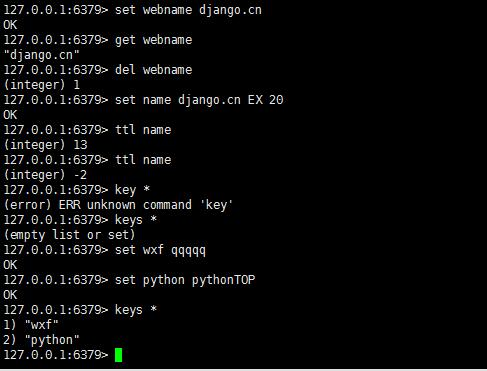

# Day91 部署项目——centos和ubuntu下redis的安装与使用

[TOC]


Redis 是一个开源（BSD许可）的，内存中的数据结构存储系统，它可以用作数据库、缓存和消息中间件。 Redis支持五种数据类型：string（字符串），hash（哈希），list（列表），set（集合）及zset(sorted set：有序集合)。Django中经常用它来提升数据查询性能。下面与大家一起学习如何在Linux下安装与使用redis。

1、[redis安装](https://www.django.cn/article/show-24.html#anzhuang)

2、[redis配置常用的配置方法](https://www.django.cn/article/show-24.html#pz)

3、[redis常用操作](https://www.django.cn/article/show-24.html#cz)

4、[Python操作redis](https://www.django.cn/article/show-24.html#py)

5、[Django中使用redis](https://www.django.cn/article/show-24.html#dj)

------

**一、redis安装**

**Centos7下安装redis**

1、通过yum源安装redis

```
yum install redis
```

2、如果没有redis yum源则下载fedora的epel仓库，然后再安装redis

```
yum install epel-release  #下载fedora的epel仓库
yum install redis         #安装redis
```

3、安装成功之后，通过下面命令启动redis

```
# 启动redis
service redis start
# 停止redis
service redis stop
# 查看redis运行状态
service redis status
# 查看redis进程
ps -ef | grep redis
```

4、让redis开机自行启动

```
chkconfig redis on
```

**Ubuntu下安装redis**

1、安装与卸载命令

```
sudo apt-get install redis-server              #安装
sudo apt-get purge --auto-remove redis-server  #卸载
```

2、启动redis

```
ps aux|grep redis                  #查看redis状态
sudo service redis-server start    #启动redis
sudo service redis-server stop      #停止redis
```


------

**二、redis配置常用的配置方法**

redis默认配置文件为/etc/redis.conf，我们通常按需求修改里面的参数对其进行设置。

1、指定Redis监听端口，默认端口为6379

```
port 6379
```

2、绑定主机IP地址

```
bind 127.0.0.1
```

3、设置数据库的数量，默认数据库为0

```
databases 16
```

4、指定在多长时间内，有多少次更新操作，就将数据同步到数据文件，可以多个条件配合

save <seconds> <changes>
Redis默认配置文件中提供了三个条件：

```
save 900 1
save 300 10
save 60 10000
```

5、指定本地数据库文件名，默认值为dump.rdb

```
dbfilename dump.rdb
```

6、指定本地数据库存放目录

```
dir /var/lib/redis  #默认存放目录
```

7、指定是否激活重置哈希，默认为开启

```
activerehashing yes
```

8、设置Redis连接密码，如果配置了连接密码，客户端在连接Redis时需要通过AUTH <password>命令提供密码，默认关闭

```
 requirepass foobared   #foobared 为密码
```

上面是学用的，更多的配置，请直接查看配置文件的注释或者查看官方文档。

------

**三、redis常用操作**

**1、连接redis**

```
redis-cli -h [ip] -p [端口]
#例
redis-cli -h 127.0.0.1 -p 6379
```

如果设置密码了的话，就输入密码：

```
auth 445813  #445813为密码，输入密码前要密码前面加 auth和空格
```


**2、简单的redis 键(key)操作
**

```
#添加
set key value
#例
set webname django.cn
set usrname "My namne is XXX" #中间有空格的要用引号
#通过KEY查询
127.0.0.1:6379> get webname
"django.cn"
#删除key
del webname

#设置过期时间(单位为秒)
expire key timeout
#也可以在设置值的时候，一同指定过期时间
set key value EX timeout
#例子
set name django.cn EX 20  #设置20秒过期

#查看过期时间
ttl key
#如
ttl name

#查看当前redis中所有Key
keys *
```



Redis支持五种数据类型：string（字符串），hash（哈希），list（列表），set（集合）及zset(sorted set：有序集合)。更多关于不同数据类型操作方法，请大家查看官方文档：https://redis.io/commands （英文），这里还有一个中文的，可以去看看。http://redisdoc.com/index.html  

------

**四、Python操作redis**

1、安装 python-redis

```
pip install redis
```

2、新建一个redis_demo.py文件。输入如下代码：

```
# 从redis包中导入Redis类
from redis import Redis
# 初始化redis实例变量
myredis = Redis(host='192.168.1.100',port=6379)
#如果设置了密码则
myredis = Redis(host='192.168.1.100',port=6379, password='445813')
```

3、对字符串的操作

```
#添加一个值，并设置过期时间为60秒，如果不设置，则永远不会过期
myredis.set('webname','django.cn',ex=60)
#获取Key值
myredis.get('webname')
# 删除一个值
myredis.delete('username')
# 给某个值自增1
myredis.set('views',1)
myredis.incr('views') # 这时候views变为2
# 给某个值减少1
myredis.decr('views') # 这时候views变为1
```

以上便展示了 python-redis 的一些常用方法，如果想深入了解其他的方法，可以参考 pythonredis 的源代码（查看源代码 pycharm 快捷键提示：把鼠标光标放在 import Redis 的 Redis 上，然后按 ctrl+b 即可进入）。

------

**五、Django中使用redis**

1、Django想要使用redis，我们需要先安装django-redis

```
pip3 install django-redis
```

2、settings.py里配置redia

```
CACHES = {
    "default": {
        "BACKEND": "django_redis.cache.RedisCache",
        "LOCATION": "redis://127.0.0.1:6379", #服务器地址
        "OPTIONS": {
            "CLIENT_CLASS": "django_redis.client.DefaultClient",
            "CONNECTION_POOL_KWARGS": {"max_connections": 100}#最大连接数
            # "PASSWORD": "密码",
        }
    }
}　　
```

3、常规redis使用方法

```
import redis
from django.shortcuts import render,HttpResponse
from utils.redis_pool import POOL
 
def index(request):
    conn = redis.Redis(connection_pool=POOL)
    conn.hset('kkk','age',18)
     
    return HttpResponse('设置成功')
 
def order(request):
    conn = redis.Redis(connection_pool=POOL)
    conn.hget('kkk','age')
 
    return HttpResponse('获取成功')
```

4、设置多个redis链接(settings.py)

```
CACHES = {
    "default": {
        "BACKEND": "django_redis.cache.RedisCache",
        "LOCATION": "redis://127.0.0.1:6379", #服务器地址
        "OPTIONS": {
            "CLIENT_CLASS": "django_redis.client.DefaultClient",
            "CONNECTION_POOL_KWARGS": {"max_connections": 100} #最大连接数
            # "PASSWORD": "密码",
        }
    },
    "back": {
        "BACKEND": "django_redis.cache.RedisCache",
        "LOCATION": "redis://127.0.0.1:6379", #服务器地址
        "OPTIONS": {
            "CLIENT_CLASS": "django_redis.client.DefaultClient",
            "CONNECTION_POOL_KWARGS": {"max_connections": 100} #最大连接数
            # "PASSWORD": "密码",
        }
    }
    
}　
```

获取数据：

```
import redis
from django.shortcuts import render,HttpResponse
from django_redis import get_redis_connection
 
def index(request):
    conn = get_redis_connection("default")
    return HttpResponse('设置成功')
def order(request):
    conn = get_redis_connection("back")
    return HttpResponse('获取成功')
```

5、Django全站缓存

django中给整个网站都设置缓存，我们需要在中间件的第一行和最后一行进行如下设置：

```
 MIDDLEWARE = [ 
 # 站点缓存 ， 注意必须在第一个位置 
 'django.middleware.cache.UpdateCacheMiddleware', 
 ... 
 # 站点缓存, 注意必须在最后一个位置 
 'django.middleware.cache.FetchFromCacheMiddleware',
  ]
```

使用中间件，经过一系列的认证等操作，如果内容在缓存中存在，则使用FetchFromCacheMiddleware获取内容并返回给用户，当返回给用户之前，判断缓存中是否已经存在，如果不存在则UpdateCacheMiddleware会将缓存保存至缓存，从而实现全站缓存。

示例：

```
from django.shortcuts import render,HttpResponse
import time

def index(request):
    ctime = str(time.time())
    return HttpResponse(ctime)
 
def order(request):
    ctime = str(time.time())
    return HttpResponse(ctime)　　
```

6、单页面缓存或者单视图缓存

把之前的中间件去掉，我们在视图里加装饰器。需要留意的是，给视图添加缓存是有风险的，如果视图所展示的网页中有经常动态变动的信息，那么被添加缓存命不可取。缓存整个视图最实用的场景应该是这个视图所展示的网页的内容基本上不怎么变动，或者说在很长一段时间内不需要变动，这样使用缓存就非常有效。

```
from django.shortcuts import render,HttpResponse
import time
from django.views.decorators.cache import cache_page
from rest_framework.throttling import SimpleRateThrottle
 
@cache_page(60 * 15)
def index(request):
    ctime = str(time.time())
    return HttpResponse(ctime)
 
def order(request):
 
    return render(request,'order.html')
```

7、URLconf中使用缓存

上面说了函数视图使用缓存，但是我们可能还有一种场景，那就是多个 URL 指向同一个函数视图，但是我只想缓存一部分的 URL，这时候就可以采用在 URLconf 中使用缓存，这样就指定了哪些 URL 需要缓存。
下面分别表示了函数视图和类视图的路由中使用缓存的方式，基本一致：

```
from django.views.decorators.cache import cache _page
urlpatterns = [
    url(r'^foo/([0-9]{1,2})/$',cache_page(60 * 15)(index)),
    url(r'^$', cache_page(60 * 30)(IndexView.as_view()), name='order'),
    ]
```

URLconf 使用缓存和视图函数使用缓存需要注意的地方是一样的，因为它们都是缓存整个页面，所有都需要考虑是否整个页面都应该缓存。

8、模板页面（局部页面）缓存

模板中使用缓存是比较推荐的一种缓存方式，因为使用这种方式可以充分的考虑缓存的颗粒度，细分颗粒度，可以保证只缓存那些适合使用缓存的 HTML 片段。

```

<!DOCTYPE HTML>
<html>
<head>
    <meta charset="UTF-8">
    <title>Myblog</title>
</head>
<body>
    <h2>测试redis</h2>
    <div><p>非缓存地段</p></div>

    
    <div><p>这里缓存</p></div>
    
    
</body>
```


如上图，留意飘红的位置。很多地方是不需要从数据库查询数据的，访问频率高，所以可以进行缓存。

**9、做缓存之前，建议做一下测试（非必须）**

进入django的后台命令模式：

```
python manage.py shell
```

逐条输入如下命令测试：

```
from django.core.cache import cache #引入缓存模块
cache.set('v', '555', 60*60)      #写入key为v，值为555的缓存，有效期30分钟
cache.has_key('v') #判断key为v是否存在
cache.get('v')     #获取key为v的缓存
```

------

**最后：**

建议一般情况下不要进行整个页面的缓存，要有选择性的，**缓存的使用原则：**
1、纯静态页面
2、读取了数据库信息，但是不经常变动的页面，比如文章热门排行榜，这个调用数据库信息并且还要排序的完全可以使用缓存，因为不需要实时展现最新的
3、HTML 的片段，比如整个页面都经常变动，但是有个侧边栏不经常变动，就可以缓存侧边栏
4、需要使用复杂逻辑生成的 HTML 片段，使用缓存可以减少多次重复操作


-16947612810458-169527911035029.jpg)