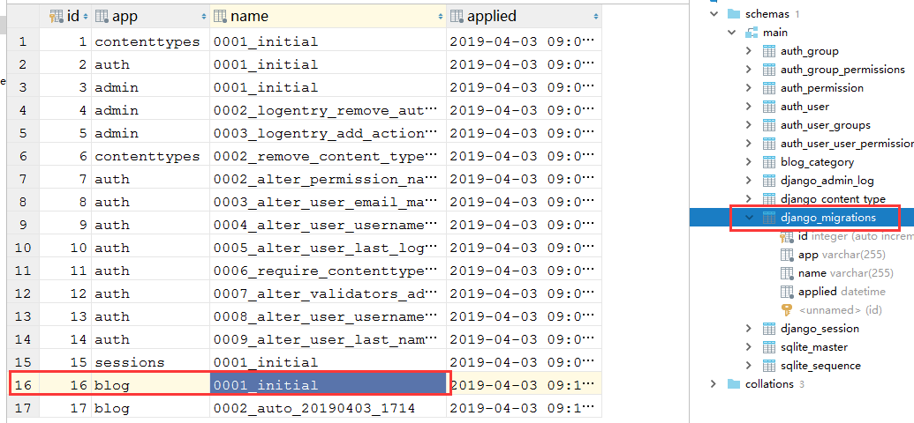

# Day92 Django——Django常用命令介绍，新手建议阅读


[TOC]

在DJango里django-admin.py和manage.py都是Django的命令工具集，用于处理系统管理相关操作，而manage.py是在创建Django工程时自动生成的，manage.py是对django-admin.py的简单包装，二者的作用基本一致。

区别：

1、django-admin存放在Python的site-packages\django\bin 里，manage.py存放在项目工程文件夹里。

2、django-admin可以对不同的项目进行设置，而manege.py只能当前的工程有效。

下面我们以manage.py为例，列出一些常用的命令：

语法：

django-admin <subcommand> [options]

manage.py <subcommand> [options]

subcommand是子命令；options是可选的

```
常用子命令：
startproject:创建一个项目（*）
startapp:创建一个app（*）
runserver：运行开发服务器（*）
shell：进入django shell（*）
dbshell：进入django dbshell
check：检查django项目完整性
flush：清空数据库
compilemessages：编译语言文件
makemessages：创建语言文件
makemigrations：生成数据库同步脚本（*）
migrate：同步数据库（*）
showmigrations：查看生成的数据库同步脚本（*）
sqlflush：查看生成清空数据库的脚本（*）
sqlmigrate：查看数据库同步的sql语句（*）
dumpdata:导出数据
loaddata:导入数据
diffsettings:查看你的配置和django默认配置的不同之处
manage.py特有的一些子命令：
createsuperuser:创建超级管理员（*）
changepassword:修改密码（*）
clearsessions：清除session
```

**1、help**

作用：获得帮助信息

语法：

```
#显示帮助信息和可用命令
python manege.py help
#显示可用命令列表
python manege.py help --commands
#显示指定命令的详细文档
python manage.py help  #commands为需要指定显示的命令
```

**2、version**

作用：获取到当前DJango的版本

语法：

```
python manage.py version
```

**3、check**

作用：检查工程中是否存在错误（检查完整性）

语法：

```
python manage.py check [appname]   #命令后面跟APP名称
```

**4、startproject**

作用：创建Django工程

语法：

```
django-admin startproject name [项目想要存放的路径]
```

**5、startapp**

作用：创建Django应用程序

语法：

```
django-admin startapp name [应用想要存放的路径]
python manage.py startapp name
```

**6、runserver**

作用：在当前机器启动一个Web服务器，运行Django项目

语法：

```
#默认是8000端口
python manage.py runserver
#指定IP和端口
python manage.py runserver 127.0.0.1:8000
#指定端口
python manage.py runserver 8000
```

**7、shell**

作用：启动一个交互窗口

语法：

```
python manage.py shell
#如果想使用ipython、bpython交互模式的话需要先安装以上交互工具，安装命令：pip install ipython
#启用命令
python manage.py shell --i [ipyhton]
```

**8、migrations**

Django通过migrations命令将Models中的任何修改写入到数库中，比如：新增加的模型或修改已有的字段等。

**makemigrations**

作用：根据models的变化生成对应的Python代码，该代码用于更新数据库

语法：

```
python manage.py makemigrations
python manage.py makemigrations [appname]
```

**migrate**

作用：将model里的修改应用到数据库

语法：

```
python manage.py migrate #默认是所有的APP的修改应用到数据库
python manage.py migrate [appname] #指定APP的修改应用到数据库
python manage.py migrate [appname] [migrations_name] #将操作恢复到指定版本
```

**注意：**

如果执行migrate的命令同时给了应用程序的名字和migtrations名字，系统会把数据库恢复到之前指定的一个版本。

```
python manage.py migrate myblog 0001_initial #指定blog应用恢复到0001_initial 这个版本
```

Django所有的migration信息都保存在django_migrations这个数据库表中，如下图所示：



如果想撤销所有的数据库更改，我们可以使用 zero代替 上面的命令:

```
python manage.py migrate blog zero
```

高级用法：

如果数据库里，已经手动更新了数据库，我们只是想设置当前的migration状态，就使用下面的命令去实现，这个命令并不会真正的去更新数据库。

语法：

```
python manage.py migrate blog zero
```

**sqlmigrate**

作用：输出某一个migrate对应的SQL语句

语法：

```
python manage.py sqlmigrate blog 0001_initial
```

**showmigrations**

作用：显示migrations记录

语法：

```
python manage.py showmigrations
```


**留意：**记录前有[X]的表示已经部署到数据库里去了，没有的则显示 [ ]


-16947612810458-169527915757830.jpg)