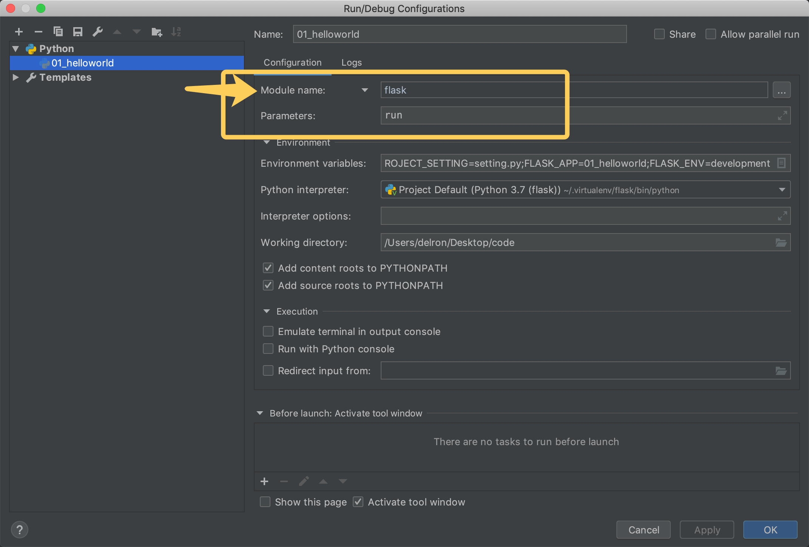

# Day95 Flask介绍

[TOC]


## 1 学习Flask框架的原因


2018 Python官方年度调研报告显示Flask与Django为Python Web开发使用最主要的两个框架。

## 2 Flask


Flask诞生于2010年，是Armin ronacher（人名）用 Python 语言基于 Werkzeug 工具箱编写的轻量级Web开发框架。

Flask 本身相当于一个内核，其他几乎所有的功能都要用到扩展（邮件扩展Flask-Mail，用户认证Flask-Login，数据库Flask-SQLAlchemy），都需要用第三方的扩展来实现。比如可以用 Flask 扩展加入ORM、窗体验证工具，文件上传、身份验证等。Flask 没有默认使用的数据库，你可以选择 MySQL，也可以用 NoSQL。

其 WSGI 工具箱采用 Werkzeug（路由模块），模板引擎则使用 Jinja2。这两个也是 Flask 框架的核心。

**最新版本 1.0.2**

## 3 框架对比

#### 1） 框架轻重

重量级的框架：为方便业务程序的开发，提供了丰富的工具、组件，如Django

轻量级的框架：只提供Web框架的核心功能，自由、灵活、高度定制，如Flask、Tornado

#### 2）与Django对比

django提供了：

django-admin快速创建项目工程目录

manage.py 管理项目工程

orm模型（数据库抽象层）

admin后台管理站点

缓存机制

文件存储系统

用户认证系统

而这些，flask都没有，都需要扩展包来提供

## 4 常用扩展包

扩展列表：http://flask.pocoo.org/extensions/

- Flask-SQLalchemy：操作数据库；
- Flask-script：插入脚本；
- Flask-migrate：管理迁移数据库；
- Flask-Session：Session存储方式指定；
- Flask-WTF：表单；
- Flask-Mail：邮件；
- Flask-Bable：提供国际化和本地化支持，翻译；
- Flask-Login：认证用户状态；
- Flask-OpenID：认证；
- **Flask-RESTful：开发REST API的工具；**
- Flask-Bootstrap：集成前端Twitter Bootstrap框架；
- Flask-Moment：本地化日期和时间；
- Flask-Admin：简单而可扩展的管理接口的框架

## 5 Flask文档

1. 中文文档（http://docs.jinkan.org/docs/flask/）
2. 英文文档（http://flask.pocoo.org/docs/1.0/）


# 工程搭建

# 环境安装

## 1. 复习虚拟环境和pip的命令

```shell
# 虚拟环境
mkvirtualenv  # 创建虚拟环境
rmvirtualenv  # 删除虚拟环境
workon  # 进入虚拟环境、查看所有虚拟环境
deactivate  # 退出虚拟环境

# pip
pip install  # 安装依赖包
pip uninstall  # 卸载依赖包
pip list  # 查看已安装的依赖包
pip freeze  # 冻结当前环境的依赖包
```

## 2. 创建虚拟环境

```shell
mkvirtualenv flask -p python3
```

注意需要联网

## 3. 安装Flask

使用flask 1.0.2版本，注意需要联网

```shell
pip install flask
```


### Flask程序编写

创建helloworld.py文件

```python
# 导入Flask类
from flask import Flask

#Flask类接收一个参数__name__
app = Flask(__name__)

# 装饰器的作用是将路由映射到视图函数index
@app.route('/')
def index():
    return 'Hello World'

# Flask应用程序实例的run方法启动WEB服务器
if __name__ == '__main__':
    app.run()
```

#### 4 启动运行

- 手动运行

  ```shell
  python helloworld.py
  ```

- pycharm 运行

  像正常运行普通python程序一样即可


# 参数说明

- Flask对象的初始化参数
- 应用程序配置参数
- app.run()运行参数

## 1 Flask对象初始化参数

Flask 程序实例在创建的时候，需要默认传入当前 Flask 程序所指定的包(模块)，接下来就来详细查看一下 Flask 应用程序在创建的时候一些需要我们关注的参数：

- import_name
  - Flask程序所在的包(模块)，传 `__name__` 就可以
  - 其可以决定 Flask 在访问静态文件时查找的路径
- static_url_path
  - 静态文件访问路径，可以不传，默认为：`/ + static_folder`
- static_folder
  - 静态文件存储的文件夹，可以不传，默认为 `static`
- template_folder
  - 模板文件存储的文件夹，可以不传，默认为 `templates`

#### 默认参数情况下

```python
app = Flask(__name__)
```

文件目录

```python
----
  |---static
  |     |--- 1.png
  |---helloworld.py
```

访问 `127.0.0.1:5000/static/1.png` 就可以访问到图片

#### 修改参数的情况下

```python
app = Flask(__name__, static_url_path='/url_path_param', static_folder='folder_param')
```

文件目录

```python
----
  |---folder_param     # 此处目录名变化
  |     |--- 1.png
  |---helloworld.py
```

访问`127.0.0.1:5000/url_path_param/1.png`才可以访问到图片

## 2 应用程序配置参数

对于Flask对象初始化参数仅仅设置的是Flask本身的属性，比如：

- Flask从哪里读取静态文件
- Flask从哪里读取模板文件
- ...

等等。

应用程序配置参数设置的是一个Web应用工程的相关信息，比如：

- 数据库的连接信息
- 日志的配置信息
- 自定义的配置信息
- ...

等等

### 作用

集中管理项目的所有配置信息

### 使用方式

Django将所有配置信息都放到了settings.py文件中，而Flask则不同。

**Flask将配置信息保存到了`app.config`属性中，该属性可以按照字典类型进行操作。**

#### 读取

- `app.config.get(name)`
- `app.config[name]`

#### 设置

主要使用以下三种方式：

- **从配置对象中加载**

  `app.config.from_object(配置对象)`

  ```python
  class DefaultConfig(object):
      """默认配置"""
      SECRET_KEY = 'TPmi4aLWRbyVq8zu9v82dWYW1'
  
  app = Flask(__name__)
  
  app.config.from_object(DefaultConfig)
  
  @app.route("/")
  def index():
      print(app.config['SECRET_KEY'])
      return "hello world"
  ```

  应用场景：

  作为默认配置写在程序代码中

  可以继承

  ```python
  class DevelopmentConfig(DefaultConfig):
      DEBUG=True
  ```

- **从配置文件中加载**

  `app.config.from_pyfile(配置文件)`

  新建一个配置文件setting.py

  ```python
  SECRET_KEY = 'TPmi4aLWRbyVq8zu9v82dWYW1'
  ```

  在Flask程序文件中

  ```python
  app = Flask(__name__)
  
  app.config.from_pyfile('setting.py')
  
  @app.route("/")
  def index():
      print(app.config['SECRET_KEY'])
      return "hello world"
  ```

  应用场景：

  在项目中使用固定的配置文件

- **从环境变量中加载**

  > **环境变量**（environment variables）一般是指在操作系统中用来指定操作系统运行**环境**的一些参数，如：临时文件夹位置和系统文件夹位置等。 **环境变量**是在操作系统中一个具有特定名字的对象，它包含了一个或者多个应用程序所将使用到的信息。

  通俗的理解，环境变量就是我们设置在操作系统中，由操作系统代为保存的变量值

  在Linux系统中设置和读取环境变量的方式如下：

  ```shell
  export 变量名=变量值  # 设置
  echo $变量名  # 读取
  
  # 例如
  export ITCAST=python
  echo $ITCAST
  ```

  **Flask使用环境变量加载配置的本质是通过环境变量值找到配置文件**，再读取配置文件的信息，其使用方式为

  `app.config.from_envvar('环境变量名')`

  环境变量的值为配置文件的绝对路径

  先在终端中执行如下命令

  ```shell
  export PROJECT_SETTING='~/setting.py'
  ```

  再运行如下代码

  ```python
  app = Flask(__name__)
  
  app.config.from_envvar('PROJECT_SETTING', silent=True)
  
  @app.route("/")
  def index():
      print(app.config['SECRET_KEY'])
      return "hello world"
  ```

  关于`silent`的说明：

  表示系统环境变量中没有设置相应值时是否抛出异常

  - False 表示不安静的处理，没有值时报错通知，默认为False
  - True 表示安静的处理，即时没有值也让Flask正常的运行下去

  ##### Pycharm运行时设置环境变量的方式

  

  

 应用场景：

 配置文件的地址不固定；

 在代码中不想暴露真实的配置文件地址，只在运行代码的服务器上才有真实配置文件的信息。

### 项目中的常用方式

使用工厂模式创建Flask app，并结合使用配置对象与环境变量加载配置

- 使用配置对象加载默认配置
- 使用环境变量加载不想出现在代码中的敏感配置信息

```python
def create_flask_app(config):
    """
    创建Flask应用
    :param config: 配置对象
    :return: Flask应用
    """
    app = Flask(__name__)
    app.config.from_object(config)

    # 从环境变量指向的配置文件中读取的配置信息会覆盖掉从配置对象中加载的同名参数
    app.config.from_envvar("PROJECT_SETTING", silent=True)
    return app

class DefaultConfig(object):
    """默认配置"""
    SECRET_KEY = 'itcast1'

class DevelopmentConfig(DefaultConfig):
    DEBUG=True

# app = create_flask_app(DefaultConfig)
app = create_flask_app(DevelopmentConfig)

@app.route("/")
def index():
    print(app.config['SECRET_KEY'])
    return "hello world"
```

## 3 app.run 参数

可以指定运行的主机IP地址，端口，是否开启调试模式

```python
app.run(host="0.0.0.0", port=5000, debug = True)
```

关于DEBUG调试模式

1. 程序代码修改后可以自动重启服务器
2. 在服务器出现相关错误的时候可以直接将错误信息返回到前端进行展示


# 开发服务器启动方式

在1.0版本之后，Flask调整了开发服务器的启动方式，由代码编写`app.run()`语句调整为命令`flask run`启动。

```python
from flask import Flask

app = Flask(__name__)

@app.route('/')
def index():
    return 'Hello World'

# 程序中不用再写app.run()
```

## 1 终端启动

```shell
$ export FLASK_APP=helloworld
$ flask run
 * Running on http://127.0.0.1:5000/
```

### 说明

- 环境变量 FLASK_APP 指明flask的启动实例

- `flask run -h 0.0.0.0 -p 8000` 绑定地址 端口

- `flask run --help`获取帮助

- 生产模式与开发模式的控制

  通过`FLASK_ENV`环境变量指明

  - `export FLASK_ENV=production` 运行在生产模式，未指明则默认为此方式
  - `export FLASK_ENV=development`运行在开发模式

### 扩展

```shell
$ export FLASK_APP=helloworld
$ python -m flask run
 * Running on http://127.0.0.1:5000/
```

## 2 Pycharm启动

设置环境变量




#### 旧版本Pycharm设置


# 路由与蓝图

# 路由

```python
@app.route("/itcast")
def view_func():
    return "hello world"
```

## 1 查询路由信息

- 命令行方式

  ```shell
  flask routes
  ```

  ```shell
  Endpoint  Methods  Rule
  --------  -------  -----------------------
  index     GET      /
  static    GET      /static/
  ```

- 在程序中获取

  在应用中的url_map属性中保存着整个Flask应用的路由映射信息，可以通过读取这个属性获取路由信息

  ```python
  print(app.url_map)
  ```

  如果想在程序中遍历路由信息，可以采用如下方式

  ```python
  for rule in app.url_map.iter_rules():
      print('name={} path={}'.format(rule.endpoint, rule.rule))
  ```

#### 需求

通过访问`/`地址，以json的方式返回应用内的所有路由信息

#### 实现

```python
@app.route('/')
def route_map():
    """
    主视图，返回所有视图网址
    """
    rules_iterator = app.url_map.iter_rules()
    return json.dumps({rule.endpoint: rule.rule for rule in rules_iterator})
```

## 2 指定请求方式

在 Flask 中，定义路由其默认的请求方式为：

- GET
- OPTIONS(自带)
- HEAD(自带)

利用`methods`参数可以自己指定一个接口的请求方式

```python
@app.route("/itcast1", methods=["POST"])
def view_func_1():
    return "hello world 1"

@app.route("/itcast2", methods=["GET", "POST"])
def view_func_2():
    return "hello world 2"
```


# 蓝图

## 需求

在一个Flask 应用项目中，如果业务视图过多，可否将以某种方式划分出的业务单元单独维护，将每个单元用到的视图、静态文件、模板文件等独立分开？

例如从业务角度上，可将整个应用划分为用户模块单元、商品模块单元、订单模块单元，如何分别开发这些不同单元，并最终整合到一个项目应用中？

在Django中这种需求是如何实现的？

## 蓝图

在Flask中，使用蓝图Blueprint来分模块组织管理。

蓝图实际可以理解为是一个存储一组视图方法的容器对象，其具有如下特点：

- 一个应用可以具有多个Blueprint
- 可以将一个Blueprint注册到任何一个未使用的URL下比如 “/user”、“/goods”
- Blueprint可以单独具有自己的模板、静态文件或者其它的通用操作方法，它并不是必须要实现应用的视图和函数的
- 在一个应用初始化时，就应该要注册需要使用的Blueprint

但是一个Blueprint并不是一个完整的应用，它不能独立于应用运行，而必须要注册到某一个应用中。

## 使用方式

使用蓝图可以分为三个步骤

1. 创建一个蓝图对象

   ```python
    user_bp=Blueprint('user',__name__)
   ```

2. 在这个蓝图对象上进行操作,注册路由,指定静态文件夹,注册模版过滤器

   ```python
    @user_bp.route('/')
    def user_profile():
        return 'user_profile'
   ```

3. 在应用对象上注册这个蓝图对象

   ```python
    app.register_blueprint(user_bp)
   ```

#### 单文件蓝图

可以将创建蓝图对象与定义视图放到一个文件中 。

#### 目录（包）蓝图

对于一个打算包含多个文件的蓝图，通常将创建蓝图对象放到Python包的`__init__.py`文件中

```shell
--------- project # 工程目录
  |------ main.py # 启动文件
  |------ user  #用户蓝图
  |  |--- __init__.py  # 此处创建蓝图对象
  |  |--- passport.py  
  |  |--- profile.py
  |  |--- ...
  |
  |------ goods # 商品蓝图
  |  |--- __init__.py
  |  |--- ...
  |...
```

## 扩展用法

#### 1 指定蓝图的url前缀

在应用中注册蓝图时使用`url_prefix`参数指定

```python
app.register_blueprint(user_bp, url_prefix='/user')
app.register_blueprint(goods_bp, url_prefix='/goods')
```

#### 2 蓝图内部静态文件

和应用对象不同，蓝图对象创建时不会默认注册静态目录的路由。需要我们在 创建时指定 static_folder 参数。

下面的示例将蓝图所在目录下的static_admin目录设置为静态目录

```python
admin = Blueprint("admin",__name__,static_folder='static_admin')
app.register_blueprint(admin,url_prefix='/admin')
```

现在就可以使用`/admin/static_admin/<filename>`访问`static_admin`目录下的静态文件了。

也可通过`static_url_path`改变访问路径

```python
admin = Blueprint("admin",__name__,static_folder='static_admin',static_url_path='/lib')
app.register_blueprint(admin,url_prefix='/admin')
```

#### 3 蓝图内部模板目录

蓝图对象默认的模板目录为系统的模版目录，可以在创建蓝图对象时使用 template_folder 关键字参数设置模板目录

```python
admin = Blueprint('admin',__name__,template_folder='my_templates')
```


# 请求与响应


# 处理请求

## 需求

在视图编写中需要读取客户端请求携带的数据时，如何才能正确的取出数据呢？

请求携带的数据可能出现在HTTP报文中的不同位置，需要使用不同的方法来获取参数。

## 1. URL路径参数（动态路由）

例如，有一个请求访问的接口地址为`/users/123`，其中123实际上为具体的请求参数，表明请求123号用户的信息。此时如何从url中提取出123的数据？

Flask不同于Django直接在定义路由时编写正则表达式的方式，而是采用转换器语法：

```python
@app.route('/users/<user_id>')
def user_info(user_id):
    print(type(user_id))
    return 'hello user {}'.format(user_id)
```

此处的`<>`即是一个转换器，默认为字符串类型，即将该位置的数据以字符串格式进行匹配、并以字符串为数据类型类型、 `user_id`为参数名传入视图。

### Flask也提供其他类型的转换器

```python
DEFAULT_CONVERTERS = {
    'default':          UnicodeConverter,
    'string':           UnicodeConverter,
    'any':              AnyConverter,
    'path':             PathConverter,
    'int':              IntegerConverter,
    'float':            FloatConverter,
    'uuid':             UUIDConverter,
}
```

将上面的例子以整型匹配数据，可以如下使用：

```python
@app.route('/users/<int:user_id>')
def user_info(user_id):
    print(type(user_id))
    return 'hello user {}'.format(user_id)


@app.route('/users/<int(min=1):user_id>')
def user_info(user_id):
    print(type(user_id))
    return 'hello user {}'.format(user_id)
```

### 自定义转换器

如果遇到需要匹配提取`/sms_codes/18512345678`中的手机号数据，Flask内置的转换器就无法满足需求，此时需要自定义转换器。

#### 定义方法

自定义转换器主要做3步

1. 创建转换器类，保存匹配时的正则表达式

   ```python
   from werkzeug.routing import BaseConverter
   
   class MobileConverter(BaseConverter):
       """
       手机号格式
       """
       regex = r'1[3-9]\d{9}'
   ```

   - 注意`regex`名字固定

2. 将自定义的转换器告知Flask应用

   ```python
   app = Flask(__name__)
   
   # 将自定义转换器添加到转换器字典中，并指定转换器使用时名字为: mobile
   app.url_map.converters['mobile'] = MobileConverter
   ```

3. 在使用转换器的地方定义使用

   ```python
   @app.route('/sms_codes/<mobile:mob_num>')
   def send_sms_code(mob_num):
       return 'send sms code to {}'.format(mob_num)
   ```

## 2. 其他参数

如果想要获取其他地方传递的参数，可以通过Flask提供的**request**对象来读取。

不同位置的参数都存放在request的不同属性中

| 属性    | 说明                           | 类型           |
| :------ | :----------------------------- | :------------- |
| data    | 记录请求的数据，并转换为字符串 | *              |
| form    | 记录请求中的表单数据           | MultiDict      |
| args    | 记录请求中的查询参数           | MultiDict      |
| cookies | 记录请求中的cookie信息         | Dict           |
| headers | 记录请求中的报文头             | EnvironHeaders |
| method  | 记录请求使用的HTTP方法         | GET/POST       |
| url     | 记录请求的URL地址              | string         |
| files   | 记录请求上传的文件             | *              |

例如 想要获取请求`/articles?channel_id=1`中`channel_id`的参数，可以按如下方式使用：

```python
from flask import request

@app.route('/articles')
def get_articles():
    channel_id = request.args.get('channel_id')
    return 'you wanna get articles of channel {}'.format(channel_id)
```

#### 上传图片

客户端上传图片到服务器，并保存到服务器中

```python
from flask import request

@app.route('/upload', methods=['POST'])
def upload_file():
    f = request.files['pic']
    # with open('./demo.png', 'wb') as new_file:
    #     new_file.write(f.read())
    f.save('./demo.png')
    return 'ok'
```


# 处理响应

## 需求

如何在不同的场景里返回不同的响应信息？

## 1 返回模板

使用`render_template`方法渲染模板并返回

例如，新建一个模板index.html

```html
<!DOCTYPE html>
<html lang="en">
<head>
    <meta charset="UTF-8">
    <title>Title</title>
</head>
<body>
我的模板html内容
<br/>{{ my_str }}
<br/>{{ my_int }}
</body>
</html>
```

后端视图

```python
from flask import render_template

@app.route('/')
def index():
    mstr = 'Hello 黑马程序员'
    mint = 10
    return render_template('index.html', my_str=mstr, my_int=mint)
```

## 2 重定向

```python
from flask import redirect

@app.route('/demo2')
def demo2():
    return redirect('http://www.itheima.com')
```

## 3 返回JSON

```python
from flask import jsonify

@app.route('/demo3')
def demo3():
    json_dict = {
        "user_id": 10,
        "user_name": "laowang"
    }
    return jsonify(json_dict)
```

## 4 自定义状态码和响应头

#### 1） 元祖方式

可以返回一个元组，这样的元组必须是 **(response, status, headers)** 的形式，且至少包含一个元素。 status 值会覆盖状态代码， headers 可以是一个列表或字典，作为额外的消息标头值。

```python
@app.route('/demo4')
def demo4():
    # return '状态码为 666', 666
    # return '状态码为 666', 666, [('Itcast', 'Python')]
    return '状态码为 666', 666, {'Itcast': 'Python'}
```

#### 2) make_response方式

```python
@app.route('/demo5')
def demo5():
    resp = make_response('make response测试')
        resp.headers[“Itcast”] = “Python”
        resp.status = “404 not found”
    return resp
```


# Cookie与Session

## 1 Cookie

### 设置

```python
from flask import Flask, make_response

app = Flask(__name__)

@app.route('/cookie')
def set_cookie():
    resp = make_response('set cookie ok')
    resp.set_cookie('username', 'itcast')
    return resp
```

设置有效期

```python
@app.route('/cookie')
def set_cookie():
    response = make_response('hello world')
    response.set_cookie('username', 'itheima', max_age=3600)
    return response
```

### 读取

```python
from flask import request

@app.route('/get_cookie')
def get_cookie():
    resp = request.cookies.get('username')
    return resp
```

### 删除

```python
from flask import request

@app.route('/delete_cookie')
def delete_cookie():
    response = make_response('hello world')
    response.delete_cookie('username')
    return response
```

## 2 Session

需要先设置SECRET_KEY

```python
class DefaultConfig(object):
    SECRET_KEY = 'fih9fh9eh9gh2'

app.config.from_object(DefaultConfig)

或者直接设置
app.secret_key='xihwidfw9efw'
```

### 设置

```python
from flask import session

@app.route('/set_session')
def set_session():
    session['username'] = 'itcast'
    return 'set session ok'
```

### 读取

```python
@app.route('/get_session')
def get_session():
    username = session.get('username')
    return 'get session username {}'.format(username)
```

### 思考

flask将session数据保存到了哪里？


# 请求钩子与上下文

# 异常处理

## HTTP 异常主动抛出

- abort 方法
  - 抛出一个给定状态代码的 HTTPException 或者 指定响应，例如想要用一个页面未找到异常来终止请求，你可以调用 abort(404)。
- 参数：
  - code – HTTP的错误状态码

```python
# abort(404)
abort(500)
```

> 抛出状态码的话，只能抛出 HTTP 协议的错误状态码

## 捕获错误

- errorhandler 装饰器
  - 注册一个错误处理程序，当程序抛出指定错误状态码的时候，就会调用该装饰器所装饰的方法
- 参数：
  - code_or_exception – HTTP的错误状态码或指定异常
- 例如统一处理状态码为500的错误给用户友好的提示：

```python
@app.errorhandler(500)
def internal_server_error(e):
    return '服务器搬家了'
```

- 捕获指定异常

```python
@app.errorhandler(ZeroDivisionError)
def zero_division_error(e):
    return '除数不能为0'
```


# 请求钩子

在客户端和服务器交互的过程中，有些准备工作或扫尾工作需要处理，比如：

- 在请求开始时，建立数据库连接；
- 在请求开始时，根据需求进行权限校验；
- 在请求结束时，指定数据的交互格式；

为了让每个视图函数避免编写重复功能的代码，Flask提供了通用设施的功能，即请求钩子。

请求钩子是通过装饰器的形式实现，Flask支持如下四种请求钩子：

- before_first_request
  - 在处理第一个请求前执行
- before_request
  - 在每次请求前执行
  - 如果在某修饰的函数中返回了一个响应，视图函数将不再被调用
- after_request
  - 如果没有抛出错误，在每次请求后执行
  - 接受一个参数：视图函数作出的响应
  - 在此函数中可以对响应值在返回之前做最后一步修改处理
  - 需要将参数中的响应在此参数中进行返回
- teardown_request：
  - 在每次请求后执行
  - 接受一个参数：错误信息，如果有相关错误抛出

## 代码测试

```python
from flask import Flask
from flask import abort

app = Flask(__name__)


# 在第一次请求之前调用，可以在此方法内部做一些初始化操作
@app.before_first_request
def before_first_request():
    print("before_first_request")


# 在每一次请求之前调用，这时候已经有请求了，可能在这个方法里面做请求的校验
# 如果请求的校验不成功，可以直接在此方法中进行响应，直接return之后那么就不会执行视图函数
@app.before_request
def before_request():
    print("before_request")
    # if 请求不符合条件:
    #     return "laowang"


# 在执行完视图函数之后会调用，并且会把视图函数所生成的响应传入,可以在此方法中对响应做最后一步统一的处理
@app.after_request
def after_request(response):
    print("after_request")
    response.headers["Content-Type"] = "application/json"
    return response


# 请每一次请求之后都会调用，会接受一个参数，参数是服务器出现的错误信息
@app.teardown_request
def teardown_request(response):
    print("teardown_request")


@app.route('/')
def index():
    return 'index'

if __name__ == '__main__':
    app.run(debug=True)
```

- 在第1次请求时的打印：

```bash
before_first_request
before_request
after_request
teardown_request
```

- 在第2次请求时的打印：

```bash
before_request
after_request
teardown_request
```


# 上下文

上下文：即语境，语意，在程序中可以理解为在代码执行到某一时刻时，根据之前代码所做的操作以及下文即将要执行的逻辑，可以决定在当前时刻下可以使用到的变量，或者可以完成的事情。

Flask中有两种上下文，请求上下文和应用上下文

Flask中上下文对象：相当于一个容器，保存了 Flask 程序运行过程中的一些信息。

## 1 请求上下文(request context)

思考：在视图函数中，如何取到当前请求的相关数据？比如：请求地址，请求方式，cookie等等

在 flask 中，可以直接在视图函数中使用 **request** 这个对象进行获取相关数据，而 **request** 就是请求上下文的对象，保存了当前本次请求的相关数据，请求上下文对象有：request、session

- request
  - 封装了HTTP请求的内容，针对的是http请求。举例：user = request.args.get('user')，获取的是get请求的参数。
- session
  - 用来记录请求会话中的信息，针对的是用户信息。举例：session['name'] = user.id，可以记录用户信息。还可以通过session.get('name')获取用户信息。

## 2 应用上下文(application context)

它的字面意思是 应用上下文，但它不是一直存在的，它只是request context 中的一个对 app 的代理(人)，所谓local proxy。它的作用主要是帮助 request 获取当前的应用，它是伴 request 而生，随 request 而灭的。

应用上下文对象有：current_app，g

### current_app

应用程序上下文,用于存储应用程序中的变量，可以通过current_app.name打印当前app的名称，也可以在current_app中存储一些变量，例如：

- 应用的启动脚本是哪个文件，启动时指定了哪些参数
- 加载了哪些配置文件，导入了哪些配置
- 连了哪个数据库
- 有哪些public的工具类、常量
- 应用跑再哪个机器上，IP多少，内存多大

#### 示例

创建`current_app_demo.py`

```python
from flask import Flask, current_app

app1 = Flask(__name__)
app2 = Flask(__name__)

# 以redis客户端对象为例
# 用字符串表示创建的redis客户端
# 为了方便在各个视图中使用，将创建的redis客户端对象保存到flask app中，
# 后续可以在视图中使用current_app.redis_cli获取
app1.redis_cli = 'app1 redis client'
app2.redis_cli = 'app2 redis client'

@app1.route('/route11')
def route11():
    return current_app.redis_cli

@app1.route('/route12')
def route12():
    return current_app.redis_cli

@app2.route('/route21')
def route21():
    return current_app.redis_cli

@app2.route('/route22')
def route22():
    return current_app.redis_cli
```

运行

```shell
export FLASK_APP=current_app_demo:app1
flask run
```

- 访问`/route11` 显示`app1 redis client`
- 访问`/route12` 显示`app1 redis client`

```shell
export FLASK_APP=current_app_demo:app2
flask run
```

- 访问`/route21` 显示`app2 redis client`
- 访问`/route22` 显示`app2 redis client`

#### 作用

**`current_app` 就是当前运行的flask app，在代码不方便直接操作flask的app对象时，可以操作`current_app`就等价于操作flask app对象**

### g对象

g 作为 flask 程序全局的一个临时变量，充当中间媒介的作用，我们可以通过它在一次请求调用的多个函数间传递一些数据。每次请求都会重设这个变量。

#### 示例

```python
from flask import Flask, g

app = Flask(__name__)

def db_query():
    user_id = g.user_id
    user_name = g.user_name
    print('user_id={} user_name={}'.format(user_id, user_name))

@app.route('/')
def get_user_profile():
    g.user_id = 123
    g.user_name = 'itcast'
    db_query()
    return 'hello world'
```

### g对象与请求钩子的综合案例

#### 需求

- 构建认证机制
- 对于特定视图可以提供强制要求用户登录的限制
- 对于所有视图，无论是否强制要求用户登录，都可以在视图中尝试获取用户认证后的身份信息

#### 实现

```python
from flask import Flask, abort, g

app = Flask(__name__)

@app.before_request
def authentication():
    """
    利用before_request请求钩子，在进入所有视图前先尝试判断用户身份
    :return:
    """
    # TODO 此处利用鉴权机制（如cookie、session、jwt等）鉴别用户身份信息
    # if 已登录用户，用户有身份信息
    g.user_id = 123
    # else 未登录用户，用户无身份信息
    # g.user_id = None

def login_required(func):
    def wrapper(*args, **kwargs):
        if g.user_id is not None:
            return func(*args, **kwargs)
        else:
            abort(401)

    return wrapper

@app.route('/')
def index():
    return 'home page user_id={}'.format(g.user_id)

@app.route('/profile')
@login_required
def get_user_profile():
    return 'user profile page user_id={}'.format(g.user_id)
```

## 3 app_context 与 request_context

#### 思考

在Flask程序未运行的情况下，调试代码时需要使用`current_app`、`g`、`request`这些对象，会不会有问题？该如何使用？

#### app_context

```
app_context`为我们提供了应用上下文环境，允许我们在外部使用应用上下文`current_app`、`g
```

可以通过`with`语句进行使用

```python
>>> from flask import Flask
>>> app = Flask('')
>>> app.redis_cli = 'redis client'
>>> 
>>> from flask import current_app
>>> current_app.redis_cli   # 错误，没有上下文环境
报错
>>> with app.app_context():  # 借助with语句使用app_context创建应用上下文
...     print(current_app.redis_cli)
...
redis client
```

#### request_context

```
request_context`为我们提供了请求上下文环境，允许我们在外部使用请求上下文`request`、`session
```

可以通过with语句进行使用

```python
>>> from flask import Flask
>>> app = Flask('')
>>> request.args  # 错误，没有上下文环境
报错
>>> environ = {'wsgi.version':(1,0), 'wsgi.input': '', 'REQUEST_METHOD': 'GET', 'PATH_INFO': '/', 'SERVER_NAME': 'itcast server', 'wsgi.url_scheme': 'http', 'SERVER_PORT': '80'}  # 模拟解析客户端请求之后的wsgi字典数据
>>> with app.request_context(environ):  # 借助with语句使用request_context创建请求上下文
...     print(request.path)
...   
/
```


# Flask-RESTful


# 起步

**Flask-RESTful是用于快速构建REST API的Flask扩展。**

## 1 安装

```shell
pip install flask-restful
```

## 2 Hello World

```python
from flask import Flask
from flask_restful import Resource, Api

app = Flask(__name__)
api = Api(app)

class HelloWorldResource(Resource):
    def get(self):
        return {'hello': 'world'}

        def post(self):
        return {'msg': 'post hello world'}

api.add_resource(HelloWorldResource, '/')

# 此处启动对于1.0之后的Flask可有可无
if __name__ == '__main__':
    app.run(debug=True)
```


# 关于视图

## 1 为路由起名

通过endpoint参数为路由起名

```python
api.add_resource(HelloWorldResource, '/', endpoint='HelloWorld')
```

## 2 蓝图中使用

```python
from flask import Flask, Blueprint
from flask_restful import Api, Resource

app = Flask(__name__)

user_bp = Blueprint('user', __name__)

user_api = Api(user_bp)

class UserProfileResource(Resource):
    def get(self):
        return {'msg': 'get user profile'}

user_api.add_resource(UserProfileResource, '/users/profile')

app.register_blueprint(user_bp)
```

## 3 装饰器

使用`method_decorators`添加装饰器

- 为类视图中的所有方法添加装饰器

```python
  def decorator1(func):
      def wrapper(*args, **kwargs):
          print('decorator1')
          return func(*args, **kwargs)
      return wrapper


  def decorator2(func):
      def wrapper(*args, **kwargs):
          print('decorator2')
          return func(*args, **kwargs)
      return wrapper


  class DemoResource(Resource):
      method_decorators = [decorator1, decorator2]

      def get(self):
          return {'msg': 'get view'}

      def post(self):
          return {'msg': 'post view'}
```

- 为类视图中不同的方法添加不同的装饰器

```python
  class DemoResource(Resource):
      method_decorators = {
          'get': [decorator1, decorator2],
          'post': [decorator1]
      }

      # 使用了decorator1 decorator2两个装饰器
      def get(self):
          return {'msg': 'get view'}

      # 使用了decorator1 装饰器
      def post(self):
          return {'msg': 'post view'}

      # 未使用装饰器
      def put(self):
          return {'msg': 'put view'}
```


# 关于请求处理

Flask-RESTful 提供了`RequestParser`类，用来帮助我们检验和转换请求数据。

```python
from flask_restful import reqparse

parser = reqparse.RequestParser()
parser.add_argument('rate', type=int, help='Rate cannot be converted', location='args')
parser.add_argument('name')
args = parser.parse_args()
```

#### 使用步骤：

1. 创建`RequestParser`对象

2. 向`RequestParser`对象中添加需要检验或转换的参数声明

3. 使用`parse_args()`方法启动检验处理

4. 检验之后从检验结果中获取参数时可按照字典操作或对象属性操作

   ```python
   args.rate
   或
   args['rate']
   ```

## 参数说明

### 1 required

描述请求是否一定要携带对应参数，**默认值为False**

- True 强制要求携带

  若未携带，则校验失败，向客户端返回错误信息，状态码400

- False 不强制要求携带

  若不强制携带，在客户端请求未携带参数时，取出值为None

```python
class DemoResource(Resource):
    def get(self):
        rp = RequestParser()
        rp.add_argument('a', required=False)
        args = rp.parse_args()
        return {'msg': 'data={}'.format(args.a)}
```

### 2 help

参数检验错误时返回的错误描述信息

```python
rp.add_argument('a', required=True, help='missing a param')
```

### 3 action

描述对于请求参数中出现多个同名参数时的处理方式

- `action='store'` 保留出现的第一个， 默认
- `action='append'` 以列表追加保存所有同名参数的值

```python
rp.add_argument('a', required=True, help='missing a param', action='append')
```

### 4 type

描述参数应该匹配的类型，可以使用python的标准数据类型string、int，也可使用Flask-RESTful提供的检验方法，还可以自己定义

- 标准类型

  ```python
  rp.add_argument('a', type=int, required=True, help='missing a param', action='append')
  ```

- Flask-RESTful提供

  检验类型方法在`flask_restful.inputs`模块中

  - `url`

  - `regex(指定正则表达式)`

    ```python
    from flask_restful import inputs
    rp.add_argument('a', type=inputs.regex(r'^\d{2}&'))
    ```

  - `natural` 自然数0、1、2、3...

  - `positive` 正整数 1、2、3...

  - `int_range(low ,high)` 整数范围

    ```python
    rp.add_argument('a', type=inputs.int_range(1, 10))
    ```

  - `boolean`

- 自定义

  ```python
  def mobile(mobile_str):
      """
      检验手机号格式
      :param mobile_str: str 被检验字符串
      :return: mobile_str
      """
      if re.match(r'^1[3-9]\d{9}$', mobile_str):
          return mobile_str
      else:
          raise ValueError('{} is not a valid mobile'.format(mobile_str))
  
  rp.add_argument('a', type=mobile)
  ```

### 5 location

描述参数应该在请求数据中出现的位置

```python
# Look only in the POST body
parser.add_argument('name', type=int, location='form')

# Look only in the querystring
parser.add_argument('PageSize', type=int, location='args')

# From the request headers
parser.add_argument('User-Agent', location='headers')

# From http cookies
parser.add_argument('session_id', location='cookies')

# From json
parser.add_argument('user_id', location='json')

# From file uploads
parser.add_argument('picture', location='files')
```

也可指明多个位置

```python
parser.add_argument('text', location=['headers', 'json'])
```

# 关于响应处理

## 1 序列化数据

Flask-RESTful 提供了marshal工具，用来帮助我们将数据序列化为特定格式的字典数据，以便作为视图的返回值。

```python
from flask_restful import Resource, fields, marshal_with

resource_fields = {
    'name': fields.String,
    'address': fields.String,
    'user_id': fields.Integer
}

class Todo(Resource):
    @marshal_with(resource_fields, envelope='resource')
    def get(self, **kwargs):
        return db_get_todo()
```

也可以不使用装饰器的方式

```python
class Todo(Resource):
    def get(self, **kwargs):
        data = db_get_todo()
        return marshal(data, resource_fields)
```

#### 示例

```python
# 用来模拟要返回的数据对象的类
class User(object):
    def __init__(self, user_id, name, age):
        self.user_id = user_id
        self.name = name
        self.age = age

resoure_fields = {
        'user_id': fields.Integer,
        'name': fields.String
    }

class Demo1Resource(Resource):
    @marshal_with(resoure_fields, envelope='data1')
    def get(self):
        user = User(1, 'itcast', 12)
        return user

class Demo2Resource(Resource):
    def get(self):
        user = User(1, 'itcast', 12)
        return marshal(user, resoure_fields, envelope='data2')
```

## 2 定制返回的JSON格式

### 需求

想要接口返回的JSON数据具有如下统一的格式

```json
{"message": "描述信息", "data": {要返回的具体数据}}
```

在接口处理正常的情况下， message返回ok即可，但是若想每个接口正确返回时省略message字段

```python
class DemoResource(Resource):
    def get(self):
        return {'user_id':1, 'name': 'itcast'}
```

对于诸如此类的接口，能否在某处统一格式化成上述需求格式？

```json
{"message": "OK", "data": {'user_id':1, 'name': 'itcast'}}
```

### 解决

**Flask-RESTful的Api对象提供了一个`representation`的装饰器，允许定制返回数据的呈现格式**

```python
api = Api(app)

@api.representation('application/json')
def handle_json(data, code, headers):
    # TODO 此处添加自定义处理
    return resp
```

Flask-RESTful原始对于json的格式处理方式如下：

代码出处：`flask_restful.representations.json`

```python
from flask import make_response, current_app
from flask_restful.utils import PY3
from json import dumps


def output_json(data, code, headers=None):
    """Makes a Flask response with a JSON encoded body"""

    settings = current_app.config.get('RESTFUL_JSON', {})

    # If we're in debug mode, and the indent is not set, we set it to a
    # reasonable value here.  Note that this won't override any existing value
    # that was set.  We also set the "sort_keys" value.
    if current_app.debug:
        settings.setdefault('indent', 4)
        settings.setdefault('sort_keys', not PY3)

    # always end the json dumps with a new line
    # see https://github.com/mitsuhiko/flask/pull/1262
    dumped = dumps(data, **settings) + "\n"

    resp = make_response(dumped, code)
    resp.headers.extend(headers or {})
    return resp
```

为满足需求，做如下改动即可

```python
@api.representation('application/json')
def output_json(data, code, headers=None):
    """Makes a Flask response with a JSON encoded body"""

    # 此处为自己添加***************
    if 'message' not in data:
        data = {
            'message': 'OK',
            'data': data
        }
    # **************************

    settings = current_app.config.get('RESTFUL_JSON', {})

    # If we're in debug mode, and the indent is not set, we set it to a
    # reasonable value here.  Note that this won't override any existing value
    # that was set.  We also set the "sort_keys" value.
    if current_app.debug:
        settings.setdefault('indent', 4)
        settings.setdefault('sort_keys', not PY3)

    # always end the json dumps with a new line
    # see https://github.com/mitsuhiko/flask/pull/1262
    dumped = dumps(data, **settings) + "\n"

    resp = make_response(dumped, code)
    resp.headers.extend(headers or {})
    return resp
```