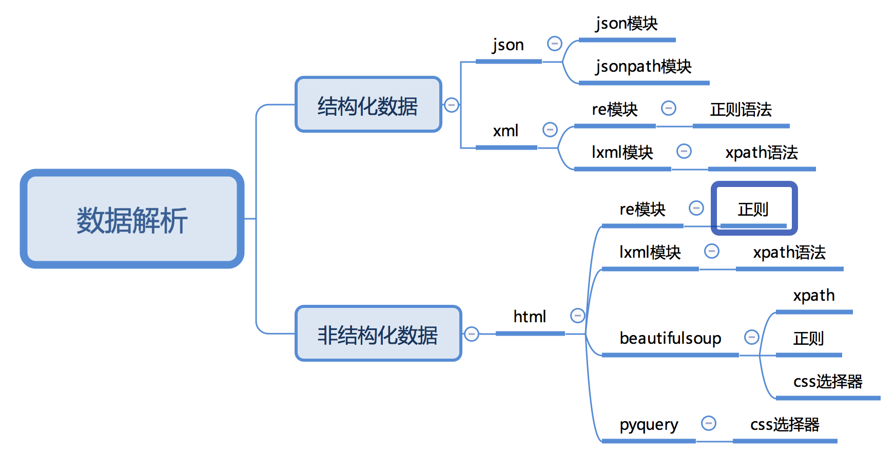

# Day99 数据提取

[TOC]


本阶段课程主要学习获取响应之后如何从响应中提取我们想要的数据，在本阶段课程中我们会讲解一些常用的方法和模块，基本上我们以后遇到的情况在掌握本阶段课程之后都能搞定


# 数据提取概述

##### 知识点

- 了解 响应内容的分类
- 了解 xml和html的区别

----


## 1. 响应内容的分类

> 在发送请求获取响应之后，可能存在多种不同类型的响应内容；而且很多时候，我们只需要响应内容中的一部分数据

- 结构化的响应内容

  - json字符串

    - 可以使用re、json等模块来提取特定数据
    - json字符串的例子如下图

    

  - xml字符串

    - 可以使用re、lxml等模块来提取特定数据

    - xml字符串的例子如下

      ```xml
      <bookstore>
      <book category="COOKING">
        <title lang="en">Everyday Italian</title> 
        <author>Giada De Laurentiis</author> 
        <year>2005</year> 
        <price>30.00</price> 
      </book>
      <book category="CHILDREN">
        <title lang="en">Harry Potter</title> 
        <author>J K. Rowling</author> 
        <year>2005</year> 
        <price>29.99</price> 
      </book>
      <book category="WEB">
        <title lang="en">Learning XML</title> 
        <author>Erik T. Ray</author> 
        <year>2003</year> 
        <price>39.95</price> 
      </book>
      </bookstore>
      ```

- 非结构化的响应内容

  - html字符串

    - 可以使用re、lxml等模块来提取特定数据
    - html字符串的例子如下图

    


------

##### 知识点：了解 响应内容的分类

------


## 2. 认识xml以及和html的区别

> 要搞清楚html和xml的区别，首先需要我们来认识xml

### 2.1 认识xml

> xml是一种可扩展标记语言，样子和html很像，功能更专注于对传输和存储数据

```xml
<bookstore>
<book category="COOKING">
  <title lang="en">Everyday Italian</title> 
  <author>Giada De Laurentiis</author> 
  <year>2005</year> 
  <price>30.00</price> 
</book>
<book category="CHILDREN">
  <title lang="en">Harry Potter</title> 
  <author>J K. Rowling</author> 
  <year>2005</year> 
  <price>29.99</price> 
</book>
<book category="WEB">
  <title lang="en">Learning XML</title> 
  <author>Erik T. Ray</author> 
  <year>2003</year> 
  <price>39.95</price> 
</book>
</bookstore>
```

**上面的xml内容可以表示为下面的树结构:**


### 2.2 xml和html的区别

> 二者区别如下图


- html：
  - 超文本标记语言
  - 为了更好的显示数据，侧重点是为了显示
- xml：
  - 可扩展标记语言
  - 为了传输和存储数据，侧重点是在于数据内容本身

----

##### 知识点：了解 xml和html的区别

----


### 2.3 常用数据解析方法



# 数据提取-jsonpath模块

##### 知识点

- 了解 jsonpath模块的使用场景
- 掌握 jsonpath模块的使用

----


## 1. jsonpath模块的使用场景

> 如果有一个多层嵌套的复杂字典，想要根据key和下标来批量提取value，这是比较困难的。jsonpath模块就能解决这个痛点，接下来我们就来学习jsonpath模块

**jsonpath可以按照key对python字典进行批量数据提取**

----

##### 知识点：了解 jsonpath模块的使用场景

----


## 2. jsonpath模块的使用方法

### 2.1 jsonpath模块的安装

> jsonpath是第三方模块，需要额外安装

`pip install jsonpath`

### 2.2 jsonpath模块提取数据的方法

```
from jsonpath import jsonpath
ret = jsonpath(a, 'jsonpath语法规则字符串')
```

### 2.3 jsonpath语法规则


#### 2.4  jsonpath使用示例

```
book_dict = { 
  "store": {
    "book": [ 
      { "category": "reference",
        "author": "Nigel Rees",
        "title": "Sayings of the Century",
        "price": 8.95
      },
      { "category": "fiction",
        "author": "Evelyn Waugh",
        "title": "Sword of Honour",
        "price": 12.99
      },
      { "category": "fiction",
        "author": "Herman Melville",
        "title": "Moby Dick",
        "isbn": "0-553-21311-3",
        "price": 8.99
      },
      { "category": "fiction",
        "author": "J. R. R. Tolkien",
        "title": "The Lord of the Rings",
        "isbn": "0-395-19395-8",
        "price": 22.99
      }
    ],
    "bicycle": {
      "color": "red",
      "price": 19.95
    }
  }
}

from jsonpath import jsonpath

print(jsonpath(book_dict, '$..author')) # 如果取不到将返回False # 返回列表，如果取不到将返回False
```


## 3. jsonpath练习

> 我们以拉勾网城市JSON文件 <http://www.lagou.com/lbs/getAllCitySearchLabels.json> 为例，获取所有城市的名字的列表，并写入文件。


参考代码：

```python
import requests
import jsonpath
import json

# 获取拉勾网城市json字符串
url = 'http://www.lagou.com/lbs/getAllCitySearchLabels.json'
headers = {"User-Agent": "Mozilla/5.0 (compatible; MSIE 9.0; Windows NT 6.1; Trident/5.0)"}
response =requests.get(url, headers=headers)
html_str = response.content.decode()

# 把json格式字符串转换成python对象
jsonobj = json.loads(html_str)

# 从根节点开始，获取所有key为name的值
citylist = jsonpath.jsonpath(jsonobj,'$..name')

# 写入文件
with open('city_name.txt','w') as f:
    content = json.dumps(citylist, ensure_ascii=False)
    f.write(content)
```


----

##### 知识点：掌握 jsonpath模块的使用

----


# 数据提取-lxml模块

##### 知识点

- 了解 lxml模块和xpath语法的关系
- 了解 lxml模块的使用场景
- 了解 lxml模块的安装
- 了解 谷歌浏览器xpath helper插件的安装和使用
- 掌握 xpath语法-基础节点选择语法
- 掌握 xpath语法-节点修饰语法
- 掌握 xpath语法-其他常用语法
- 掌握 lxml模块中使用xpath语法定位元素提取属性值或文本内容
- 掌握 lxml模块中etree.tostring函数的使用

----


## 1. 了解 lxml模块和xpath语法

> 对html或xml形式的文本提取特定的内容，就需要我们掌握lxml模块的使用和xpath语法。

- lxml模块可以利用XPath规则语法，来快速的定位HTML\XML 文档中特定元素以及获取节点信息（文本内容、属性值）
- XPath (XML Path Language) 是一门在 HTML\XML 文档中查找信息的**语言**，可用来在 HTML\XML 文档中对**元素和属性进行遍历**。
  - W3School官方文档：<http://www.w3school.com.cn/xpath/index.asp>
- 提取xml、html中的数据需要lxml模块和xpath语法配合使用

----

##### 知识点：了解 lxml模块和xpath语法

----


## 2. 谷歌浏览器xpath helper插件的安装和使用

> 要想利用lxml模块提取数据，需要我们掌握xpath语法规则。接下来我们就来了解一下xpath helper插件，它可以帮助我们练习xpath语法

### 2.1 谷歌浏览器xpath helper插件的作用

> 在谷歌浏览器中对当前页面测试xpath语法规则

### 2.2 谷歌浏览器xpath helper插件的安装和使用

> 我们以windos为例进行xpath helper的安装

#### 2.2.1 xpath helper插件的安装

1. 下载Chrome插件 XPath Helper

   - 可以在chrome应用商城进行下载，如果无法下载，也可以从下面的链接进行下载

   - 下载地址：<https://pan.baidu.com/s/1UM94dcwgus4SgECuoJ-Jcg> 密码:337b

2. 把文件的后缀名crx改为rar，然后解压到同名文件夹中

3. 把解压后的文件夹拖入到已经开启开发者模式的chrome浏览器扩展程序界面

   

   

4. 重启浏览器后，访问url之后在页面中点击xpath图标，就可以使用了

   


5. 如果是**linux或macOS操作系统**，无需操作上述的步骤2，直接将crx文件拖入已经开启开发者模式的chrome浏览器扩展程序界面

----

##### 知识点：了解 谷歌浏览器xpath helper插件的安装和使用

------


## 3. xpath的节点关系

> 学习xpath语法需要先了解xpath中的节点关系

### 3.1 xpath中的节点是什么

> 每个html、xml的标签我们都称之为节点，其中最顶层的节点称为根节点。我们以xml为例，html也是一样的


### 3.2 xpath中节点的关系


**`author`是`title`的第一个兄弟节点**


## 4. xpath语法-基础节点选择语法

> 1. XPath 使用路径表达式来选取 XML 文档中的节点或者节点集。
> 2. 这些路径表达式和我们在常规的**电脑文件系统中看到的表达式**非常相似。
> 3. **使用chrome插件选择标签时候，选中时，选中的标签会添加属性class="xh-highlight"**

### 4.1 xpath定位节点以及提取属性或文本内容的语法

| 表达式   | 描述                                                       |
| -------- | ---------------------------------------------------------- |
| nodename | 选中该元素。                                               |
| /        | 从根节点选取、或者是元素和元素间的过渡。                   |
| //       | 从匹配选择的当前节点选择文档中的节点，而不考虑它们的位置。 |
| .        | 选取当前节点。                                             |
| ..       | 选取当前节点的父节点。                                     |
| @        | 选取属性。                                                 |
| text()   | 选取文本。                                                 |


### 4.2 语法练习

> 接下来我们通过itcast的页面来练习上述语法：http://www.itcast.cn/

- 选择所有的h2下的文本
  - `//h2/text()`
- 获取所有的a标签的href
  - `//a/@href`
- 获取html下的head下的title的文本
  - `/html/head/title/text()`
- 获取html下的head下的link标签的href
  - `/html/head/link/@href`

------

##### 知识点：掌握 xpath语法-选取节点以及提取属性或文本内容的语法

------


## 5. xpath语法-节点修饰语法

> 可以根据标签的属性值、下标等来获取特定的节点

### 5.1 节点修饰语法

| 路径表达式                          | 结果                                                         |
| ----------------------------------- | ------------------------------------------------------------ |
| //title[@lang="eng"]                | 选择lang属性值为eng的所有title元素                           |
| /bookstore/book[1]                  | 选取属于 bookstore 子元素的第一个 book 元素。                |
| /bookstore/book[last()]             | 选取属于 bookstore 子元素的最后一个 book 元素。              |
| /bookstore/book[last()-1]           | 选取属于 bookstore 子元素的倒数第二个 book 元素。            |
| /bookstore/book[position()>1]       | 选择bookstore下面的book元素，从第二个开始选择                |
| //book/title[text()='Harry Potter'] | 选择所有book下的title元素，仅仅选择文本为Harry Potter的title元素 |
| /bookstore/book[price>35.00]/title  | 选取 bookstore 元素中的 book 元素的所有 title 元素，且其中的 price 元素的值须大于 35.00。 |

### 5.2 关于xpath的下标

- 在xpath中，第一个元素的位置是1
- 最后一个元素的位置是last()
- 倒数第二个是last()-1

### 5.3 语法练习

> 从itcast的页面中，选择所有学科的名称、第一个学科的链接、最后一个学科的链接：http://www.itcast.cn/

- 所有的学科的名称
  - `//div[@class="nav_txt"]//a[@class="a_gd"]`
- 第一个学科的链接
  - `//div[@class="nav_txt"]/ul/li[1]/a/@href`
- 最后一个学科的链接
  - `//div[@class="nav_txt"]/ul/li[last()]/a/@href`

------

##### 知识点：掌握 xpath语法-选取特定节点的语法

------


## 6. xpath语法-其他常用节点选择语法

> 可以通过**通配符**来选取未知的html、xml的元素

### 6.1 选取未知节点的语法

| 通配符 | 描述                 |
| ------ | -------------------- |
| *      | 匹配任何元素节点。   |
| node() | 匹配任何类型的节点。 |

### 6.2 语法练习

> 从itcast的页面中 http://www.itcast.cn/ ，选中全部的标签、全部的属性

- 全部的标签
  - `//*`
- 全部的属性
  - `//node()`

------

##### 知识点：掌握 xpath语法-选取位置节点的语法

------


## 7. lxml模块的安装与使用示例

> lxml模块是一个第三方模块，安装之后使用

### 7.1  lxml模块的安装

对发送请求获取的xml或html形式的响应内容进行提取

```
pip/pip3 install lxml
```

##### 知识点：了解 lxml模块的安装

### 7.2 爬虫对html提取的内容

- 提取标签中的**文本内容**
- 提取标签中的**属性的值**
  - 比如，提取a标签中href属性的值，获取url，进而继续发起请求

### 7.3 lxml模块的使用

1. 导入lxml 的 etree 库

   `from lxml import etree`

2. 利用etree.HTML，将html字符串（bytes类型或str类型）转化为Element对象，Element对象具有xpath的方法，返回结果的列表

   ```python
   html = etree.HTML(text) 
   ret_list = html.xpath("xpath语法规则字符串")
   ```

3. xpath方法返回列表的三种情况

   - 返回空列表：根据xpath语法规则字符串，没有定位到任何元素
   - 返回由字符串构成的列表：xpath字符串规则匹配的一定是文本内容或某属性的值
   - 返回由Element对象构成的列表：xpath规则字符串匹配的是标签，列表中的Element对象可以继续进行xpath

### 7.4 lxml模块使用示例

> 运行下面的代码，查看打印的结果

```python
from lxml import etree
text = ''' 
<div> 
  <ul> 
    <li class="item-1">
      <a href="link1.html">first item</a>
    </li> 
    <li class="item-1">
      <a href="link2.html">second item</a>
    </li> 
    <li class="item-inactive">
      <a href="link3.html">third item</a>
    </li> 
    <li class="item-1">
      <a href="link4.html">fourth item</a>
    </li> 
    <li class="item-0">
      a href="link5.html">fifth item</a>
  </ul> 
</div>
'''

html = etree.HTML(text)

#获取href的列表和title的列表
href_list = html.xpath("//li[@class='item-1']/a/@href")
title_list = html.xpath("//li[@class='item-1']/a/text()")

#组装成字典
for href in href_list:
    item = {}
    item["href"] = href
    item["title"] = title_list[href_list.index(href)]
    print(item)
```

------


### 8 练习

> 将下面的html文档字符串中，将每个class为item-1的li标签作为1条新闻数据。提取a标签的文本内容以及链接，组装成一个字典。

```python
text = ''' <div> <ul> 
        <li class="item-1"><a>first item</a></li> 
        <li class="item-1"><a href="link2.html">second item</a></li> 
        <li class="item-inactive"><a href="link3.html">third item</a></li> 
        <li class="item-1"><a href="link4.html">fourth item</a></li> 
        <li class="item-0"><a href="link5.html">fifth item</a> 
        </ul> </div> '''
```

- 注意：

  - **先分组，再提取数据**，可以避免数据的错乱

  - 对于空值要进行判断

- 参考代码

  ```python
  from lxml import etree
  text = ''' 
  ```

<div> 
  <ul> 
    <li class="item-1">
      <a href="link1.html">first item</a>
    </li> 
    <li class="item-1">
      <a href="link2.html">second item</a>
    </li> 
    <li class="item-inactive">
      <a href="link3.html">third item</a>
    </li> 
    <li class="item-1">
      <a href="link4.html">fourth item</a>
    </li> 
    <li class="item-0">
      a href="link5.html">fifth item</a>
  </ul> 
</div>'''


  #根据li标签进行分组
  html = etree.HTML(text)
  li_list = html.xpath("//li[@class='item-1']")

  #在每一组中继续进行数据的提取
  for li in li_list:
      item = {}
      item["href"] = li.xpath("./a/@href")[0] if len(li.xpath("./a/@href"))>0 else None
      item["title"] = li.xpath("./a/text()")[0] if len(li.xpath("./a/text()"))>0 else None
      print(item)

  ```
------

##### 知识点：掌握 lxml模块中使用xpath语法定位元素提取属性值或文本内容

------


## 10. lxml模块中etree.tostring函数的使用

> 运行下边的代码，观察对比html的原字符串和打印输出的结果

```python
from lxml import etree
html_str = ''' <div> <ul> 
        <li class="item-1"><a href="link1.html">first item</a></li> 
        <li class="item-1"><a href="link2.html">second item</a></li> 
        <li class="item-inactive"><a href="link3.html">third item</a></li> 
        <li class="item-1"><a href="link4.html">fourth item</a></li> 
        <li class="item-0"><a href="link5.html">fifth item</a> 
        </ul> </div> '''

html = etree.HTML(html_str)

handeled_html_str = etree.tostring(html).decode()
print(handeled_html_str)
  ```

### 10.1 现象和结论

> 打印结果和原来相比：
>
> 1. 自动补全原本缺失的`li`标签
> 2. 自动补全`html`等标签

```html
<html><body><div> <ul> 
<li class="item-1"><a href="link1.html">first item</a></li> 
<li class="item-1"><a href="link2.html">second item</a></li> 
<li class="item-inactive"><a href="link3.html">third item</a></li> 
<li class="item-1"><a href="link4.html">fourth item</a></li> 
<li class="item-0"><a href="link5.html">fifth item</a> 
</li></ul> </div> </body></html>
```


**结论**：

- lxml.etree.HTML(html_str)可以自动补全标签

- `lxml.etree.tostring`函数可以将转换为Element对象再转换回html字符串
- 爬虫如果使用lxml来提取数据，应该以`lxml.etree.tostring`的返回结果作为提取数据的依据


------

##### 知识点：掌握 lxml模块中etree.tostring函数的使用

------


# 方法介绍

可以目标信息存在于em标签下a标签内的文本和href属性中。可直接利用requests库构造请求，并用BeautifulSoup或者lxml进行解析。

### ·        方式一：requests+BeautifulSoup+select css选择器

select method import requests from bs4 import BeautifulSoup

headers = {'User-Agent': 'Mozilla/5.0 (Windows NT 10.0; Win64; x64) AppleWebKit/537.36 (KHTML, like Gecko) Chrome/64.0.3282.119 Safari/537.36'}

url = '' Soup = BeautifulSoup(requests.get(url=url, headers=headers).text.encode("utf-8"), 'lxml')

em = Soup.select('em[class="f14 l24"] a') for i in em:

    title = i.get_text()
    
    link = i['href']
    
    print({'标题': title,
    
           '链接': link
    
    })

 很常规的处理方式，抓取效果如下：

/blog/attachment/201807/3/31077337_1530609020XPfE.jpg?x-oss-process=style/bb

### ·        方式二：requests+BeautifulSoup+find_all进行信息提取

find_all method import requests from bs4 importBeautifulSoup

headers = {'User-Agent': 'Mozilla/5.0 (Windows NT 10.0; Win64; x64) AppleWebKit/537.36 (KHTML, like Gecko) Chrome/64.0.3282.119 Safari/537.36'}

url = '' Soup = BeautifulSoup(requests.get(url=url, headers=headers).text.encode("utf-8"), 'lxml')

em = Soup.find_all('em', attrs={'class': 'f14 l24'})for i in em:

    title = i.a.get_text()
    
    link = i.a['href']
    
    print({'标题': title,            '链接': link
    
    })

同样是requests+BeautifulSoup的爬虫组合，但在信息提取上采用了find_all的方式。效果如下：

/blog/attachment/201807/3/31077337_1530609089ta9l.jpg?x-oss-process=style/bb

### ·        方式三：requests+lxml/etree+xpath表达式

lxml/etree method import requests from lxml import etree

headers = {    'User-Agent': 'Mozilla/5.0 (Windows NT 10.0; Win64; x64) AppleWebKit/537.36 (KHTML, like Gecko) Chrome/64.0.3282.119 Safari/537.36'}

url = '' html = requests.get(url = url, headers = headers)

con = etree.HTML(html.text)

title = con.xpath('//em[@class="f14 l24"]/a/text()')

link = con.xpath('//em[@class="f14 l24"]/a/@href') for i in zip(title, link):

    print({'标题': i[0],
    
           '链接': i[1]
    
    })

使用lxml库下的etree模块进行解析，然后使用xpath表达式进行信息提取，效率要略高于BeautifulSoup+select方法。这里对两个列表的组合采用了zip方法。效果如下：

/blog/attachment/201807/3/31077337_1530609108D7CG.jpg?x-oss-process=style/bb

### ·        方式四：requests+lxml/html/fromstring+xpath表达式

lxml/html/fromstring method 


import requests 

import lxml.html as HTML

headers = {'User-Agent': 'Mozilla/5.0 (Windows NT 10.0; Win64; x64) AppleWebKit/537.36 (KHTML, like Gecko) Chrome/64.0.3282.119 Safari/537.36'}

url = '' con = HTML.fromstring(requests.get(url = url, headers = headers).text)

title = con.xpath('//em[@class="f14 l24"]/a/text()')

link = con.xpath('//em[@class="f14 l24"]/a/@href') for i in zip(title, link):

    print({'标题': i[0],'链接': i[1]
    
    })

跟方法三类似，只是在解析上使用了lxml库下的html.fromstring模块。抓取效果如下：

/blog/attachment/201807/3/31077337_15306091256Q0W.jpg?x-oss-process=style/bb

很多人觉得爬虫有点难以掌握，因为知识点太多，需要懂前端、需要python熟练、还需要懂数据库，更不用说正则表达式、XPath表达式这些。其实对于一个简单网页的数据抓取，不妨多尝试几种抓取方案，举一反三，也更能对python爬虫有较深的理解。长此以往，对于各类网页结构都有所涉猎，自然经验丰富，水到渠成。

爬取网页数据用正则表达式的话，可以直接从网页源代码文本中匹配，但出错率较高，且熟悉正则表达式的使用也比较难，需要经常翻阅文档。

 实际爬取数据大多基于 HTML 结构的 Web 页面，网页节点较多，各种层级关系。可以考虑使用 Xpath 解析器、BeautifulSoup解析器、PyQuery CSS解析器抽取结构化数据，使用正则表达式抽取非结构化数据。

 Xpath：可在 XML 中查找信息；支持 HTML 的查找 ；通过元素和属性进行导航，查找效率很高。在学习 Selenium 以及 Scrapy 框架中也都会用到。

 BeautifulSoup：依赖于 lxml 的解析库，也可以从 HTML 或 XML 文件中提取数据。

 PyQuery：Python仿照 jQuery 严格实现，可以直接解析 DOM 节点的结构，并通过 DOM 节点的一些属性快速进行内容提取。

对于爬取网页结构简单的 Web 页面，有些代码是可以复用的，如下所示：

from fake_useragent import UserAgent  

#随机产生请求头  

ua = UserAgent(verify_ssl=False, path='fake_useragent.json')  

def random_ua():  

    headers = {  
    
        "Accept-Encoding": "gzip",  
    
        "User-Agent": ua.random  
    
    }  
    
    return headers

伪装请求头，并可以随机切换，封装为函数，便于复用。

def scrape_html(url):  

    resp = requests.get(url, headers=random_ua())  
    
    # print(resp.status_code, type(resp.status_code))  
    
    # print(resp.text)  
    
    if resp.status_code == 200:  
    
        return resp.text  
    
    else:  
    
        logging.info('请求网页失败')

请求网页，返回状态码为 200 说明能正常请求，并返回网页源代码文本。


