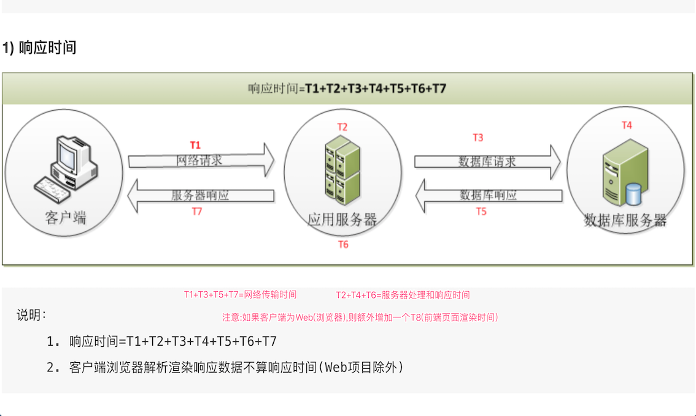

# Day12 性能测试详解——什么是性能测试?、性能测试分类及常用指标、性能测试流程、总结


[TOC]


# 什么是性能测试?

**学习目标 ： **

- 了解为什么学习性能测试
- 掌握什么是性能测试
- 了解性能测试的焦点

------

### 一、为什么要学习性能测试

```
职场需求：
    1. 面试：会性能测试吗？
    2. 招聘信息：要求会使用性能测试工具LoadRunner、Jmeter

业务需求：
    1. 登录不得超过3秒钟
    2. 开发一款 Web 电商网站，使用 JS 还是 Python 呢？
    3. OA 办公系统-我们公司20000左右员工需要使用此系统。
```

#### 1.1 业务需求 解决方案

```
1. 负载测试-根据客户实际应用场景模拟测试应用软件、服务器是否满足需求；如果不满足，则定位问题，进行调整直到满足需求；
2. 分别使用 JS 和 Python 写个 Demo，搭建相同的应用场景进行性能测试，找出最优符合应用场景的开发语言；
3. 根据二八定律统计出单位时间内(秒)最高请求数。
```

#### 1.2 问题

```
以上解决方案都为性能测试方面知识，我们暂无法解决，所以需要学习性能测试。
```

------

### 二、什么是性能测试？【重要】

```
概念：性能测试是模拟多种正常、峰值以及异常负载条件来对系统的各项性能指标进行的测试。

说明：
    1). 峰值：客户指定指标数值或场景需求数值，如：CPU使用率80%以内、登录3秒、内存空间40%等等
    2). 负载：用户(一个或多个)向服务器发送请求，负载测试我们1.2节会讲解
```

#### 2.1 性能测试与功能测试（焦点）

```
功能测试：验证软件系统操作功能是否符合产品功能需求规格，主要焦点在功能（正向、逆向）；
性能测试：验证软件系统是否满足业务需求场景，主要焦点是业务场景的满足度（时间、空间）；

说明：
    时间：软件的响应时间...
    空间：服务器的磁盘读写数率、CPU 使用率、内存空闲率...
```

#### 2.2 性能测试与功能测试（关系）

```
功能测试和性能测试是相辅相成的，对于一款优秀的软件产品来讲，它们是测试工作中不可或缺的两个重要环节；
```


# 性能测试分类及常用指标

### 一、性能测试常用分类

性能测试是个综合的概述，性能测试指的是测试一种分类或多种分类，任何一具体分类，都是性能测试。 主要包含下面几种：

1. **负载测试**
2. **压力测试**
3. **并发测试**
4. **稳定性测试**
5. 配置测试
6. 容量测试

#### 1.1 负载测试 【重点】

```
说明：通过逐步增加系统负载(向服务器发送请求)，测试系统性能的变化，并最终确定在满足系统的性能指标情况下，系统所能够承受的最大负载量的测试。

提示：负载测试是通过逐步加压的方式来确定系统的处理能力、确定系统能够承受的各项阀值。
例如：逐步加压，从而得到“响应时间不超过3秒”、“服务器CPU平均利用率低于80%”等指标的阀值。            

* 阀值：关注的某一具体数值(比如：登录小于3秒、用户数2000、业务成功率100%)
```

#### 1.2 压力测试 【重点】

```
说明：通过逐步增加系统负载，测试系统性能的变化，并最终确定在什么负载条件下系统性能处于【失效】状态。

提示：
 1. 压力测试：是逐步增加负载，使系统某些资源达到饱和甚至失效。(如：测试系统最多支持同时处理多少请求，超过此数数量系统瘫痪)
 2. 负载测试：是逐步增加负载，确定在满足性能指标情况下，系统能承受的最大负载测试。(如：登录3秒内，最多支持多少用户同时登录；如超出此数量，可能需要5秒钟或更多时间才能登录成功)
```

#### 1.3 并发测试 【重点】

```
概念：并发测试就是【多用户】同时访问【同一个应用】。

目的：测试应用服务器指定功能的同时访问数是否达到预期结果。

*并发测试需要配合集合点来使用(集合点：我们在接口阶段已了解)
```

#### 1.4 稳定性测试【理解】

```
通过给系统加载一定的业务压力（如：CPU资源在70%～90%的使用率）的情况下，运行一段时间，检查系统是否稳定。

*通常稳定性测试，我们测试一段时间即可；(如：24小时、3×24小时或7×24小时来模拟长时间运行)
```

### 二、性能测试常用指标【重要】

**指标：** 一些经过运算得出的结果，用来衡量某种操作性能的统称， 包括指标名和指标值；比如：错误率0.5%

性能测试常用指标:

1. 吞吐量
2. 并发数
3. 响应时间
4. 点击数
5. 资源利用率
6. 错误率

#### 2.1 吞吐量

```
吞吐量（Throughput）：指的是单位时间内处理的客户端请求数量，直接体现软件系统的性能承载能力。

通常情况下，吞吐量用“请求数/秒”(QPS)或者“页面数/分钟”来衡量。

从业务角度来看，吞吐量也可以用“业务数/小时”、“业务数/天”、“访问人数/天”、“页面访问量/天”来衡量。
从网络角度来看，还可以用“字节数/小时”、“字节数/天”等来衡量网络的流量。
```

#### 2.2 并发数

```
并发（Concurrency）：它最简单的描述就是指多个同时发生的业务操作。
例如，100个用户同时单击登录页面的“登录”按钮操作。

并发性测试描述的是多个客户端同时向服务器发出请求，考察服务器端承受能力的一种性能测试方式。
```

#### 2.3 响应时间

```
响应时间指用户从客户端发起一个请求开始，到客户端接收到从服务器端返回结果整个过程所耗费的时间
```



#### 2.4 点击数

```
点击数是衡量Web服务器处理能力的一个重要指标。它的统计是客户端向Web服务器发了多少次HTTP请求计算的。

提示：
    1. 点击数不是通常一般人认为的访问一个页面就是１次点击数，点击数是该页面包含的元素（如：图片、链接、框架等）向Web服务器发出的请求数数量。
    2. 通常我们也用每秒点击次数（Hits per Second）指标来衡量Web服务器的处理能力。
```

#### 2.5 资源利用率

```
是指系统各种资源的使用情况，一般用“资源的使用量/总的资源可用量×100%”形成资源利用率的数据。

通常，没有特殊需求的话：
    1. 建议CPU使用率不高于80%(±5)；
    2. 内存使用率不高于80%；
    3. 磁盘读写时间比不高于90%。
```

#### 2.6 错误率

```
错误率指系统在负载情况下，失败交易的概率。错误率＝(失败交易数/交易总数)*100%。

提示：
    1. 不同系统对错误率要求不同，但一般不超过千分之五；
    2. 稳定性较好的系统，其错误率应该由超时引起，即为超时率。
```

### 三、性能常用测试工具

| 工具       | 说明      | 作用                                                   | 优点                                                     | 缺点 |
| :--------- | :-------- | :----------------------------------------------------- | :------------------------------------------------------- | :--- |
| Jmeter     | Java开发  | 性能测试、接口测试、Web测试                            | 免费、开源、小巧                                         |      |
| LoadRunner | C语言开发 | 模拟高并发负载测试、测试场景搭建、运行、监控及结果分析 | 支持多协议、自带强大的图表功能、可根据需求合并需要的图表 | 收费 |


# 性能测试流程

### 流程

```
1. 性能测试需求分析
2. 性能测试计划
3. 性能测试用例
4. 测试脚本编写
5. 测试场景设计
6. 测试场景运行
7. 场景运行监控
8. 运行结果分析
9. 系统性能调优
10. 性能测试报告总结
```

#### 1 性能测试需求分析

需求分析就是把真正需求搞清楚

```
例如：
    1). 公司需要对所有的功能都进行性能测试；
    2). 用户登录响应时间小于3秒钟；
    3). 系统支持20万用户并发访问；
```

#### 2 性能测试计划

```
1). 性能测试计划是对性能测试过程描述的重要过程；
2). 在对需求文档经过认真分析后，作为性能测试管理人员，需要编写的第一份文档就是性能测试计划；
3). 性能测试计划中，需要阐述产品、项目的背景，将前期的需要测试性能需求明确，并落实到文档中。
```

#### 3 性能测试用例

性能测试需求最终要体现在性能测试用例设计中，性能测试用例应结合用户应用系统的场景，设计出相应的性能测试用例，用例应能覆盖到测试需求。

```
提示：
    1). 明确哪些功能业务量较大；
    2). 明确系统预期的用户规模、并发用户数、在线用户数；
    3). 明确系统业务的处理能力要求，如：TPS、响应时间、系统资源利用率等；
    TPS ：(Transaction per second)事务数/秒
    4). 详细的操作步骤及场景的搭建模式
```

#### 4 测试脚本编写

性能测试用例编写完成以后，接下来就需要结合用例的需要，进行测试脚本的编写工作。

```
注意：
    1). 协议的正确选用；
    2). 脚本保证其正确性，去除冗余代码；
    3). 注重编码的规范和代码的编写质量。
```

#### 5 测试场景设计

测试场景设计的一个重要原则就是依据测试用例，把测试用例设计的场景展现出来。

```
提示：
    1). 虚拟用户数量及启动虚拟用户方式
    2). 场景的相关设置（如：集合点)
    3). 脚本是否存在依赖关系（登录与注册)
```

#### 6 测试场景运行

测试场景运行是关系到测试结果是否准确的一个重要过程。

```
注意：
    1). 负载的测试机是否能够运行设定的虚拟用户数；
    2). 有没有“预热”的过程；
    3). 有没有模拟用户的真实环境；
    4). 性能用例运行次数是否过少。
```

#### 7 场景运行监控

场景运行监控，可以在场景运行时决定要监控那些数据，便于后期分析性能测试结果。

1). 应用性能测试工具的重要目的就是可以提取到本次测试关心的数据指标内容；
2). 性能测试工具利用应用服务器取得在负载过程中相关计数器的性能指标。
(计数器：计算、统计性能指标的工具)

```
注意：尽量搜集与系统测试目标相关信息，无关内容不必进行监控。
```

#### 8 运行结果分析

性能测试执行过程中，性能测试工具搜集相关性能测试数据，待执行完成后，这些数据会存储到数据表或者 其他文件中，为了定位系统性能问题，我们需要系统分析这些性能测试结果。

```
提示：
    1). 一般使用“拐点分析”方法，利用性能计数器曲线图上的拐点进行分析的方法。
    （基本思想就是性能产生瓶颈的主要原因就是因为某个资源的使用达到了极限，此时表现为随着压力的增大，
    系统性能却出现急剧下降，就产生了“拐点”现象。）
```

#### 9 系统性能调优

性能测试分析人员经过对结果的分析以后，有可能提出系统存在性能瓶颈。

```
提示：
    1). 调优人员(开发人员、数据库管理员、系统管理员、网络管理员、性能测试分析人员)相关人员对系统进行调整；
    2). 验证-性能测试人员继续进行第二轮、第三轮...的测试，与以前的测试结果进行对比，从而确定经过调整以后的
    系统性能是否有提升。
```

注意事项：

```
系统调优由易到难的先后顺序如下：
    1. 硬件问题；
    2. 网络问题；
    3. 应用服务器、数据库等配置问题；
    4. 源代码、数据库脚本问题；
    5. 系统架构问题。
```

#### 10 性能测试报告总结

性能测试总结要包含以下内容：

```
1). 性能测试需求覆盖情况，性能测试过程中出现的问题，如何去分析、调优、解决的；
2). 测试人员、进度控制与实际执行偏差和性能测试过程中遇到各类风险是如何控制的；
3). 经过该项目性能测试后，有那些经验和教训等内容。
```


# 总结：


**什么是性能测试？ **

```
概念：性能测试是模拟多种正常、峰值以及异常负载条件来对系统的各项性能指标进行的测试。

说明：
    1). 峰值：客户指定指标数值或场景需求数值，如：CPU使用率80%以内、登录3秒、内存空间40%等等
    2). 负载：用户(一个或多个)向服务器发送请求，负载测试我们1.2节会讲解
```


**性能测试常用分类：**

```
1. **负载测试**
2. **压力测试**
3. **并发测试**
4. **稳定性测试**
5. 配置测试
6. 容量测试
```


**Jmeter 和 LoadRunner 的简单对比总结：**

```
Jmeter：接口测试及接口性能压测首选

LoadRunner：Web性能测试首选
```


**常用指标**

```
1. 吞吐量
2. 并发数
3. 响应时间
4. 点击数
5. 资源利用率
6. 错误率
```


**性能测试流程**

```
1. 性能测试需求分析
2. 性能测试计划
3. 性能测试用例
4. 测试脚本编写
5. 测试场景设计
6. 测试场景运行
7. 场景运行监控
8. 运行结果分析
9. 系统性能调优
10. 性能测试报告总结
```

#### 

> 性能测试对于测试工程师尤为重要
>
> 这一篇只是带大家了解性能测试基础概念


