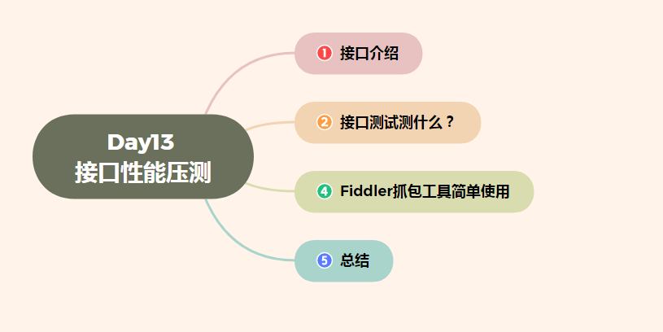

# Day13 接口性能压测--接口介绍、接口测试测什么？、Fiddler抓包工具简单使用、总结

[TOC]





>  本篇主要讲接口测试及接口性能压测的相关内容
>
> web压测工具LoadRunner可以看我的专栏有讲解

#  接口介绍

**接口测试**（复习一下~）

接口测试是测试系统组件间接口的一种测试。接口测试主要用于检测外部系统与系统之间以及内部各个子系统之间的交互点。测试的重点是要检查数据的交换，传递和控制管理过程，以及系统间的相互逻辑依赖关系等。

> 简单理解

接口测试就是验证入参和对应出参信息是否满足或符合要求。 接口测试主要检查接口返回的接口数据是否正确、是否和接口文档中定义的一致。

**接口测试步骤**

1. 获取接口地址(根据接口文档/根据抓包工具抓取)
2. 分析接口请求数据(入参、处理、出参）
3. 构造接口数据
4. 编写测试用例
5. 根据工具或者代码执行接口，比对结果即可

### 1.1 常见的接口

接口是指外部系统与系统之间以及内部各子系统之间的交互点。

**程序内部接口**

功能和功能之间、模块和模块之间

> 登录和发帖、登录下订单

用户界面

**系统外部接口**

第三方登录

> QQ登录、微信登录、手机号登录

第三方支付

> 支付宝支付、微信支付、银行卡支付

### 1.2　接口的组成

接口地址可以通过接口文档获得，也可通过抓包工具获得。 以微信公众平台API接口文档为例


# 接口测试测什么？

### 第一：可用性测试

第一：可用性测试

根据约定的协议、方法、格式、内容等传输数据到接口，经处理后返回期望的结果。这里分为三个点：

1，接口功能是否正确。

2，实现返回值除了内容要正确，类型也要正确，保证调用方能够正确的解析。

3，参数的边界值等价类的测试。

### 第二：错误和异常处理测试

第二：错误和异常处理测试。

1，这里主要分为输入异常值。比如空值，字段值没超过约定长度等等，接口能否正确处理，且按预期响应。

2，输入错误的参数，接口能正确处理，并按预期响应。

3，多输入少输入参数，接口能正确处理，并且按照预期响应。

4，错误传输的数据格式，比如json格式写成form格式，是否能够正确处理。

### 第三：安全性测试

第三：安全性测试

主要是指传输数据的安全安全性，这里主要分为四个点：

1，敏感数据，比如说密码，秘钥等是否加密传输。

2，返回数据是否含有敏感数据，比如说用户密码，完整的用户银行账号信息。

3，接口是否对传入的数据进行安全校验，比如身份ID加token，类似校验。

4，接口是否防止恶意请求，比如大量伪造请求接口致使服务器崩溃。

### 第四：性能测试

第四：性能测试

比如接口的响应时间，并发处理能力，压测处理情况，这里分为三个点：

1，并发请求相同的接口，特别是POST的请求接口的处理情况，比如插入了相同的记录，导致数据出错，引发系统故障。

2，接口响应时间长，在用户可忍受的范围内。

3，对于请求量大的接口做压测，确定最大的瓶颈点是否满足当前业务需要。


# Fiddler抓包工具简单使用

### Fiddler的安装

官网链接:https://www.telerik.com/fiddler 进入官网首页 


页面跳转后，先安装，一路下一步即可

Fiddler安装一路下一步即可

> 这里主要演示Fiddler 的Windows版本


### fiddler基本应用

#### 设置过滤

Filters菜单--->勾选Use Filters

在第二个下拉框中选择Show only the following Hosts--->只显示以下地址的请求和响应数据

Actions--->Run Filterset Now立即执行


### 查看请求和响应数据

判断GET请求和POST请求


【<>】符号的为GET请求

绿色向右的小箭头为POST请求

选中请求，右侧Inspectors

- **请求**

在Headers和Raw中可以查看请求行和请求头部信息

在Textview或者WebForms中查看请求实体数据

- **响应**

在下面的Headers/Raw中查看响应行和响应头部信

在下面的Textview中查看响应实体部分数据


### fiddler修改接口请求数据

原理：越过界面验证，测试服务器端

举例：会员添加功能中手机号的正确性验证

> 在Fiddler中做过滤（断点） 点击【会员添加】按钮---->并填写相应参数 点击【确定】按钮 选中拦截的请求（红色的T） 选择Inspectors--->找到请求要发送的数据--->对其进行修改 重新发送接口请求：Run to Completion 关闭断点：Disabled


#### 过滤数据

选择 Fiddler 菜单中 Rules--->Automatic Breakpoints--->Before Requests，设置断点，也可以使用快捷键 F11；

如果底部显示一个红色标识，证明设置断点成功了


修改数据并发送


### Composer的应用

可以通过Composer模拟发送接口请求和数据，不用特意先拦截下来再去修改数据

点击右侧Composer--->Options--->Tear off 让它单独显示


点击Parsed，可以手动输入，也可把我们抓到的包拖动到Composer中，进行相应的修改；

点击【Execute】发送请求。


# 总结：

**接口测试测什么？**

```
第一：可用性测试
第二：错误和异常处理测试
第三：安全性测试
第四：性能测试

```


本篇结合Day 8 一起学习、也是接口测试的补充和接下来讲解**接口性能压测**的基础

[Day8 接口测试详解–接口概述、什么是接口测试、常用的接口测试工具、RESTFUL架构_老板来片烤面包的博客-CSDN博客](https://blog.csdn.net/gregcsdn/article/details/130942256)


> 正常工作中简单的验证接口的输入输出推荐Postman，操作简单对新人友好
>
> 进阶一点学习抓包工具Fiddler，看网络抓包来分析缺陷
>
> 做接口性能压测就需要，使用Jmeter工具了


