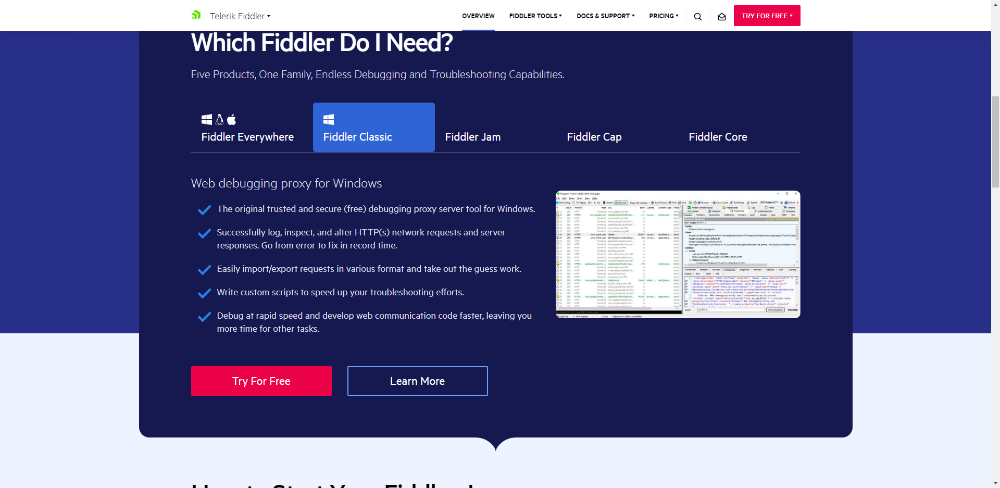
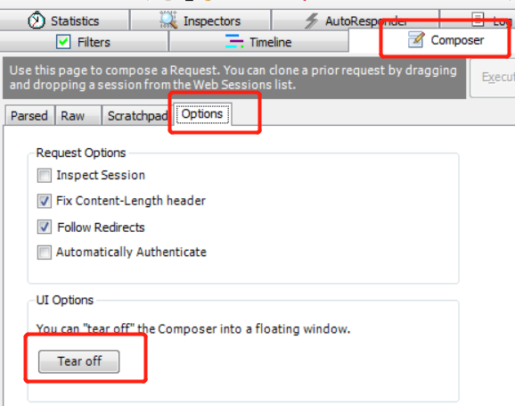
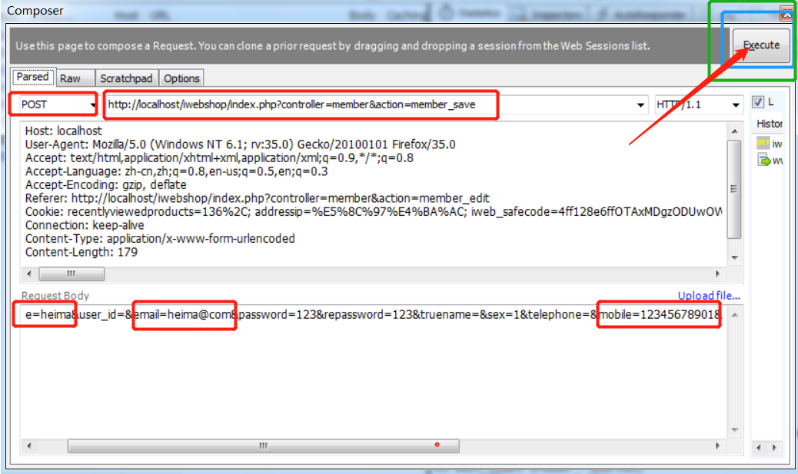

# Day14 工具篇--C站最全fiddler讲解（Fiddler基础、安装、界面讲解、Fiddler捕获请求、Fiddler实现接口测试）

[TOC]


## 一、 Fiddler基础

### 1、什么是Fiddler

Fiddler是强大且好用的Web调试工具之一，它能记录客户端和服务器的http和https请求，允许你监视，设置断点，甚至修改输入输出数据。

### 2、 Fiddler的运行机制

本机上监听8888端口的HTTP代理。

对于PC端Fiddler启动的时候默认IE的代理设为了127.0.0.1:8888，而其他浏览器是需要手动设置的，所以如果需要监听PC端Chrome网络请求，将其代理改为127.0.0.1:8888就可以监听数据了。

 

### 3、Fiddler 抓包简介

Fiddler是通过改写HTTP代理，让数据从它那通过，来监控并且截取到数据。在打开它的那一瞬间，它就已经设置好了浏览器的代理了。当你关闭的时候，它又帮你把代理还原了。


## 二、 安装Fiddler

### Fiddler的安装

官网链接:https://www.telerik.com/fiddler 进入官网首页 



页面跳转后，先安装，一路下一步即可

Fiddler安装一路下一步即可

> 这里主要演示Fiddler 的Windows版本


## 三、 Fiddler的界面

### 1 、Fiddler主界面

 

### 2 、Fiddler会话区

 

```
从左到右：

#：顺序号，按照抓包的顺序从1递增

 Result：HTTP状态码

 Protocol：请求使用的协议，如HTTP/HTTPS/FTP等

 HOST：请求地址的主机名或域名

 URL：请求资源的位置（路径）

 Body：请求大小

 Caching：请求的缓存过期时间或者缓存控制值

 Content-Type：请求响应的类型

 Process：发送此请求的进程

 Comments：备注

 Custom：自定义值
```


### 3、 Fiddler的HTTP统计视图

 

 **请求总数、请求包大小、响应包大小。**

 **请求起始时间、响应结束时间、握手时间、等待时间、路由时间、TCP/IP、传输时间。**

 **HTTP状态码统计。**

 **返回的各种类型数据的大小统计以及饼图展现。**

### 4 、Fiddler的监控面板（Inspector）

 

```
 Headers：信息头，若用手机和电脑打开的页面不一样，与此设置有关。

 TextView：以文本形式显示请求或响应的数据。

 SyntaxView：同TextView，但有语法着色。

 WebForms：请求部分以表单形式显示所有的请求参数和参数值；响应部分与TextView内容是一样的。

 HEX：十六进制形式的数据。

 Auth：显示认证信息，如Authorization。

 Cookies：显示所有cookies。

 Raw：显示Headers和Body数据。

 JSON：请求或响应数据是json格式时，json形式显示请求或响应内容。

 XML：请求或响应数据是xml格式，xml形式显示请求或响应内容。
```


### 5 、Fiddler的Request消息结构

 

```
 POST：请求方式，HTTP/1.1表示协议与版本

 Accept：浏览器端可接受的媒体类型

 Referer：告诉服务器是从哪个页面链接过来的

 Accept-Language：语言类型

 Accept-Encoding：压缩方法

 User-Agent：客户端使用的操作系统和浏览器的名称和版本

 Connection：网页打开后，客户端和服务器之间用于传输数据的TCP连接是否关闭，keep-alive表示不会关闭，客户端再次访问这个服务器上的网页，会继续使用这一条已经建立的连接

 COOKIE：将cookie值发送给服务器
```


### 6、Fiddler的Response的消息结构

 

 

```
HTTP/1.1：协议，200：状态码，OK响应消息文本

 Cache-Control：private的消息不能被共享缓存处理，对于其他用户的请求无效

 Content-Type：charset：告知客户端服务器本身响应的对象的类型和字符集

 Expires：浏览器会在指定过期时间内使用本地缓存

 Last-Modified：客户端请求的资源文件在服务器端最后被修改的时间

 Date：生成消息的具体时间和日期

 Content-Length：正文长度

 Set-Cookie：把cookie发送到客户端
```


## 四、 Fiddler捕获请求

 使用真实的IP或域名

 Fiddler的Response乱码

 

这是因为HTML被压缩了， 通过两种方法去解压缩。

方法一：点击红框内容“Response body is encouded.Click to decode.”

方法二：选中工具栏中的"Decode"，这样会自动解压缩。

 Fiddler不仅能监听HTTP请求而且默认情况下也能捕获到HTTPS请求

Too-> Fiddler Option -> HTTPS下面进行设置，勾选上“Decrypt HTTPS traffic”

如果不必监听服务器端得证书错误可以勾上“Ignore server certification errors”


## 五、 使用Fiddler实现接口测试

### 1 、测试登录接口

1.  抓包，完成后退出抓包
2.  选中需要测试的url，找到并复制请求部分raw中的cookie整行
3.  重新启动Fiddler
4.  Composer→Parsed
5. Composer
6. 创作
7. 输入越权访问的url
8. 粘贴Cookie
9. 执行越权url
10. Execute

可以通过Composer模拟发送接口请求和数据，不用特意先拦截下来再去修改数据

点击右侧Composer--->Options--->Tear off 让它单独显示



点击Parsed，可以手动输入，也可把我们抓到的包拖动到Composer中，进行相应的修改；

点击【Execute】发送请求。




### 2 、传递非法参数

 修改参数为非法数据，使用此方式伪造或篡改数据。

 【例】测试Webtours处理信用卡号的接口。

方法1：

1. 在Fiddler中设置抓包
2. 选择url，F2，修改参数
3. 回放url
4. 查看响应数据或后台数据

方法2

1. Composer
2. 选择get或post方法
3. 输入url，url后应携带/
4. post方法应添加
5. Content-Type: application/x-www-form-urlencoded
6. 参数
7. get方法直接在url/后写
8. ?参数名1=值1&参数名2=值2
9. post方法在RequestBody中写
10. 参数名1=值1&参数名2=值2
11. Execute
12. 查看响应数据或后台数据


 **响应中文乱码问题**

- 进入注册表
- HKEY_CURRENT_USERSoftwareMicrosoftFiddler2
- 新建字符串值：HeaderEncoding，值设置为GBK
- 重启Fiddler

### 3 、伪造数据

 设置断点修改Request，使用此方式伪造或篡改数据。

 【例】攻击Webtours付款接口。

- 无需截获数据流（抓包），在浏览器中打开将数据（如价格）发给服务器的页面，停止操作
- 在Fiddler中设置抓包和拦截请求
- 返回软件操作，给服务器发送数据
- 拦截完成，篡改将要发送的数据，点击Break on Response，点击Run to Completion
- 在Fiddler中取消抓包和拦截请求
- 继续后续操作，到完成
- 查看后台数据

 支付漏洞与解决方案

漏洞1：在支付过程中直接发送含有支付金额的数据包

- 让开发不要在数据包中加入价格和数量等敏感值。

漏洞2：没有对购买数量进行限制

- 严格控制购买数量的大小，不允许数量为负数，控制总支付金额是一个正常的数。

漏洞3：程序的异常处理

- 指支付的数据包异常的程序的错误处理。
- 这种异常可以是数据与KEY不符，支付的金额有错误，购买的数量不正确等。
- 程序的异常处理出现的原因主要是开发人员对出现异常后的处理不当造成的。


## 六、Fiddler查阅补充：

> 通常学完前5个工作上基本能解决80%的问题了
>
> 下面是对前面内容的补充讲解

### 1、Fiddler界面补充

Fiddler想要抓到数据包，要确保Capture Traffic是开启，在File –> Capture Traffic。开启后再左下角会有显示，当然也可以直接点击左下角的图标来关闭/开启抓包功能。

 

Fiddler开始工作了，抓到的数据包就会显示在列表里面，下面总结了这些都是什么意思：

 

| 名称                                  | 含义                                                       |
| ------------------------------------- | ---------------------------------------------------------- |
| #                                     | 抓取HTTP Request的顺序，从1开始，以此递增                  |
| Result                                | HTTP状态码                                                 |
| Protocol                              | 请求使用的协议，如HTTP/HTTPS/FTP等                         |
| Host                                  | 请求地址的主机名                                           |
| URL                                   | 请求资源的位置                                             |
| Body                                  | 该请求的大小                                               |
| Caching                               | 请求的缓存过期时间或者缓存控制值                           |
| Content-Type                          | 请求响应的类型                                             |
| Process                               | 发送此请求的进程：进程ID                                   |
| Comments                              | 允许用户为此回话添加备注                                   |
| Custom                                | 允许用户设置自定义值                                       |
| 图标                                  | 含义                                                       |
|                 | 请求已经发往服务器                                         |
|                 | 已从服务器下载响应结果                                     |
|                 | 请求从断点处暂停                                           |
|                 | 响应从断点处暂停                                           |
|                 | 请求使用 HTTP 的 HEAD 方法，即响应没有内容（Body）         |
|  | 请求使用 HTTP 的 POST 方法                                 |
|                 | 请求使用 HTTP 的 CONNECT 方法，使用 HTTPS 协议建立连接隧道 |
|                | 响应是 HTM格式                                             |
|                | 响应是一张图片                                             |
|                | 响应是脚本格式                                             |
|                | 响应是 CSS 格式                                            |
|                | 响应是 XM格式                                              |
|                | 响应是 JSON 格式                                           |
|                | 响应是一个音频文件                                         |
|                | 响应是一个视频文件                                         |
|                | 响应是一个 SilverLight                                     |
|                | 响应是一个 FLASH                                           |
|                | 响应是一个字体                                             |
|                | 普通响应成功                                               |
|                | 响应是 HTTP/300、301、302、303 或 307 重定向               |
|                | 响应是 HTTP/304（无变更）：使用缓存文件                    |
|                | 响应需要客户端证书验证                                     |
|                | 服务端错误                                                 |
|                | 会话被客户端、Fiddler 或者服务端终止                       |

 

 

### 2、 Statistics 请求的性能数据分析

>statistics
>英
>/stəˈtɪstɪks/
>
>美
>/stəˈtɪstɪks/
>
>n.统计数字;统计资料;统计学;(一项)统计数据
>statistic的复数

好了。左边看完了，现在可以看右边了

随意点击一个请求，就可以看到Statistics关于HTTP请求的性能以及数据分析了（不可能安装好了Fiddler一条请求都没有…）：

 

 

### 3、 Inspectors 查看数据内容

> inspectors
> 英
> /ɪnˈspɛktəz/
>
> 美
> /ɪnˈspɛktərz/
>
> n.检查员;视察员;巡视员;(警察)巡官;(英国公共汽车或火车上的)查票员
> inspector的复数

Inspectors是用于查看会话的内容，上半部分是请求的内容，下半部分是响应的内容：

 

 

### 4、 AutoResponder 允许拦截指定规则的请求

**AutoResponder允许你拦截指定规则的请求，并返回本地资源或Fiddler资源，从而代替服务器响应。**

看下图5步，我将“baidu”这个关键字与我电脑“f:UsersYukiOPicturesboy.jpeg”这张图片绑定了，点击Save保存后勾选Enable rules，再访问baidu，就会被劫持。

这个玩意有很多匹配规则，如：

1. 字符串匹配（默认）：只要包含指定字符串（不区分大小写），全部认为是匹配

| 字符串匹配（baidu）                               | 是否匹配 |
| ------------------------------------------------- | -------- |
| [http://www.baidu.com](http://www.baidu.com/)     | 匹配     |
| [http://pan.baidu.com](http://pan.baidu.com/)     | 匹配     |
| [http://tieba.baidu.com](http://tieba.baidu.com/) | 匹配     |

 

2. 正则表达式匹配：以“regex:”开头，使用正则表达式来匹配，这个是区分大小写的

| 字符串匹配（regex:.+.(jpg \| gif \| bmp ) $）                | 是否匹配 |
| ------------------------------------------------------------ | -------- |
| [http://bbs.fishc.com/Path1/query=foo.bmp&bar](http://bbs.fishc.com/Path1/query=example.bmp) | 不匹配   |
| http://bbs.fishc.com/Path1/query=example.gif                 | 匹配     |
| http://bbs.fishc.com/Path1/query=example.bmp                 | 匹配     |
| http://bbs.fishc.com/Path1/query=example.Gif                 | 不匹配   |

 

 

 

### 5、Composer 自定义请求发送服务器

Composer允许自定义请求发送到服务器，可以手动创建一个新的请求，也可以在会话表中，拖拽一个现有的请求

Parsed模式下你只需要提供简单的URLS地址即可（如下图，也可以在RequestBody定制一些属性，如模拟浏览器User-Agent）

 

 

 

### 6、Filters 请求过滤规则

Fiters 是过滤请求用的，左边的窗口不断的更新，当你想看你系统的请求的时候，你刷新一下浏览器，一大片不知道哪来请求，看着碍眼，它还一直刷新你的屏幕。这个时候通过过滤规则来过滤掉那些不想看到的请求。

 

勾选左上角的Use Filters开启过滤器，这里有两个最常用的过滤条件：Zone和Host

1、Zone 指定只显示内网（Intranet）或互联网（Internet）的内容：

 

 

2、Host 指定显示某个域名下的会话：

 

如果框框为黄色（如图），表示修改未生效，点击红圈里的文字即可

 

 

### 7、Timeline 请求响应时间

在左侧会话窗口点击一个或多个（同时按下 Ctr键），Timeline 便会显示指定内容从服务端传输到客户端的时间：

 

### 8、 Fiddler 设置解密HTTPS的网络数据

Fiddler可以通过伪造CA证书来欺骗浏览器和服务器。大概原理就是在浏览器面前Fiddler伪装成一个HTTPS服务器，而在真正的HTTPS服务器面前Fiddler又装成浏览器，从而实现解密HTTPS数据包的目的。

解密HTTPS需要手动开启，依次点击：

1. Tools –> Fiddler Options –> HTTPS

 

2. 勾选Decrypt HTTPS Traffic

 

3. 点击OK

 

### 9、Fiddler 抓取Iphone / Android数据包

想要Fiddler抓取移动端设备的数据包，其实很简单，先来说说移动设备怎么去访问网络，看了下面这张图，就明白了。

 

可以看得出，移动端的数据包，都是要走wifi出去，所以我们可以把自己的电脑开启热点，将手机连上电脑，Fiddler开启代理后，让这些数据通过Fiddler，Fiddler就可以抓到这些包，然后发给路由器（如图）：

 

1. 打开Wifi热点，让手机连上（我这里用的360wifi，其实随意一个都行）

 

2. 打开Fidder，点击菜单栏中的 [Tools] –> [Fiddler Options]

 

3. 点击 [Connections] ，设置代理端口是8888， 勾选 Allow remote computers to connect， 点击OK

 

4. 这时在 Fiddler 可以看到自己本机无线网卡的IP了（要是没有的话，重启Fiddler，或者可以在cmd中ipconfig找到自己的网卡IP）

 

 

5. 在手机端连接PC的wifi，并且设置代理IP与端口（代理IP就是上图的IP，端口是Fiddler的代理端口8888）

 

 

6. 访问网页输入代理IP和端口，下载Fiddler的证书，点击下图FiddlerRoot certificate

 

【注意】：如果打开浏览器碰到类似下面的报错，请打开Fiddler的证书解密模式（[Fiddler 设置解密HTTPS的网络数据](#l02)）

No root certificate was found. Have you enabled HTTPS traffic decryption in Fiddler yet?

     

     

 

7. 安装完了证书，可以用手机访问应用，就可以看到截取到的数据包了。（下图选中是布卡漫画的数据包，下面还有QQ邮箱的）

 

 

### 10、Fiddler 内置命令与断点

Fiddler还有一个藏的很深的命令框，就是眼前，我用了几年的Fiddler都没有发现它，偶尔在别人的文章发现还有这个小功能，还蛮好用的，整理下记录在这里。

FIddler断点功能就是将请求截获下来，但是不发送，这个时候你可以干很多事情，比如说，把包改了，再发送给服务器君。还有balabala一大堆的事情可以做，就不举例子了。

 

| 命令                                  | 对应请求项   | 介绍                                                         | 示例                                 |
| ------------------------------------- | ------------ | ------------------------------------------------------------ | ------------------------------------ |
| ?                                     | All          | 问号后边跟一个字符串，可以匹配出包含这个字符串的请求         | ?google                              |
| >                                     | Body         | 大于号后面跟一个数字，可以匹配出请求大小，大于这个数字请求   | >1000                                |
| <                                     | Body         | 小于号跟大于号相反，匹配出请求大小，小于这个数字的请求       | <100                                 |
| =                                     | Result       | 等于号后面跟数字，可以匹配HTTP返回码                         | =200                                 |
| @                                     | Host         | @后面跟Host，可以匹配域名                                    | @www.baidu.com                       |
| select                                | Content-Type | select后面跟响应类型，可以匹配到相关的类型                   | select image                         |
| cls                                   | All          | 清空当前所有请求                                             | cls                                  |
| dump                                  | All          | 将所有请求打包成saz压缩包，保存到“我的文档Fiddler2Captures”目录下 | dump                                 |
| start                                 | All          | 开始监听请求                                                 | start                                |
| stop                                  | All          | 停止监听请求                                                 | stop                                 |
| 断点命令                              |              |                                                              |                                      |
| bpafter                               | All          | bpafter后边跟一个字符串，表示中断所有包含该字符串的请求      | bpafter baidu（输入bpafter解除断点） |
| bpu                                   | All          | 跟bpafter差不多，只不过这个是收到请求了，中断响应            | bpu baidu（输入bpu解除断点）         |
| bps                                   | Result       | 后面跟状态吗，表示中断所有是这个状态码的请求                 | bps 200（输入bps解除断点）           |
| bpv / bpm                             | HTTP方法     | 只中断HTTP方法的命令，HTTP方法如POST、GET                    | bpv get（输入bpv解除断点）           |
| g / [Go](http://lib.csdn.net/base/go) | All          | 放行所有中断下来的请求                                       | g                                    |

 

示例演示：

>

 

<

 

=

 

@

 

select

 

cls

 

dump

 

 

断点命令：

断点可以直接点击Fiddler下图的图标位置，就可以设置全部请求的断点，断点的命令可以精确设置需要截获那些请求。如下示例：

 

命令：

bpafter

  

bps

 

 

 

bpv

 

 

 

g / go

 

 

 

 

 

## 总结：

想要做好接口测试，Fiddler是基本功。

这里提一个面试题：你测试过程中使用Fiddler一般做什么？、Fiddler能做什么？

```
-->你测试过程中使用Fiddler一般做什么？、Fiddler能做什么？
1、Fiddler抓包检查接口数据
2、Statistics 请求的性能数据分析
3、 Inspectors 查看数据内容
4、 AutoResponder 允许拦截指定规则的请求
5、Composer 自定义请求发送服务器（做接口测试、传达非法参数、伪造数据）
6、Filters 请求过滤规则
7、Timeline 请求响应时间
8、 Fiddler 设置解密HTTPS的网络数据
9、Fiddler 抓取Iphone / Android数据包
10、Fiddler 内置命令与断点总结：
```


> Fiddler还有一个强大的功能是可以把抓到的接口输出成.jmx格式
>
> 之间用jmeter打开，极大的减少了写脚本的工作量
>
> 但是这个也有弊端，后期jmeter章节讲解


