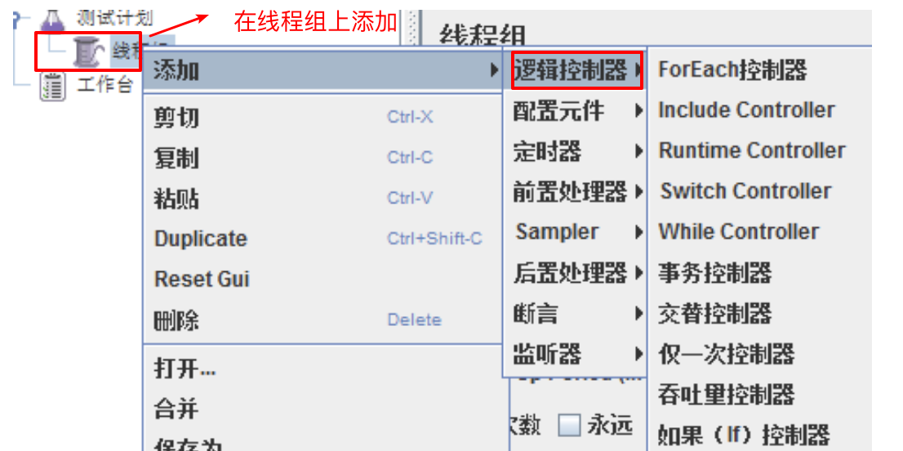
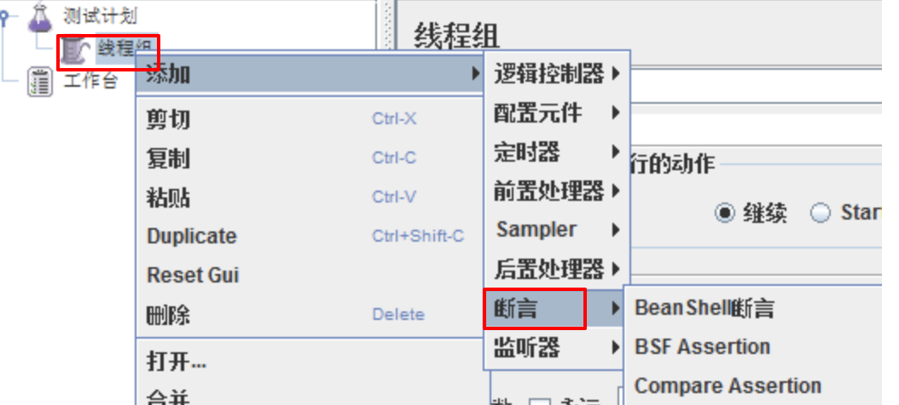

# Day16 工具篇——C站最全jmeter讲解（1）-Jmeter简介、Jmeter工具安装、Jmeter 基本使用流程、Jmeter 八大元件及执行顺序

[TOC]


# 一、Jmeter简介

## 1. Jmeter 概述

JMeter最初是由Apache软件基金会的Stefano Mazzocchi编写和开发的, 所以Jmeter也称为“Apache JMeter”，它是一个开源的，100%基于Java的应用程序，带有图形界面。

> Apache JMeter 是 100%纯 java 桌面应用程序，被设计用来测试客户端/服务器结 构的软件(例如 web 应用程序)。**它可以用来测试包括基于静态和动态资源程序 的性能**，例如静态文件，Java Servlets，Java 对象，数据库，FTP 服务器等等。 JMeter 可以用来在一个服务器、网络或者对象上模拟重负载来测试它的强度或 者分析在不同的负载类型下的全面性能。
>
> 另外，JMeter 能够通过**让你们用断言创建测试脚本来验证我们的应用程序是否 返回了我们期望的结果**，从而帮助我们回归测试我们的程序。为了最大的灵活性， JMeter 允许我们使用正则表达式创建断言。

Jmeter的主要功能有:

```
1. web自动化测试
2. 接口测试
3. 性能测试
4. 压力测试
5. 通过jdbc进行数据库测试
6. java测试
```

## 2. Jmeter的优缺点

**优点:**

```
1、开源工具，可扩展性非常好

2、高可扩展性，用户可自定义调试相关模块代码

3、精心简单的GUI设计，小巧灵活

4、完全的可移植性和100％纯java

5、完全swing和轻量组件支持（预编译的HAR使用javax.swing.*）包

6、完全多线程框架，允许通过多个线程并发取样以及单独的线程对不同的功能同时取样

7、支持脚本取样器
```

**缺点:**

```
1、 不支持IP欺骗
2、 使用JMeter无法验证JS程序，也无法验证页面UI，所以要须要和Selenium配合来完成Web2.0应用的测试
```

## 3. 了解：JDK、JRE、JVM

**JDK**

```
JDK概念：java开发工具包，程序员使用。包含JRE和JVM。
```

 **JRE**

```
JRE(java runtime environment)：JAVA程序运行环境，包含JVM和JVM运行时所需要的资源。是java编写的程序运行时需要的软件环境, 是提供给想运行java程序的用户使用的.
```

**JVM**

```
JVM(java virtualenv machine)：Java虚拟机
```

**JAVA跨平台原理【扩展】**

**java跨平台机制是: 一次编译,到处运行.**


> !!!!重点来了：

**总结： 对于测试人员，我们要记住，如果使用JMeter，必须要安装JDK或者JRE。**


# 二、Jmeter工具安装

## 1、官网下载地址:

http://jmeter.apache.org/download_jmeter.cgi

下载示意图


注意：

> 下载后，解压文件到任意目录，避免在一个有空格的路径安装Jmeter，这将导致远程测试出现问题。


## 2、启动JMeter的两种方式：

- 进入bin目录
  - 方式1: **双击 ApacheJMeter.jar文件(最常用);**
  - 方式2: 双击 Jmeter.bat文件(有黑窗口并且不能关闭,是服务端);
  - 方式3: linux 下启动Jmeter == meter.sh


## 3 、Jmeter常用目录文件介绍

### 3.1 Bin目录

存放可执行文件和配置文件

- Jmeter.bat：windows系统中JMeter的启动文件
- ApacheJMeter.jar Java环境下的JMeter启动文件
- Jmeter.log：日志文件
- Jmeter.sh：linux系统中JMeter的启动文件
- Jmeter.properties：系统配置文件
- Jmeter-server.bat：windows分布式测试要用到的服务器配置
- Jmeter-serve：linux分布式测试要用到的服务器配置

### 3.2 docs目录(了解开源)

> docs：是JMeter的java Doc，可打开api\index.html页面来查看;

### 3.3 printable_docs目录

> printable_docs的usermanual子目录下的内容是JMeter的用户手册文档，其中usermanual下**component_reference.html**是最常用到的核心元件帮助文档。


# 三、Jmeter 基本使用流程


## 1、主界面布局

JMeter的主界面布局分为标题栏、菜单栏、工具栏、树形标签栏和内容栏

```
标题栏：主要显示计划信息及JMeter版本。
菜单栏：全部的功能的都包含在菜单栏中。
工具栏：工具栏中的按钮在菜单栏都可以找到，工具栏就相当于菜单栏常用功能的快捷按钮
树形标签栏：树形标签栏通常用来显示测试用例（计划）相关的标签。
内容栏：配合树形标签栏显示，树形标签中点击哪个标签，内容栏中就显示相应的内容和操作。
```


组件

```
概念: Jmeter中功能点称为组件
```

元件

```
概念：相同类似功能组件的集合称之为元件.
```

> 常用的八大元件:
>
> 1. 逻辑控制器
> 2. 配置元件: 包含java默认值、http请求默认值、http表头管理器等等
> 3. 定时器(Timer): 包含同步定时器、泊松随时时间等
> 4. 前置(预)处理器: jdbc 预处理器、html链接解析器,用户参数等
> 5. 采样器(Sampler): 包含http请求、jdbc请求、邮件请求等
> 6. 后置处理器: 包含jdbc后处理器、xpath抽取器、正则表达式抽取器等
> 7. 断言
> 8. 监听器: 包含图表结果、查看结果树、汇总报告等


## 2.Jmeter的基本使用流程

需求：

```
1. 需求对我们学院查询执行100次，如何去做？
2. 50个请求同时请求如何操作？  
```

使用JMeter的解决方案

```
1. 添加【测试计划】
2. 基于添加的测试计划添加【线程组】，循环次数设置为100次
3. 在【取样器】中基于线程组添加**HTTP请求**  
4. 在【监听器】基于线程组添加【察看结果树】  
5. 在监听器基于线程组添加【聚合报告】 
```

### 2.1 创建测试计划


在测试计划的**名称**栏目修改名字后,**ctrl + s 保存**

### 2.2 设置请求三要素


### 2.3 运行并查看结果

**(1). 设置监听器和结果树**


 **(2). 查看运行结果**


## 3. 相关概念

### 3.1 TestPlan(测试计划)


在Jmeter中包含各种相互关联但为不同目的而设计的元素.

**测试计划可视化为用于运行测试的JMeter脚本**, 包含执行脚本的所有步骤。测试计划由测试元素组成，包括线程组，逻辑控制器，样本生成控制器，监听器，定时器，断言和配置元素等等。

每个测试计划中至少应有一个**线程组**。 我们可以根据要求添加或删除元素。

测试计划的作用：

```
1. 本次测试所需要的【组件】都是基于测试计划添加；
2. 本次测试所有组件的设置与执行都基于测试计划；

组件：完成指定功能代码段的封装；
```

选项(在这里我们只介绍我们会使用到的选项)

- **独立运行每个线程组：**

  ```
  进程：是每个正在运行的应用程序。
  线程：按照进程的指令去执行指定的代码。
  线程组（多线程）：多个线程的组合。
  线程组（多线程）的执行顺序是并行的。 
  
  勾选：让本次测试计划中所有线程组保持从上到下顺序执行
  ```

- **Add directory or jar to classpath：**

  ```
  加载第三方jar包；比如：测试数据库时使用，加载数据库驱动jar包。
  ```

**注意事项**

- 在运行测试计划前,一定要保存测试计划

- Jmeter文件或测试计划以.jmx扩展文件形式保存.JMX是一种基于开放测试的格式,它使测试计划能够在文本编辑器中启动.

  

### 3.2 Threads(User)线程组 【重点】


```
1. thread group(线程组): 通常添加使用的线程组,一般一个线程组可以看作一个虚拟用户组,其中每个线程为一个虚拟用户.
2. setup thread group: 一种特殊线程组, 可用于执行预测试操作,即执行测试前进行, 一般做初始化操作.
3. teardown thread group: 一种特殊的线程组, 可用于执行后操作,即执行测试结束后执行, 一般做结尾操作.
```

**(1)、 thread group(线程组)**


作用:

```
1. 添加测试中使用的大多数组件
```

在取样器错误后要执行的动作

```
- 继续: 取样器执行时出现错误时,请求不会停止,继续执行
- Start Next Thread Loop: 忽略错误, 线程当前循环错误,执行下一个循环
- 停止线程: 只限当前线程停止,不影响其他线程执行
- 停止测试: 当前执行的线程全部执行完毕后结束
- Stop Test Now: 立刻停止
```

线程属性

```
- 线程数：虚拟用户数
- Ramp-Up Period(in serconds)：启动虚拟全部用户数所需要的时间
- 循环次数 ：指定次数或勾线永远
- Delay Thread creation until needed: 默认不勾选,测试开始时,所有线程被创建完.若勾选,线程会在需要合适时间进行创建.
- 调度器：勾选后，调度器配置才能使用；
```

调度器配置

```
- 持续时间（秒）：设置脚本压测持续时间
- 启动延迟（秒）：启动延迟时间
- 启动时间: 设置启动时间和启动延迟冲突.如果启动延迟设置后,启动时间被忽略.
- 结束时间: 设置脚本运行结束时间,和持续时间冲突,若有持续时间,结束时间会被忽略
```

> **提示：**为了理解setup thread、teardown thread两个线程组我们结合案例理解下

**(2) 案例**

**需求:**

```
通过thread group、setup thread group、teardown thread group 三个线程组去访问去访问查询所有学院接口
```

效果图


1. 需求组件：

```
1. 基于测试计划添加【线程组】  
2. 基于线程组添加【HTTP请求】
3. 基于测试计划添加【setup thread group】线程组
4. 基于setup thread group添加HTTP请求
5. 基于测试计划添加【teardown thread group】线程组
6. 基于teardown thread group添加HTTP请求
7. 基于测试计划添加【察看结果树】
```

2. 组件设置细节：

```
1. 测试计划勾选独立运行线程组 
2. HTTP请求：服务器地址 http://127.0.0.1:8000/api/departments/
3. HTTP请求: 修改HTTP请求名称，以做区分
```

3. 结论

```
经过测试我们发现线程组的执行顺序是: setup thread group、thread group、 teardown thread group 
```

### 3.3 Http请求

添加http请求


http界面


(1)、 作用:

```
1. 模拟前端或第三方软件向服务器发送请求;
2. 设置请求时的方法和参数数据;
```

(2)、 参数详解：

```
1. 名称：本属性用于标识一个取样器，建议使用一个有意义的名称。
2. 服务器名称或IP ：HTTP请求发送的目标服务器名称或IP地址。
3. 端口号：目标服务器的端口号，默认值为80 。
4. 协议：向目标服务器发送HTTP请求时的协议,可以是http或者是https ,默认值为http 。
5. 方法：发送HTTP请求的方法，可用方法包括GET、POST、PUT、DELETE。
6. Content encoding ：内容的编码方式，默认值为iso8859；一般设置【UTF-8】
7. 路径：目标URL路径（不包括服务器地址和端口）
8. 同请求一起发送参数:请求时需要传递参数，如：学院资源list查询
         http://127.0.0.1:8000/api/departments/?$dep_id_list=T01,T02,T03
         参数名称：【$dep_id_list】
         参数值：T01,T02,T03
```

(3)、 Body Data选项作用：

```
1.新增或更新时需要传递JSON报文；如学院新增是的JSON报文填写位置：
       {
          "data": [
                      {
                        "dep_id": "T01",
                        "dep_name": "Test学院",
                        "master_name": "Test-Master",
                        "slogan": "Here is Slogan"
                      }
                  ]
        }

    2. 【注意】：新增和更新时传入报文也需要设置Content-Type:application/json   
                 告诉服务器我传的数据格式为JSON格式；  
                 设置地点：配置元件-->HTTP信息头管理器（用到的时候我们在讲解）
```

HTTP请求总结：

```
1. 接口完整请求地址
2. JSON报文存放地址
3. 设置默认请求数据格式
```

### 3.4 查看结果树


(1)、  作用：

```
1.查看请求服务器时的请求信息;
2.查看服务器响应数据;
3.记录信息到指定文件;
```

(2)、 说明：

```
1. 文件名：存放服务器响应后的状态信息； 如：e:\查询所有response.txt
2. 取样结果：服务器响应的信息头信息；比如：响应代码，响应数据大小
3. 请求：查看向服务器请求时的信息；比如：请求地址、方法、数据等
4. 响应数据：查看服务器响应的数据；比如：获取资源时，返回的JSON数据
```

察看结果树总结：

```
1. 查看请求
2. 查看响应
3. 存储请求状态信息
```


# 四、Jmeter 八大元件及执行顺序


JMeter的主要元件:

- 控制器(Controllers)
- 监听器(Listeners)
- 计时器(Timers)
- 配置元素(Configuration Elements)
- 预处理器元素(Pre-Processor Elements)
- 后处理器元素(Post-Processor Elements)

------

## 1. 元件作用域及执行顺序

jmeter是一个开源的性能测试工具，它可以通过鼠标拖拽来随意改变元件之间的顺序以及元件的父子关系，那么随着它们的顺序和所在的域不同，它们在执行的时候，也会有很多不同.

**jemter主要依靠测试计划中元件相对位置,来确定作用域.**

元件的肤质关系及元件本身类型决定test plan中各元件的执行顺序;元件在test plan中位置不同,可能导致该元件有很大的行为差异.

### 1.1 元件作用域

在jmeter中，元件的作用域是靠test plan的树形结构中元件的父子关系来确定的，其原则如下：

```
1）sampler不与其他元件相互作用，因此不存在作用域问题

2）Logic Controller只对其子节点中的sampler和Logic Controller作用

3）除sampler和Logic Controller外的其他元件，如果是某个sampler的子节点，则该元件仅对其父节点作用

4）除sampler和Logic Controller外的其他元件，如果其父节点不是sampler，则其作用域是该元件父节点下的其他所有后带节点（包括子节点，子节点的子节点等）
```

jmeter中共有8类可被执行的元件（test plan和thread group不属于元件），其中，sampler（取样器）是不与其他元件发生交互的作用的元件，Logic Controller（逻辑控制器）只对其子节点的sampler有效，而其他元件需要与sampler等元件交互。

**Config Elements（配置元件）：**影响其范围内的所有元件

**Pre-porcessors（前置处理器）：**在其作用范围内的每一个sampler元件之前执行

**Timer（定时器）：**对其作用范围内的每一个sampler有效

**Post-porcessors（后置处理器）：**在其作用范围内的每一个sampler元件之后执行

**Assirtions（断言）：**对其作用范围内的每一个sampler元件执行后的结果执行校验

**Listener（监听器）：**收集其作用范围内的每一个sampler元件的信息并且呈现出来

### 1.2 执行顺序

```
在同一个作用域范围内,测试计划中的元件按照一下顺序执行:
1.配置元件
2.前置处理器
3.定时器
4.取样器
5.后置处理器
6.断言
7.监听器
```

**注意:**

1. Pre-porcessors、Post-porcessors和Assirtions等元件仅对Sampler作用，如在它们作用域内没有任何Sampler，则不会被执行；

2. 如果在同一作用域范围内有多个同一类型的元件，则这些元件按照它们在test plan中的**上下顺序**依次执行

## 2. 八大可执行元件

### 2.1. 控制器(Controllers)

控制器分为两大类: 

- 取样器
- 逻辑控制器

作用: 用这些元件驱动处理一个测试

**取样器(Sampler)**

 

是性能测试中向服务器发送请求，记录响应信息，记录响应时间的最小单元. JMeter 原生支持多种不同的sampler , 每一种不同类型的 sampler 可以根据设置的参数向服务器发出不同类型的请求.

常用的sampler:

```
1) HTTP请求
2) JDBC Request 
3) Debug Sampler
```

 **逻辑控制器**



包含两类元件:

- 一类是控制Test Plan中Sampler节点发送请求的逻辑顺序控制器，常用的有：If Controller、Swith Controller、Loop Controller、Random Controller等
- 另一类是用来组织和控制Sampler节点的，如Transaction Controller、Throughput Controller等

### 2.2 监听器


监听器是对测试结果进行处理和可视化展示的一系列组件.

常用的组件:

```
1) 察看结果树
2) 聚合报告 
3) 断言结果 
```

### 2.3. 定(计)时器


作用:  设置操作之间的等待时间. 等待时间是性能测试中常用的控制客户端QPS的手段.

常用:

```
1) Synchronizing Timer 

同步定时器
```


### 2.4.  配置元件（config Element）


作用: 设置相关请求的静态配置.不用每次都重复配置.

常用的:

```
1) CSV Data Set Config （csv数据集配置）
2) HTTP请求默认值
3) HTTP信息头管理器      
```

### 2.5.  前置处理器（Per Processors）


作用: 在实际请求发出前对即将法术的请求进行特殊处理.

例如：Count处理器可以实现自增操作，自增后生成的的数据可以被将要发出的请求使用，而HTTP URL Re—Writing Modifier处理器则可以实现URL重写

```
1) 用户参数 
```

### 2.6. 后置处理器（Post Processors）


作用: 对sampler发出请求后得到服务器响应进行处理.一般用来提取响应的特定数据.

常用:

```
1) 正则表达式提取器 
2) XPath Extractor （xpath提取器）
```

### 2.7. 断言（Assertions）



作用: 用于检查测试中得到的响应数据是否符合预期.Assertions一般用来设置检查点，用以保证性能测试过程中的数据交互与预期一致

常用:

```
1) 响应断言 
```

**注意: test plan和thread group不属于元件**


# 总结

1. **对于测试人员，我们要记住，如果使用JMeter，必须要安装JDK或者JRE。**
2. 我们发现在Jmeter中测试计划是展开测试工作的源头,所以要掌握测试计划的创建、删除操作.
3. 在测试计划使用中我们根据不同需求创建不同的元件和组件, 来实现测试计划. 
4. 元件是相似功能组件的集合,能够便于管理组件,而组件是某个功能的在Jmeter中的实现.

5. 测试计划中每个线程组就是虚拟的一组用户,每个线程就是一个虚拟用户,对于每个用户发起的测试的请求,可以每次定义http请求


```
在同一个作用域范围内,测试计划中的元件按照一下顺序执行:
1.配置元件
2.前置处理器
3.定时器
4.取样器
5.后置处理器
6.断言
7.监听器
```

