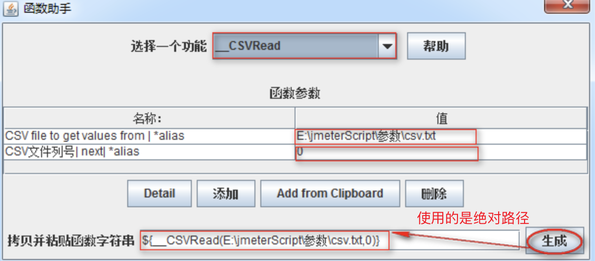
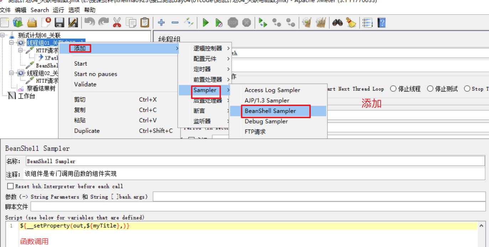

# Day17 工具篇——C站最全jmeter讲解（2）--

[TOC]


# 一、Jmeter实现参数化

## 1. 为什么要参数化

现在有下面需求:

```
学院-新增100条数据:
    1) 请求方法：POST
    2) 请求地址：http://127.0.0.1:8000/api/departments/
    3) 请求JOSN报文：
    4) 调用传入的json串如下（可新增多条，之间用,隔开）：
        {
            "data": [
                    {
                        "dep_id": "T01",
                        "dep_name": "Test学院",
                        "master_name": "Test-Master",
                        "slogan": "Here is Slogan"
                    }
              ]
        }
```

### 思考

如何快速实现??

## 2. 参数化概述

### 2.1 Jmeter参数化的概念

当使用JMeter进行测试时，测试数据的准备是一项重要的工作。若要求每次迭代的数据不一样时，则需进行参数化，然后从参数化的文件中来读取测试数据.

**参数化就是动态的获取或设置数据.**

> **参数化**：是自动化测试脚本的一种常用技巧，可将脚本中的某些输入使用参数来代替,在脚本运行时指定参数的取值范围和规则。
>
> 例如登录时利用GET/POST请求方式传递参数的场景.
>
> 脚本在运行时，根据需要选取不同的参数值作为输入，该方式称为**数据驱动测试**（Data Driven Test），而参数的取值范围被称为**数据池**（Data Pool）。

### 2.2 参数化的四种方式及使用场景对比

|      | 参数化                                 | 使用场景                                                     |
| ---- | -------------------------------------- | ------------------------------------------------------------ |
| 1    | CSV Data Set Config（csv数据集配置）   | 适用于参数取值范围较大的时候使用，该方法具有更大的灵活性     |
| 2    | User Parameters（用户参数）            | 适用于参数取值范围很小的时候使用                             |
| 3    | User Defined Variables（用户定义变量） | 一般用于Test Plan中不需要随请求迭代的参数设置，如：Host、Port Number |
| 4    | 函数                                   | 可作为其他参数化方式的补充项，如：随机数生成的函数${__Random(,,)} |

## 3. CSV Data Set Config

```
概念：一种从外部读取数据功能的组件 
```

### 3.1 实施方案分析

```
1. 基于测试计划->线程组
2. 基于线程组->配置元件->CSV Data Set Config
3. 基于线程组->Sampler->HTTP请求
4. 基于测试计划->HTTP信息头管理器
5. 基于测试计划->监听器->察看结果树     
```

### 3.2 组件要点分析

```
1. 线程组:循环次数10
2. CSV Data Set Config 读取变量配置
3. HTTP请求：Body Data填写(JSON报文) 方法(POST)
4. 参数化引用格式：${参数名} 如：${dep_id}
5. HTTP信息头管理器：Content-Type:application/json;charset=utf-8
```

### 3.3 参数配置图


```
1. Filename:文件路径+文件名+后缀名    如：d:/a.txt;
2. File Encoding:文件编译字符编码，一般设置utf-8;
3. Vaiable Names:读取参数后保存的变量名称;
4. Delimiter:如文件中使用的是逗号分隔，则填写逗号；如使用的是TAB，则填写\t;
5. Allow quoted data: 是否允许引用数据，默认false，选项选为“true”的时候对全角字符的处理出现乱码 ;
6. Recycle on EOF？：是否循环读取参数文件内容；True是循环读取; False时,读取文件末尾就不在继续读取.
7. Stop thread on EOF?：当Recycle on EOF为False时（读取文件到结尾），停止进程，当Recycle on EOF为True时，此项无意义;
8. Sharing mode:共享模式，即参数文件的作用域.
```

### 3.4 添加http信息头管理器并进行参数配置

**作用: 服务器请求的数据格式.**


参数配置: 

```
1. Content-Type:指定请求信息格式-类型名称
2. application/json:指定请求信息为-JSON格式
3. charset=utf-8:字符编码
```

##### 3.5 添加http请求


### 3.6 总结

```
1. CSV Data Set Config 配置参数设置
2. 参数化引用格式
3. HTTP请求
4. HTTP信息头管理器作用与设置 
```

## 4. 用户定义变量

用户可根据需求自定义相应的变量，一般做全局变量使用。

```
分析：     
    1. 通过概念我们知道，【用户定义的变量】一般做全局变量使用，不适合参数需求量大时的选择
    2. 所以在这里我们不在使用，用户定义的变量去做我们学院新增时的解决方案
    3. 主要讲解下它做参数化时的使用步骤和方式
```

### 4.1 需求场景

```
1. 查询学院-指定：http://127.0.0.1:8000/api/departments/T02/ 
2. 接口查询指定的id(T02)采用参数动态获取方式
```

### 4.2 解决方案分

```
1. 参数化组件：用户定义的变量 (测试计划->线程组->配置元件->用户定义的变量)
2. 线程组 
3. 请求组件：HTTP请求 
4. 查看结果组件：察看结果树
```

### 4.3 效果图


```
1. 名称：变量名称(参数化引用时使用)
2. 值：变量的值(通过引用变量名称获取的值)
3. Description：备注说明
```

### 4.4 总结：

```
1. 一般做设置全局变量
2. 请求时附带少量参数需求使用
```

## 5. 用户参数

一种参数设置方式，用户可设置参数名称以及参数值;

```
我们使用用户参数作为参数化方式对学院新增10条记录问题进行实现
```

### 5.1 解决方案实施分析

```
1. 位置：测试计划-->线程组-->前置处理器-->用户参数 
2. 其他组件和CSV Data Set Config实现新增10个学院相同，去除 CSV Data Set Config组件    
```

### 5.2 组件要点分析

```
1. 线程组:注意是【线程数】为10
2. 用户参数：学院每个属性为一个参数名称;参数格式：可以是数字、字母、下划线开头，建议最好是实义单词
3. HTTP请求：Body Data填写(JSON报文) 方法(POST)
4. 参数化引用格式：${参数名} 如：${dep_id}
5. HTTP信息头管理器：Content-Type:application/json;charset=utf-8
```

### 5.3 用户参数配置


```
1. 添加变量：学院资源属性 (dep_id、dep_name、master_name、slogan)
2. 添加用户：每个线程为没一个用户
```

### 5.4 用户参数-总结：

```
1. 用户参数位置
2. 线程组设置
3. 引用参数化方式  
4. 用户参数适合满足少量参数化需求场景使用
```

## 6. 函数

**函数是完成某个指定功能代码的封装。**

```
1. 函数查找方式：函数助手对话框
       1) 菜单-选项->函数助手对话框
       2) Ctrl+Shift+F1
       3) 工具栏倒数第二个记事本图标
2. 函数在Jmeter中有非常多类型（计数函数、日期函数、随机函数...）
```

### 6.1 需求：

```
1. 查询学院-所有：http://127.0.0.1:8000/api/departments/
2. 查询10次，在每次请求地址后面增加访问记录数
    http://127.0.0.1:8000/api/departments/?num=1
    http://127.0.0.1:8000/api/departments/?num=2 
```

### 6.2 需求关键点分析

```
1. 起个计数参数名 如：num
2. 把计数参数名的值给参数化
3. 参数化的值使用计数函数(count)
```

### 6.3 实施方案

```
1. 基于测试计划添加线程组(循环次数10)
2. 基于线程组添加HTTP请求
3. 基于测试计划添加察看结果树
```

### 6.4 函数配置


```
1. 选择一个功能：选择_counter计数函数
2. 第一个参数：TRUE，每个用户有自己的计数器；FALSE，使用全局计数器 我们选FALSE
3. 点击生成
4. 选择复制生成的函数
```

### 6.5 函数的结果图


```
?num=${__counter(FALSE,)}

1. ?：问号后面一切东东，HTTP请求不做解析
2. num：为我们起的一个计数参数名称
3. ${__counter(FALSE,)}：为我们粘贴进来的函数作为值使用
```

### 6.6 函数总结:

```
1. 使用方便快捷
2. 经常配合固定参数使用 
```

## 7. 参数化方式总结

### 7.1 区别

```
1. CSV Data Set Config: 功能强大、适应各种迭代及多参复杂场景。
2. 用户参数：适应传递少量参数时使用
3. 用户定义的变量：和用户参数使用场景相似，不同在于一般做全局变量使用
4. 函数：功能强大，函数类型繁多，灵活度大，适应各种应用场景。
```

### 7.2  推荐

```
 1. CSV Data Set Config 
 2. 函数
```

# 二、Jmeter 从数据库中获取数据

------

## 目标

- 掌握使用Jmeter从数据库获取数据的方法；

------

## 为什么要使用Jmeter从数据库中获取数据？

```
1. 我们测试的软件项目所有的数据都存储在数据库
```

### 1. 思路分析

```
1) 连接数据库
2) 发送sql语句请求进行增删改查
3) 查看执行sql语句后的数据
4) 获取执行sql语句后的数据
```

**注意: Jmeter本身不具备直连数据库的功能,必须整合具备此功能的第三方实现.**

### 2. 案例

```
使用Jmeter连接学生管理项目数据库，统计学院资源表中记录数； 
数据库名：db.sqlite3
数据库位置：项目\studentManagementSystem\
学院数据库表名：departments
```

### 3. 效果图


**获取执行sql语句后的数据**


### 4. 操作步骤

#### 4.1 连接数据

添加数据库jar包, 添加数据库驱动


配置连接信息


#### 4.2 发送sql语句请求

```
 1) 添加-线程组
 2) 添加-JDBC Request
```

#### 4.3 查看执行sql语句响应数据

```
 1) 添加-察看结果树   
```

#### 4.4 获取执行sql语句后的数据

```
 1) 添加-Debug Sampler
```

### 5. 参数详解

#### 5.1 JDBC Connection Configuration 参数详解


```
1. Variable Name:数据库池名称【JDBC请求时要引用】
2. Database URL:jdbc:sqlite:E:\\课件\\项目\\studentManagementSystem\\db.sqlite3
         1) jdbc:sqlite:通过JDBC驱动连接sqlite数据库固定格式
         2) E:\\课件\\项目\\studentManagementSystem\\db.sqlite3：数据路径和数据库名
3. JDBC Driver class：org.sqlite.JDBC（sqlite驱动包内sqlite驱动的路径位置）
4. Username:(连接数据库用户名，如实填写,我们项目sqlite数据库用户名默认为空)
5. Password:(数据库密码，如实填写，如果密码为空不写)  
```

### 5.2 jdbc参数详解


**JDBC Request** 参数：Variable names 设置图 


```
1. Variable Name：数据库连接池的名字，需要与JDBC Connection Configuration的Variable Name【保持一致】
2. Query Type:Select Statement、Update Statement
    1) Select Statement:查询语句时使用
    2) Update Statement:(新增、更新、删除)语句时使用
3. Query: 填写的sql语句未尾不要加“;”  
4. Variable names：count 保存sql语句返回结果的变量名;  
```

### 练习

```
1. 通过Jmeter中JDBC请求使用SQL语句-新增1条学院
2. 通过Jmeter中JDBC请求使用SQL语句-更新新增学院
3. 通过Jmeter中JDBC请求使用SQL语句-删除更新学院
```

### 6. 数据库-总结：

```
1. JDBC驱动包
2. 数据库连接池配置
3. JDBC请求
4. Degbeg Sampler   
```

------

### 【扩展】对不同类型数据库配置

```
1. 针对企业内常用数据库如何基于Jmeter连接做个扩展
2. 数据库主要有：Mysql、Oracle
3. 各类型不同之处： 
    1. 数据库驱动包各不相同
    2. 数据库连接池配置各不同
```

### 1. MySQL数据库

```
1. MySQL驱动包
2. 数据库池配置
```

[MySQL连接驱动-jar包](..../img/mysql-connector.jar)

 **mysql-jdbc连接配置**


#### 注意

```
1. 127.0.0.1：为数据库服务器IP地址(根据实际项目数据库服务器IP更改)
2. 3306：为数据库端口号（根据项目实际实际数据库端口更改）    
3. xst_shop：为数据库名称（根据项目实际数据库名更改）
4. Username：为登陆数据库用户名
5. password: 为登陆数据库密码
6. 其他为固定格式，参照配置图填写
```

### 2. Oracle数据库

```
1. Oracle驱动包
2. 数据库池配置   
```

[oracle数据库驱动包](..../img/ojdbc14.jar)

**oracle jdbc连接配置**


#### 注意

```
1. 10.245.145.45:为数据库服务器IP地址(根据实际IP地址填写)
2. 1521：为端口号(根据项目端口更改)
3. orcl：为数据库名称(根据实际项目数据库名称填写)
4. Username：为登陆数据库用户名
5. password: 为登陆数据库密码
6. 其他为固定格式，参照配置图填写
```

# 三、Jmeter 关联

------

## 目标

- 了解关联应用场景；
- 掌握正则表达式的作用和用法；

------

## 1. 需求

```
1. 对http://www.baidu.com进行2次访问；
2. 第一次获取title值，第二次把获取的值作为参数名(title)的参数值附加请求中。 
```

### 1.1 问题

```
1. 如何从第一次请求获取的响应数据中提取title值？
2. 解决这种需求场景在测试领域中叫什么？
```

### 1.2 什么是关联？

```
概念：一个请求响应的结果要作为另一个请求提交的数据.
```

**注意: 由第一个请求响应的结果,我们在第二次请求中使用, 我们会发现,关联是后置处理器的一部分.**

### 1.3 Jmeter关联中常用的两种方式

```
1. 正则表达式提取器 
2. XPath Extractor
```

------

## 2. 正则表达式提取器

```
概念：根据需求定制规则，返回匹配规则的数据的一种组件  
```

### 2.1 实施方案分析

```
1. 测试计划->线程组
2. 线程组->HTTP请求(获取title)
3. 获取title->后置处理器->正则表示式提取器
4. 线程组->HTTP请求(使用title)
5. 测试计划->察看结果树  
```

 技术难点分析

```
1. 正则表达式 
```

### 2.2 实施步骤

#### 1. 创建测试计划、线程组、添加http请求

#### 2. 添加正则表达式提取器


**参数解释:**

1. 引用名称：下一个请求要引用的参数名称，如填写title，则可用${title}引用它。
2. 正则表达式：制定规则的公式
   公式模板：前缀识别()后缀识别
   ()：括起来的部分就是要提取的数据。

1) .：匹配任何字符串。
2) +：一次或多次。
3) ?：在找到第一个匹配项后停止。
4) *：匹配规则内所有字符串

3. 模板：$$格式；$1$表示解析到的第1个值；如果匹配有2个值，第二个值$2$，以此例推
4. 匹配数字：1代表全部取值，0代表随机取值，通常情况下填1  

#### 3. 传值, 把第一个请求提取的值传给第二个请求, 格式是: **${变量名}**

### 2.3 正则表达式提取器-总结

```
1. 位置
2. 引用名称
3. 正则表达式
4. 模板格式
5. 匹配数字
```

## 3. xpath Extractor(xpath 提取器)

```
一种可被用来提取页面给定内容的组件，主要采用的方式为XPath路径   
```

### 3.1 解决方案分析

```
1. 测试计划->线程组
2. 线程组->HTTP请求(获取title)
3. 获取title->后置处理器->XPath Extractor
4. 线程组->HTTP请求(使用title)
5. 测试计划->察看结果树
```

**实施难点分析**

```
XPath 路径 
```

### 3.2 实施步骤

#### 1. 创建测试计划、线程组、htt请求

#### 2. 添加xpath提取器


**参数解释**

```
1. Use Tidy?：当需要处理的页面是HTML格式时，必须选中该选项。
       1) Tidy：一种HTML格式化模板
2. Reference Name：存放提取出的值的参数名称（被引用时使用）。
3. XPath Query：用于提取值的XPath表达式（跟学习WEB自动化使用XPath一样）。  
```

#### 3. 传值.将第一个请求xpath提取的数据传递给第二个请求,格式是:**${变量名}**

### 3.3 xpath提取器总结

```
1.xpath的使用
2.use tidy
```

## 4. 关联-总结：

### 正则表达式和xpath的区别

```
1. 正则表达式提取器可以用于对页面任何文本文档、标签文档的提取，提取的内容是根据正则表达式在页面内容中进行文本匹配；
2. XPath Extractor则可以提取返回页面任意标签元素的任意属性，如//a[@href="http://tieba.baidu.com"]/@name;
```

### 选择

```
1. 如果需要提取的文本是页面上某元素的属性值，建议使用XPath Extractor;
2. 如果需要提取的文本在页面上的位置不固定，或者不是元素的属性，建议使用正则表达式提取器。
```

**注意事项:**

关联中使用的正则表达式、xpath提取器是属于后者处理器的, 我们使用的是比较常用的.

更多请参考:[后置处理器](http://jmeter.apache.org/usermanual/component_reference.html)

# 四、Jmeter断言

## 目标

- 了解什么是断言
- 了解常用断言分类
- 掌握响应断言组件使用

## 1. 断言概述

### 1.1 断言概念

```
概念：断言就是让程序代替人工去判断程序响应数据是否达到预期结果.
```

### 1.2 断言作用

```
在request的返回层面增加一层判断机制,检测是否符合预期,来保证测试过程中数据交互与预期是一致的.
```

### 1.3 断言的实现

#### 1. 断言组件实现流程

1. 在Sampler下增加对应的断言(不同类型的断言检查的内容不同)
2. 配置响应的检查内容
3. 添加监听器, 通过断言结果查看断言是否通过
   - 通过断言,无显示
   - 失败,除了输出请求失败外,还会输出失败原因

**注意事项:**

- 一个Sapmpler下可以添加多个断言,要根据需求添加断言,当所有断言都通过,那么请求才算成功

#### 2. 常用断言组件分类

最新的3.x版本的jmeter中有13种断言,我们只简介常用的:**响应断言、size assertion、Duration Assertion**


## 2. 需求

```
1.查询学院-指定：http://127.0.0.1:8000/api/departments/T02/ 
  让程序判断请求 
   1) 响应代码是否为200
   2) 响应数据是否为T02资源
2. 使用断言判断需求1返回的主体数据大小是否小于100kb
3. 判断需求1返回的响应时间是否小于10ms
```

## 3. 响应断言

### 3.1 响应断言的作用对象

```
作用:判断响应的报文内容
作用对象包含: 响应文本、响应内容、响应状态码、响应信息等
```

### 3.2 解决方案

```
1. 测试计划-线程组
2. 线程组-HTTP请求
3. HTTP请求->断言->响应断言
4. 测试计划->监听器->察看结果树
5. 测试计划->监听器->断言结果
```

### 3.3 响应断言配置图

#### 1.响应的状态吗


```
1. 响应代码: 只有选择响应代码，Jmeter才去拿预期结果和响应代码去对比
2. 要测试的模式：这里填写我们的预期结果；如：200   
```

#### 2.响应的数据


```
1. 响应文本：只有选择响应文本，Jmeter才去拿预期结果和响应数据去对比
2. 要测试的模式：这里填写我们的预期结果；如：T02 
```

### 3.4 断言结果

```
断言成功,在结果树上默认不显示,断言失败,显示失败原因
```

## 4. Size Assertion(大小断言)

### 4.1 作用对象

```
作用:判断返回内容的大小,
作用对象包含: 全部响应、响应头部、响应主体、响应报文等等
```

### 4.2 解决方案

```
1. 测试计划-线程组
2. 线程组-HTTP请求
3. HTTP请求->断言->size assertion 
4. 测试计划->监听器->察看结果树
5. 测试计划->监听器->断言结果
```

### 4.3 size assertion配置图


```
1. Response Body:选择此项判断返回主题数据Body的大小
2. 字节大小：设置要判断数值 单位bytes/kb
3. <:小于符号，说明判断要返回Body主题数据大小小于100kb
```

## 5. 断言持续时间--Duration Assertion

### 5.1 作用对象

```
作用: 断言服务器响应请求的时间是否小于指定值； 
作用对象: 服务器
```

### 5.2 解决方案

```
1. 测试计划-线程组
2. 线程组-HTTP请求
3. HTTP请求->断言->duration assertion
4. 测试计划->监听器->察看结果树
```

### 5.3 持续时间配置图


```
1. 持续时间(毫秒)：这里的持续时间为毫秒，比如：10 毫秒。
2. 断言响应时间是否超过设置的值(10)，如果超过则断言失败，反之成功
```

## 6.总结

断言是使用程序代替人工进行检测程序的响应结果是否和预期一样. 各种不同的断言有不同的使用场景,要灵活使用不同断言.

```
1. 响应断言：断言响应代码/响应数据
2. Size Assertion：断言响应数据大小是否在指定范围
3. 断言持续时间：断言响应数据时间是否在指定时间范围
```

1. Number of Simulated Users to Group 
   by:集合多少用户后再执行请求（也就是执行的线程数）

扩展选项：
2. Timeout in milliseconds：超时时间(毫秒)
    1) 设置为0，无限等待，直到达到集合点设置的线程数。
    2) 设置指定时长，如果到达指定时长，集合点数量未到达，集合多少用户释放多少用户数量。


# 五、Jmeter 集合点

------

## 目标

- 掌握集合点的场景及使用

------

## 1. 需求

```
1. 学院查询-所有 http://127.0.0.1:8000/api/departments/
2. 学院查询-指定 http://127.0.0.1:8000/api/departments/T02/

需求对(学院查询-所有)这个接口进行20个用户【同时】请求访问操作。
```

### 问题

```
1. 设置线程组循环次数为：20，解决不了需求问题
2. 设置线程组线程数量为：20，同样解决不了问题
```

## 2 集合点(同步定时器)

### 2.1 集合点的作用

```
作用: 阻塞线程，直到指定的线程数量到达后，再一起释放,模拟并发.
```

> 主要使用场景是并发亮特别大的场景,比如“秒杀”, “抢购”等场景.

### 2.2 需求实现分析

```
1. 测试计划->线程组
2. 线程组->Sampler->HTTP请求(学院查询-所有)
3. 线程组->Sampler->HTTP请求(学院查询-指定)
4. HTTP请求(学院查询-所有)->定时器->Synchronizing Timer
5. 测试计划->监听器->察看结果树
```

### 2.3 实现步骤

#### 1. 创建测试计划、添加线程组、通过sampler添加http请求,添加同步定时器


#### 2. 配置同步定时器


参数解释:

```
1. Number of Simulated Users to Group 
   by:集合多少用户后再执行请求（也就是执行的线程数）

扩展选项：
2. Timeout in milliseconds：超时时间(毫秒)
    1) 设置为0，无限等待，直到达到集合点设置的线程数。
    2) 设置指定时长，如果到达指定时长，集合点数量未到达，集合多少用户释放多少用户数量。
```

#### 3. 添加聚合报告查看运行结果

添加聚合报告:


### 2.4 集合点作用域

```
1. 集合点只对一个请求起作用，如果针对指定请求起作用，放到该请求内；
2. 集合点对多个个请求起作用，放到与请求平级同一层次；
```

### 2.5 集合点-总结

集合点,也叫同步定时器, 作用是阻塞线程的释放,直到线程达到一定数量一次释放,产生并发的压力,从而模拟模拟并发场景.

每个请求对所在的请求起作用,假如要想让一个集合点对多个请求起作用,要调整集合点和请求的层级关系,使其同一个层级.

**更多定时器资料请参考:**

[1. jmeter—定时器](<http://jmeter.apache.org/usermanual/component_reference.html#timers>)

[2. 定时器](<http://www.cnblogs.com/imyalost/p/6004678.html>)


# 六、Jmeter函数

## 学习目标

- 掌握常用的Jmeter函数, 重点是_setProperty、_property

## 1. Jmeter函数概述

### 1.1 Jmeter函数是什么

```
可以被认为是特殊值,可以填充测试树任何采集器或其他元素的字段.
```

### 1.2 为什么学习Jmeter函数

1. 使用函数可以批量对请求的参数操作
2. 使用函数可以读取外部数据进行参数化
3. 使用函数可以设置指定动态数据为全局变量

### 1.3 如何使用Jmeter函数

#### (1)、 Jmeter函数调用格式

```
${__functionName(var1,var2,var3)} 

     1) ${} 函数引用固定格式和参数化相同
     2) __functionName匹配被调用的函数名称；
     3) 用圆括号包含函数的形参，例如${__time(YMD)}，不同函数要求的参数也不同；
     4) 有些JMeter函数不要求参数，则可以不使用圆括号，例如${__threadNum};
```

**函数的参数的注意事项:**

> ​	**如果函数参数包含逗号，请确保使用“ \” 转义，否则JMeter会将其视为参数分隔符.**
>
> 例如:$ {__ time（EEE \，d MMM yyyy）}
>
> 如果逗号未被转义 - 例如$ {__ javaScript（Math.max（2,5））}
>
> 将收到如下错误：
>
> ```
> 错误 -  jmeter.functions.JavaScript：处理Javascript时出错：[Math.max（2）
>  参数列表后面的org.mozilla.javascript.EvaluatorException：missing）（<cmd>＃1）
> ```

#### **(2)、函数助手对话框**

作用: 对Jmeter中自带函数的参数设置和生成使用.

```
启动方式:
       1) 菜单-选项->函数助手对话框
       2) Ctrl+Shift+F1
       3) 工具栏倒数第二个记事本图标
```

## 2 常用的函数

```
1. __CSVRead
2. __counter 
3. __Random
4. __time
5. __setProperty
6. __property
以上为我们使用Jmeter测试项目时常用的函数，接下来我们将逐个学习；
```

### 2.1 _CSVRead函数

作用: csvRead函数是从外部读取参数,可以从一个文件中读取多个参数

#### **(1)、案例1**

```
通过CSVRead函数读取csv.txt内容，作为请求时接口所需参数的值使用

http://127.0.0.1:8000/api/departments/?$dep_id_list=${__CSVRead(E:\jmeterScript\参数\csv.txt,0)}
,${__CSVRead(E:\jmeterScript\参数\csv.txt,1)}

csv.txt内容
    T01,T02
    T03,T04
    T05,T06  
```

#### **(2)、实现分析**

```
1. 测试计划->线程组
2. 线程组->HTTP请求
3. 函数助手对话框->__CSVRead
4. 测试计划->监听器->察看结果树
```

#### **(3)、参数配置**



```
1. 选择一个功能：选择__CSVRead
2. CSV file to get values from | *alias：要读取的文件路径-(绝对路径)
3. CSV文件列号| next| *alias：从第几列开始读取，注意第一列是0
4. 点击生成函数引用格式
5. 全选复制
```

#### **(4)、总结**

流程与 CSV Data Set Config 类似，功能也类似，但是：

1、路径使用绝对路径，可移植性差

2、调用语法冗余(一次只能读取一个字段)

3、使用线程数控制执行次数，比较耗费资源

4、乱码处理不统一(不能使用 UTF-8,使用 ANSI)

综上: CSVRead 函数使用慎重(CSVRead 可以实现的， CSV Data Set Config 也可以)

### 2.2 _counter 函数

```
作用：这个函数是一个计数器，用于统计函数的使用次数  
```

#### **(1)、案例2**

```
使用counter计次函数，请求(查询学院-所有)10次,为每次请求做计次标识  

http://127.0.0.1:8000/api/departments/?num=${__counter(FALSE,)}
```

#### **(2)、实现分析**

```
1. 测试计划->线程组
2. 线程组->HTTP请求
3. 函数助手对话框->__counter
4. 测试计划->监听器->察看结果树
```

#### **(3)、参数配置**


```
参数解释:
 - true:代表每个用户有自己的计数器,可以用于统计每个线程各执行了多少次
 - false: 代表全局计数器,可以统计出这次测试运行了多少次
```

#### **(4)、总结**

```
1. __counter函数作用
2. __counter函数与指定值配合使用 num=${__counter(FALSE,)}
```

### 2.3 _Random函数

作用: 随机生成一个指定范围内的数

#### **(1)、案例3**

```
使用__Random函数对请求(查询学院-指定)进行随机查询

http://127.0.0.1:8000/api/departments/T0${__Random(1,6,)}/
```

#### **(2)、实现分析**

```
1. 测试计划->线程组
2. 线程组->HTTP请求
3. 函数助手对话框->__Random
4. 测试计划->监听器->察看结果树  
```

#### **(3)、函数配置图**


```
1. 一个范围内的最小值:随机数生成时开始数，也是最小数
2. 一个范围内允许的最大值:随机生成结束数，也是最大数
```

#### **(4)、总结**

```
1. __Random作用
2. __Random设置
```

### 2.4 _time 函数

```
作用：获取当前电脑日期时间 比如：MMddhhmmss 月/日/时分秒
```

#### **(1)、案例4**

```
使用__time函数解决迭代(学院-新增)dep_id重复问题

JSON报文：
        {
            "data": [
                        {
                            "dep_id":"time${__time(MMddhhmmss,)}",
                            "dep_name":"Test学院",
                            "master_name":"Test-Master",
                            "slogan":"Here is Slogan"
                        }
                      ]
        }
```

#### **(2)、实现分析**

```
1. 测试计划->HTTP信息头管理器
2. 测试计划->线程组
3. 线程组->HTTP请求
4. 函数助手对话框->__time函数
5. 测试计划->监听器->察看结果树   
```

#### **(3)、_time函数参数配置**


```
Format string for SimpleDateFormat (optional)：
    1) 为空：返回毫秒
    2) 设置格式：MMddhhmmss 月/日/时/分/秒   
```

#### **(4)、总结**

```
1. __time作用
2. __time参数设置
```

### 2.5 _setProperty 、__property 函数

```
作用：
setproperty作用: 用于把指定数据设定成Jmeter属性，可以理解为是把指定数据设置成全局变量 
property: 获取Jmeter属性值
```

#### **(1)、案例5**

```
通过__setProperty函数把新增的学院ID，设置成全局变量
```

#### **(2)、实现分析**

```
1. 测试计划-HTTP信息头管理器
2. 测试计划->JDBC Connection Configuration
3. 测试计划->线程组(学院-新增)
4. 线程组->HTTP请求(HTTP请求-学院新增)
5. 线程组->JDBC Request
6. 函数助手对话框->__setProperty函数
7. 线程组->BeanShell Sampler
8. 线程组->Debug Sampler
9. 测试计划->察看结果树
10. 工作台->Property Display
```

**技术难点:**

```
1. __setProperty函数参数设置
2. BeanShell Sampler作用 
3. JDBC Request SQL语句
4. 如何知道设置的属性(全局变量)成功了
5._property函数获取参数值
```

#### **(3)、setproperty函数配置图**


```
1. 属性名称:要设置的属性名称也就是全局变量名
2. Value of property:属性的值(全局变量的值) 
```

#### **(4)、BeanShell Sampler 配置图**

作用: 可执行js的一种一种容器



#### **(5)、property函数配置图**

用来获取属性值


```
选项解析:
Name of variable in which to store the result (optional):获取属性的名称
```

#### **(6)、总结**

set_property把第一个请求响应的数据声明为属性,beanshell sampler 把属性提升为全局的变量,第二个线程组使用property获取声明为全局的变量值,从而达到第一个线程组的结果作为第二个线程组的参数的传递.

## 3. 总结

每个函数都有不同的使用场景,重点我们要掌握的是___SetProperty 和___Property两种函数的使用.


# 七、总结

>
>
>需要掌握：

>- 参数化：数据分离 (4种参数化的方法和对应场景)
>- 数据库：连接数据库获取数据
>- 关联：动态获取数据
>- 集合点：掌握如何基于Jmeter并发测试
>- 断言：判断自动化脚本执行成功或失败
>
>

