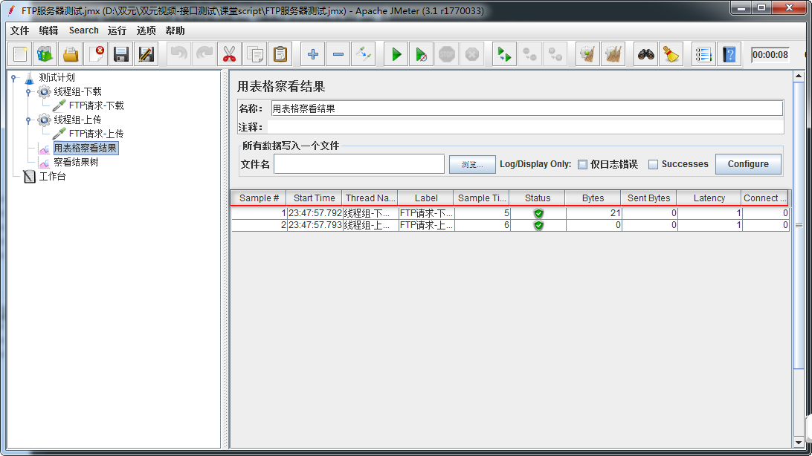

# Day20 工具篇——C站最全jmeter讲解（5）——项目接口自动化脚本设计、性能测试脚本设计


# 接口自动化脚本设计

------

## 目标

- 掌握自动化脚本设计原则；
- 掌握自动化脚本调优技巧；

------

## 为什么要设计自动化脚本？

```
1. 后台程序更新/发布新版之前需要验证下之前的功能是否能用
```

### 1. 自动化脚本设计原则：

```
1. 每个测试用例都是独立的
2. 测试用例都是可重复运行的
3. 测试数据与业务相分离（测试数据包括参数接口数据/ 测试执行所需要的系统数据)
4. 测试完成后，要删除不必要的测试数据。
```

### 2. 自动化脚本设计组件分析：

```
1. 使用数据库连接池
2. 使用setUp Thread Group线程组
3. 使用tearDown Thread Group线程组
4. 使用线程组
5. 使用函数
6. 使用关联
7. 添加断言
8. 使用sampler中请求
9. 添加聚合报告
```

## 3. 组件配置图

### 3.1 测试计划：


勾选独立运行每个线程组（目的：保证线程组执行从上到下，保持先增后改再查再删原则）

### 3.2 HTTP请求：


使用函数，确保无论运行多少次，保证唯一属性不重复

### 3.3 响应断言:


```
使用函数，确保每次请求后响应数据达到预期结果
```

## 4. 整体效果动态演示


## 5. 脚本执行含查数据库演示


## 6. 自动化脚本-总结

```
1. 使用数据库连接池
2. 使用setUp Thread Group线程组
3. 使用tearDown Thread Group线程组
4. 使用线程组
5. 使用函数（setProperty、Property、counter）
6. 使用关联
7. 添加断言
8. 使用循环
9. 使用sampler中（HTTP请求、BeanShell Sampler、JDBC Request、Debug Sampler）请求
10. 去除单接口察看结果树
11. 添加聚合报告
12. 将测试计划中独立运行每线程组勾选
```

# 性能脚本设计

------

## 目标

## - 性能脚本设计技巧

## 1. 为什么要设计性能脚本？

### 1.1 需求

```
100虚拟用户对(查询学院-所有)接口测试，以每秒启动10个用户,统计服务器平均响应时间和错误率
```

### 1.2 问题

```
100虚拟用户请求服务器的时候，如何统计服务器响应时间和错误率？
```

------

## 2. 什么是性能脚本？

```
概念：借助测试工具模拟多种业务需求操作对系统的各项性能指标进行测试的脚本
```

### 2.1 解决方案分析

```
1. 测试计划->线程组
2. 线程组->HTTP请求(查询学院-所有)
3. 测试计划->查看结果树
4. 测试计划->聚合报告
```

### 2.2 技术难点分析

```
1. 线程组-线程数
2. 测试计划-聚合报告(各指标意义)
```

### 2.3 聚合报告使用图


```
1. Label:在不勾选"Include group name in label?"复选框的情况下，为请求取样器的名称，
    否则为“请求取样器所在线程组:请求取样器名称”
2. Samples:用同一个请求取样器，发送请求的数量(注意：该值是不断累计的)。
    比如，10个线程数设置为10，迭代10次，那么每运行一次测试，该值就增加10*10=100
3. Average:请求的平均响应时间
4. Median:中位数。50%的样本都没有超过这个时间。
    这个值是指把所有数据按由小到大将其排列，就是排列在第50%的值。
5. 90% Line：90%的样本都没有超过这个时间。这个值是指把所有数据按由小到大将其排列，就是排列在第90%的值。
6. Min:针对同一请求取样器，请求样本的最小响应时间
7. Max:针对同一请求取样器，请求样本的最大响应时间
8. Error %:出现错误的请求样本的百分比
9. Throughput：吞吐量以“requests/second、requests /minute、requests /hour”来衡量。
    时间单位已经被选取为second，所以，显示速率至少是1.0，即每秒1个请求。
10. Received KB/sec - 收到的千字节每秒的吞吐量测试。
11. Kb/sec - 以Kilobytes/seond来衡量的吞吐量(发送的千字节每秒的吞吐量测试)
```

------

## 3. 项目-性能脚本设计

### 3.1 性能脚本设计技巧

```
1. 新增、更新、删除：使用固定数值,比如新增100条,更新100条,删除100条
2. 查询：采用虚拟用户数和持续时间配合(比如，100用户，持续查询600秒)
```

### 3.2 提示

```
1. 参数化：参数化尽量避免采用从外部读取参数，使用固定参数+函数形式( 如：${__counter(TRUE,)})
2. 察看结果树：必须清除单个接口内察看结果树
            (如不去掉，非常占用测试机自身性能)，在测试计划下添加一个察看结果树  
3. 报告：性能报告可根据实际需求选择，建议保留添加聚合报告  
4. 线程组：增删改查每一个功能点，都需建立单独线程组，而避免在同一个线程组内添加
           多个HTTP请求完成增删改查(一便参数化对单个请求做压测和并发)
5. 分布式：如并发数量大，采用分布式测试
6. 新增/删除：新增和删除接口建议不要采用时间模式来压测，直接使用线程数和循环；
```

### 3.3 性能脚本设计-总结

```
1. 参数化
2. 报告
3. 查询接口-性能常用方式
```


# 生成HTML报告

------

## 目标

- 学习如何利用Jmeter生成HTML报告

------

## 1. 效果

------

[浏览ResultReport](../report/index.html)

### 2. Statistics 图


### 3. Response Time Overview 图


### 提示：

**JMeter 3.0以上开始支持自动生成动态报告**

------

## 操作步骤：

**两种模式：**

- 1. 无jtl日志或csv日志文件生成报告
- 1. 有jtl日志或csv日志文件生成报告

------

### 1. 无日志文件生成：

**1.1 基本命令格式：**

```
jmeter -n -t <test JMX file> -l <test log file> -e -o <Path to output folder>
```

**1.2 样例：**
`jmeter -n -t E:\课件\Jmeter\Script\自动化脚本\Stu_AutoScript.jmx -l testLog -e -o ./output/report`

### 1.3 参数详解：

- -n ：以非GUI形式运行Jmeter

- -t ：source.jmx 脚本路径

- -l ：运行结果保存路径（.jtl）,此文件

  必须不存在

  ```
    1) .jtl
    2) .txt
    3) 无后缀
  ```

- -e ：在脚本运行结束后生成html报告

- -o ：保存html报告的地址, 此文件**必须不存在**

------

### 2. 使用已有的jtl日志文件或csv日志文件生成

**2.1 基本命令格式：**

```
jmeter -g <log file> -o <Path to output folder>
```

**2.2 样例：**

```
jmeter -g E:\课件\Jmeter\Script\自动化脚本\resultt.jtl -o ./outputreport
```

### 提示：

- 执行命令时，出现Jmeter不是内部或外部命令

  

#### 解决：

- 将Jmeter目录下bin文件目录添加到环境变量Path中，注意追加路径是，前面分号；
  


# 接口测试基于Jmeter项目汇总

------

## 目标

- 总结接口基于Jmeter测试流程

------

### 1. API文档

```
1. 梳理业务需求整理接口清单
2. 提出相应不确定问题
```

### 2. 接口清单

```
1. 设计测试用例
2. 设计功能脚本
```

### 3. 测试用例

```
1. 设计参数化覆盖数据
```

### 4. 功能脚本

```
1. HTTP请求默认值(设置服务器IP或域名；Content encoding：UTF-8)
2. HTTPHTTP信息头管理器(ContentType:application/json;charset=utf-8)
3. 线程组
4. Sampler(如:HTTP请求)  
 5. 新增-方法(POST)
 6. 更新-方法(PUT)
7. 删除-方法(DELETE)
8. 查询-方法(GET)
9. 查看结果树    
```

------

### 5. 自动化脚本

```
1. 测试计划：勾选（独立运行每个线程组）确保脚本执行顺序，从上
2. 如不校验逆向数据，请去除CSV Data Set Config
3. 添加断言
4. 去除每个接口内的察看结果树元件
5. 动态数据使用**关联**(正则表达式/XPath)获取
6. 脚本执行顺序(先增数据，拿到新增数据ID后；在更新完毕数据后，查询新增数据；最后删除新增数据)  
7. 基于测试计划添加聚合报告和察看结果树
```

### 6.性能测试脚本

```
1. 线程组：设置线程数,调度器;
2. 监听器：察看结果树/聚合报告/用表格察看结果/Aggregate Graph
3. 检测服务器性能：(jp@gc - PerfMon Metrics Collector和ServerAgent插件)
```


# 性能知识点-科普

------

## 目标

- 理解Jmeter常用性能术语

------

## 1. 需求

测试100个用户访问 <https://www.baidu.com在负载达到60> QPS时的平均响应时间。

### 1.1 问题

```
1. QPS是什么？
2. 如何每秒负载数达到60QPS?
```

------

## 2. QPS是什么？

```
概念：QPS:Query Per Second每秒查询率。是一台查询服务器每秒能够处理的查询次数。
```

### 2.1. 如何每秒达到负载数达到60QPS？

### 2.2 Constant Throughput Timer(常数吞吐量定时器)

```
作用：控制Jmeter中请求时指定的吞吐量,单位为分钟
```

### 2.3 解决方案分析

```
1. 测试计划->线程组
2. 线程组->HTTP请求
3. HTTP请求->Constant Throughput Timer
4. 测试计划->察看结果树
5. 测试计划->聚合报告
```

### 2.4 技术难点分析

```
1. Constant Throughput Timer 参数配置
```

### 2.5 Constant Throughput Timer配置图


```
1. Target throughput(in samples per minte):目标吞吐量。
  注意:
    1) 这里是每分钟发送的请求数，实际填的数值为：60*QPS(60*60);    

2. Calculate Throughput based on：  
    1) This thread only:控制每个线程的吞吐量，选择这种模式时；
        总的吞吐量为设置的target Throughput乘以该线程的数量。
```

### 2.5 QPS-总结：

```
1. QPS概念
2. Constant Throughput Timer
```

------

## 3. Jmeter常用性能术语[了解]

### 3.1 响应时间(RT)

```
概念：响应时间是指系统对请求作出响应的时间。  

备注：
    响应时间指用户从客户端发起一个请求开始，到客户端接收到从服务器端返回结果的响应结束;
    结果信息展现在客户端，整个过程所耗费的时间。
```

### 3.2 吞吐量(Throughput)

```
概念：单位时间内服务器处理的客户端请求数量

备注：
    1) 通常情况下，吞吐量用“请求数/秒”或者“页面数/秒”来衡量。
    2) 从业务角度来看，吞吐量也可以用“业务数/小时”、“业务数/天”、“访问人数/天”、“页面访问量/天”来衡量。
    3) 从网络角度来看，还可以用“字节数/小时”、“字节数/天”等来衡量网络的流量。
```

### 3.3 并发用户数

```
概念：多个用户同一时间操作同一业务。
备注：
  1) 并发用户数的时候一般结合集合点(Synchronizing Timer)一起使用；
```


# Jmeter FTP服务器测试

------

## 目标

```
1. 了解基于Jmeter测试FTP服务器
```

------

## 1. FTP是什么？

```
概念：FTP是英语File Transfer Protocol的首字母缩写，汉语意思为文件传输协议。
```

## 2. FTP有什么用？

```
作用：可以根据FTP服务器进行上传和下载文件(上传、下载需要权限)
```

## 3. 如何测试FTP服务器？

### 3.1 操作步骤分析

```
1. 测试计划->线程组(线程组-下载)
2. 线程组->FTP请求(FTP请求-下载)
3. 测试计划->线程组(线程组-上传)
4. 线程组->FTP请求(FTP请求-上传)
5. 测试计划->监听器->用表格察看结果
```

### 3.2 FTP请求-下载配置图


```
1. Remote file：上传到FTP服务器新的文件名+后缀
2. local file：为本地存放到本机上的路径+文件名+后缀
3. get(RETR)：为下载文件
4. 用户名：ftp服务器用户名
5. 密码：ftp服务器的密码
```

### 3.3 FTP请求-上传配置图


```
1. Remote file：上传到FTP服务器新的文件名+后缀
2. local file：为本地存放到本机上的路径+文件名+后缀
3. put(RETR)：为上传文件
4. 用户名：ftp服务器用户名
5. 密码：ftp服务器的密码
```

### 3.4 用表格察看结果使用图

一种统计响应数据组件

### 3.4 FTP服务器测试-总结

```
1. FTP概念
2. FTP下载方法
3. FTP上传方法
```

# Jmeter Test Fragment(测试片段)

------

## 目标

```
1. 了解Test Fragment(测试片段)使用场景和方法
```

------

## 1. Test Fragment(测试片段)

### 1.1 Test Fragment(测试片段)是什么？

```
概念：测试片段元素是控制器上的一个种特殊的线程组，它在测试树上与线程组处于一个层级。

备注：
    它与线程组有所不同，因为它不被执行，除非它是一个模块控制器或者是被控制器所引用时才会被执行。
```

### 1.2 Test Fragment(测试片段)有什么用？

```
作用：把单独功能脚本封装起来，待需要使用的时候，直接引用；类似于python中的函数或模块
```

------

## 2. 案例

```
使用Test Fragment把(查询学院-指定)接口进行封装,然后使用模块控制器调用
```

### 2.1 操作步骤分析

```
1. 测试计划->Test Fragment
2. Test Fragment->HTTP请求(查询学院-指定)
3. 测试计划->线程组
4. 线程组->逻辑控制器->模块控制器
5. 测试计划->察看结果树
```

### 2.2 Test Fragment使用图


```
1. Test Fragment默认为不启用状态
```

### 2.3 模块控制器使用图


```
    Module To Run:选择要运行的封装片段

提示：测试片段被引用执行两种方式
    1) 模块控制器可以引用执行测试片段;
    2) Include Controller控制器也可以引用和执行片段；
```

### 2.4 Test Fragment-总结：

```
1. 作用
2. 测试片段引用执行两种方式
```


# Jmeter 工作台-非测试元件

------

## 目标

```
1. 了解Jmeter工作台作用
2. 了解Jmeter工作台下非测试元件
```

------

## 1. 工作台

### 1.1 工作台有什么用？

```
作用：工作台为测试中不使用的测试元素提供一个临时存的位置；
目的：是提供复制/粘贴或者其他目的。

提示：保存测试计划工作台的内容默认不会保存除非选择”save workbench”（保存工作台）选项
```

### 1.2 非测试元件分类

```
1. HTTP Mirror Server
2. HTTP代理服务器
3. Property Display
```

------

## 2. HTTP Mirror Server

### 2.1 HTTP Mirror Server有什么用？

```
作用：它可以在本地临时搭建一个HTTP服务器，该服务器把接收到的请求原样返回;
      这样就可以看到发送出的请求的具体内容，以供调试;
```

### 2.2 HTTP Mirror Server配置使用图


```
1. 端口号：默认搭建临时HTTP服务器端口为8081，可自定义修改(未占用端口号);
2. 启动：点击启动，启动HTTP临时搭建的服务
```

### 2.3 HTTP请求使用HTTP Mirror搭建服务器图

服务器名称或IP：为本机IP(127.0.0.1) 端口号：为搭建HTTP临时服务器时的端口号

### 2.4 HTTP Mirror Server-总结

```
1. HTTP Mirror Server作用
2. 使用方法
```

------

## 3. HTTP代理服务器

### 3.1 为什么要了解HTTP代理服务器?

### 3.2 需求

```
使用Jmeter测试http://www.so.com搜索引擎,搜索测试，搜索三个关键字Java
、python、Test]
```

### 3.3 问题

```
1. 如何使用Jmeter录制HTTP协议的Web程序脚本？
```

### 3.4 HTTP代理服务器是什么？

```
概念：HTTP代理服务器是监听浏览器代理，记录基于代理浏览器所有的请求，并以Jmeter可执行的脚本格式保存。
```

### 3.5 解决方案分析

```
1. 工作台->非测试元件->HTTP代理服务器
2. IE->工具->Internet选项->代理服务器设置
3. 测试计划->线程组
```

### 3.6 HTTP代理服务器配置图


```
1. 端口号：可自定义端口(未必占用的端口号)
2. 目标控制器：选择录制的脚本要保存的地方,比如：测试计划-线程组
3. 启动：启动监听程序
```

### 3.7 HTTP代理服务器-总结

```
1. HTTP代理服务器作用
2. HTTP代理服务器设置
3. IE代理设置
```

------

## 4. Property Display


```
    作用：以GUI图形界面显示Jmeter配置文件(jmeter.properties)
```


# 总结

目标

1. 自动化脚本设计
2. 性能脚本设计
3. 生成HTML报告

1. 了解Jmeter其他功能知识点
2. 了解Jmeter录制Web项目脚本