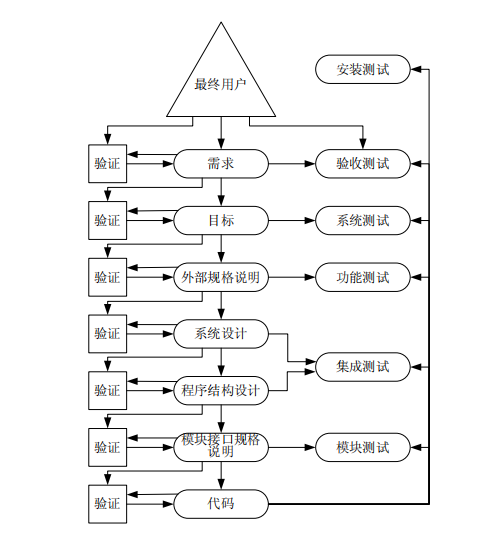

# Day6 高级别测试——功能测试、系统测试、能力测试、容量测试、强度测试、易用性测试

[TOC]

# 软件产品开发周期的模型

**一个软件产品开发周期的模型过程的流程可归结为以下7 个步骤：**

1. 将软件最终用户的要求转换为一系列书面的需求。这些需求就是该软件产品要实现的目标。

2. 通过评估可行性与成本、消除相抵触的用户需求、建立优先级和平衡关系，将用户需求转换为具体的目标。

3. 将上述目标转换为一个准确的产品规格说明，将产品视为一个黑盒，仅考虑其接口以及与最终用户的交互。该规格说明被称为“外部规格说明”。

4. 如果该产品是一个系统，如操作系统、飞行控制系统、数据库管理系统或雇员人事系统等，而不仅是一个程序（编译器、工资程序、字处理程序等），那么下一步骤就是系统设计。该步骤将系统分割为单独的程序、部件或子系统，并定义它们的接口。

5. 通过定义每个模块的功能、模块的层次结构以及模块间的接口，来设计程序或程序集合的结构。

6. 设计一份准确的规格说明，定义每个模块的接口与功能。

7. 经过一个或更多的子步骤，将模块接口规格说明转换为每个模块的源代码算法。

以下是从其他角度来审视上述文档的形式：

-  需求规格说明定义了为什么要开发程序。

-  目标定义了程序要做什么，以及应做得怎样。

-  外部规格说明定义了程序对用户的准确表现。

- 与后续阶段相关的文档越来越详细地规定了程序是如何建立起来的。

假定软件开发周期的七个阶段包括了信息的沟通、理解和转换，以及大多数的软件错误都来源于信息处理中的故障，那么现在有三个补充的方法来预防或识别这些错误。

首先，我们可以使软件开发过程更加精密，以防其中出现很多错误；其次，在每个阶段结束时可以引入一个独立的验证过程，在进入下一个阶段之前尽可能多地发现问题。

# 功能测试(Function Testing)

功能测试是一个试图发现程序与其外部规格说明之间存在不一致的过程。外部规格说明是一份从最终用户的角度对程序行为的精确描述。除了在小程序中的使用情况之外，功能测试通常是一项黑盒操作。也就是说，要依赖早期的模块测试的过程来实现理想的白盒逻辑覆盖准则。在进行功能测试时，需要对规格说明进行分析以获取测试用例集。

所讨论的等价类划分方法、边界值分析方法、因果图分析方法和错误猜测方法尤其适合于功能测试。

>  应始终牢记功能测试的目的是**为了暴露程序的错误以及与规格说明不一致之处，而不是为了证明程序符合其外部规格说明。**

# 系统测试(System Testing)

系统测试最容易被错误理解，也是最困难的测试过程。系统测试并非是测试整个系统或程序功能的过程，因为有了功能测试，这样会显得多余。

**系统测试有着特定的目的：将系统或程序与其初始目标进行比较。**

给定这个目标之后，隐含两方面的含义：

1. 系统测试并不局限于系统。如果产品是一个程序，那么系统测试就是一个试图说明程序作为一个整体是如何不满足其目标的过程。

2. 根据定义，如果产品没有一组书面的、可度量的目标，系统测试也就无法进行。

在寻找程序与其目标之间的不一致的过程中，应重点注意那些在设计外部规格说明的过程中所犯的转换错误。系统测试因而成为一种关键的测试类型，因为就软件产品本身、所犯错误的数量及其严重性而言，开发周期的这个阶段是最易出错的。这也暗示与功能测试的情况不同，外部规格说明不能作为获得系统测试用例的基础，否则就破坏了系统测试的目标。然而另一方面，也不能利用目标文档本身来表示测试用例，因为根据定义，这些文档并不包含对程序外部接口的准确描述。克服这一两难局面的方法是利用程序的用户文档或书面材料。通过分析目标文档来设计系统测试，分析用户文档来阐明测试用例。该方法能够产生两方面的作用，一是将程序与其目标和用户文档相比较，二是同时也将用户文档与程序目标相比较.

> **系统测试有着特定的目的：将系统或程序与其初始目标进行比较。**

# 能力测试(Facility Testing)

最明显的系统测试类型是判断目标文档提及的每一项能力（或功能，为了避免与功能测试发生混淆而不使用“功能”一词）是否都确实已经实现。能力测试的过程是逐条语句地检查目标文档，当某条语句定义了一个“要做什么”（例如，“语法应该一致……”、“用户应当可以指定一个空间范围……”等），就判断程序是否满足。此种类型的测试常常可以在不使用计算机的情况下进行；有时人工对目标和用户文档进行比较就足够了。尽管如此，利用问题检查单将有助于在下一次进行测试时，确保人工检查的目标是相同的。

> 容量测试的目的是为了判断目标文档提及的每一项能力是否都确实已经实现

# **容量测试**(Volume Testing)

第二类系统测试是使程序经受大容量数据的检验。举例来说，编译器可能要编译规模非常庞大的源程序，连接编辑器可能需要处理一个包含上千模块的程序，电子电路模拟器可能要输入一个包含上千部件的电路，而操作系统的作业队列可能已经达到饱和的容量。如果程序需要处理跨越不同卷的文件，则应产生足够的数据使程序从一个卷转换到另一个中。换言之，**容量测试的目的是为了证明程序不能处理目标文档中规定的数据容量**。

由于容量测试显然需要大量的资源，鉴于对机器和工时的考虑，不可进行过多的容量测试。当然，每个程序应该至少进行几次容量测试。

> **容量测试的目的是为了证明程序不能处理目标文档中规定的数据容量**。

# 强度(峰值)测试(Stress Testing)

强度测试使程序承受高负载或强度的检验。这不应和容量测试发生混淆；所谓高强度是指在**很短的时间间隔内**达到的数据或操作的数量峰值。类似的情况是测试一名打字员。容量测试是判断打字员能否处理大篇幅的稿子，而强度测试则是判断打字员能否达到每分钟 50 个单词的速度。由于强度测试涉及时间因素，因此，它不适用于很多程序，如编译器或批处理工资程序。然而，**强度测试适用于在可变负载下运行的程序**，以及交互式程序、实时程序和过程控制程序。

基于 web 的应用程序是最常按受强度测试的软件之一。在这里，我们需要确信的是应用程序及硬件能够处理一定容量的并发用户。读者可能会争辩说，也许有数百万人在同一时刻访问站点，但这是不现实的。我们需要弄清用户群，然后设计一个强度测试，体现出可能访问站点的最大人群的情况。

虽然有很多强度测试体现的是程序在运行过程中可能会遇到的情况，然而也有另一些强度测试确实体现了“不可能发生”的情况，但这并不意味这些测试是无用的。如果在这些不可能发生的情况中检查出了错误，那么这项测试就是有价值的，因为同样的错误也可能发生在现实的、强度稍低的环境中。

> **强度(峰值)测试是很短的时间间隔内达到的数据或操作的数量峰值的测试**

# 易用性测试(Usability Testing)

系统测试的另一个重要类型是试图发现人为因素或易用性的问题。软件系统，尤其是那些为广大商业市场而设计的软件，通常都进行了广泛的人为因素的研究，而现在的软件自然也受益于过去的成千上万的程序和系统。然而，对人为因素的分析依然是一项极为主观的事情。

在以下的清单中，我们列举了需要测试的一些问题：

1. 每个用户界面是否都根据最终用户的智力、教育背景和环境要求而进行了调整？

2. 程序的输出是否有意义、不模糊且没有计算机的杂乱信息？

3. 错误诊断（如错误信息）是否直接，用户是否需要有计算机学科的博士学位才能理解它门？

   举例来说，程序是否产生了诸如“IEK022A OPEN ERROR ON FILE ' SYSIN ' ABEND CODE = 102 ?”此类信息？象这样的信息在二十世纪七、八十年代的软件系统中并不鲜见。今天的面向大众销售的系统在这方面有了改进，但我们仍然会遇到诸如“出现一个未知错误”或“程序遇到了一个错误，必须重新启动”这样无用的信息。自己编写的程序是由自己控制的，不应加入这些无用的信息。即使我们并不开发软件，如果在测试小组中工作，那么可以推动人机界面这个领域的改进。

4. 整体的用户界面是否在语法、惯例、语义、格式、风格和缩写方面展现出了相当程度的概念完整性，基本的一致性和统一性？

5. 在准确性极为重要的环境里，如网上银行系统，输入中是否有足够的冗余信息？举例来说，该系统可能会要求输入账号、用户名和 PIN（个人识别号）来验证访问账户信息的是合法用户。

6. 系统是否包含过多或不太可能用到的选项？现代软件的一个趋势是，仅向用户提供那些基于软件测试和设计考虑而确定出的最有可能使用的菜单选项。一个设计良好的软件可以向用户学习，并开始向不同的用户展示其经常访问的菜单项。即使已经有了这样智能化的菜单系统，仍需要设计成功的软件，使得对不同选项的访问合乎逻辑、符合直觉。

7. 对于所有的输入，系统是否返回了某些类型的即时确认信息？举例来说，在点击鼠标进行输入的环境里，被选项可以变换颜色，或者某个按钮对象可以显示凹进或凸起的状态。如果要让用户从列表中选择，那么当用户做出选择后被选序号应显示在屏幕上。还有，如果被选的操作需要一些运行时间（如果软件正在访问一个远程的系统，情况常会如此），那么应显示一条信息通知用户当前正在做什么。

8. 程序是否易于使用？举例来说，如果输入是区分大小字符的，这一点对用户来说是否清楚？此外，如果程序要求浏览一系列的菜单或操作，那么返回到主菜单的方法是否清楚？用户是否可以很容易浏览到上一层或下一层？

> **易用性测试目的：试图发现人为因素或易用性的问题。**

# 安全性测试(Security Testing)

由于社会对个人隐私的日益关注，许多软件都有特别的安全性目标。安全性测试是设计测试用例来突破程序安全检查的过程。举例来说，我们可以设计测试用例来规避操作系统的内存保护机制，破坏数据库管理系统的数据安全机制。设计此种测试用例的方法之一是研究类似系统中已知的安全问题，然后生成测试用例，尽量暴露被测系统存在相似问题。

> 安全性测试是验证安全性目标的测试。
>
> （除了常规对安全性要求，许多软件都有特别的安全性目标。）

# 性能测试(Performance Testing)

很多软件都有特定的性能或效率目标，这终特性描述为在特定负载和配置环境下程序的响应时间和吞吐率。再一次强调，由于系统测试的目的是为了证明程序不能实现其目标，因此应设计测试用例来说明程序不能满足其性能目标。

> 性能测试是验证性能目标的测试。
>
> 由于系统测试的目的是为了证明程序不能实现其目标，因此应设计测试用例来说明程序不能满足其性能目标。

# 存储测试(Storage Testing)

类似地，软件偶尔会有存储目标，举例来说，可能描述了程序使用的内存和辅存的容量，以及临时文件或溢出文件的大小。应设计测试用例来证明这些存储目标没有得到满足。

# 配置测试(Configuration Testing)

诸如操作系统，数据库管理系统和信息交换系统等软件都支持多种硬件配置，包括不同类型和数量的 I/O 设备和通信线路，或不同的存储容量。通常可能的配置数量非常之大，以至于测试无法面面俱到，但是至少应该使用每一种类型的设备，以最大和最小的配置来测试程序。如果软件本身的配置可忽略掉某些程序组件，或可运行在不同的计算机上，那么该软件所有可能的配置都应测试到。

如今的很多软件都设计成可运行在多种操作系统下，因此如果测试此类程序，应该在该程序面向的所有操作系统环境中对其进行测试。对设计在 Web 浏览器里运行的程序，需要特别的注意，因为 Web 浏览器的种类繁多，并不是所有浏览器都按同样方式运行。除此之外，即使是同一种 Web 浏览器，在不同的操作系统之下，运行方式也会不同。

# 兼容性/配置/转换测试

兼容性/配置/转换测试(Compatibility/Configuration/Conversion Testing) 。

大多数开发的软件都并不是全新的，常常是为了替换某些不完善的系统。这样的软件往往有着特定的自标，涉及与现有系统的兼容以及从现有系统的转换过程。再次强调，在针对这些目标测试程序时、测试用例的目的是证明兼容性目标未被满足，转换过程并未生效。在将数据从一个系统转移到另一个系统时，应尽力发现错误。升级数据库管理系统就是一个例子。需要确定现有的数据安置到了新的系统中。有很多不同的方法测试这个过程；但这些方法都高度依赖于所使用的数据库系统。

# 安装测试(Installability Testing) 

有些类型的软件系统安装过程非常复杂，测试安装过程是系统测试中的一个重要部分。对于包含在软件包中的自动安装系统而言，这尤其重要。安装程序如果出现故障，会影响用户对软件的成功体验。用户的第一次体验来自于安装软件的过程。如果这个过程进行得很槽糕，用户或顾客就要么寻找其他的产品，要么对软件的有效性不抱太大信心。

# 可靠性测试(Reliability Testing) 

当然，所有类型的测试都是为了提高软件的可靠性，但是如果软件的目标中包含了对可靠性的特别描述，就必须设计专门的可靠性测试。测试可靠性目标可能很困难。

举例来说，诸如公司广域网（WAN）或因特网服务供应商（ISP）等现代在线系统在整个运行期间，正常运行时间应占 99.97％。我们现在还不太可能花上数月甚至数年的时间来测试这个目标。

今天的关键软件系统的可靠性标准甚至更高，而现今的硬件可以令人信服地保障这个目标的实现。但如果软件或系统有更为适中的平均故障间隔时间（MTBF）目标或合理的（以测试而言）功能错误目标，就有可能对其进行测试。

# 可恢复性测试(Recovery Testing) 

诸如操作系统、数据库管理系统和远程处理系统等软件通常都有可恢复性目标，说明系统如何从程序错误、硬件失效和数据错误中恢复过来。系统测试的一个目标是证明这些恢复机制不能够正确发挥作用。我们可以故意将程序错误置入某个系统中，判断系统是否可以从中恢复。诸如内存校验错误或 I/O 设备错误等硬件错误也可以进行模拟。而如通信线路中的嗓音或数据库中的无效指针等数据错误可以故意生成或模拟出来，以分析系统的反应。

这些系统的设计目标之一是使平均恢复时间（MTTR）最小。系统宕机才通常会减少公司的收入。我们的一个测试目标是证明系统不能满足 MTTR 的服务合同。MTTR 往往有上界和下界，所以测试用例应反映出这些界限。

# 适用性测试(Serviceability Testing) 

软件还可能有适用性或可维护性的目标。所有的此类目标都必须测试到。这些目标可能定义了系统提供的服务辅助功能，包括存储转存程序或诊断程序、调试明显问题的平均时间、维护过程以及内部业务文档的质量等。

# 文档测试(Documentation Testing) 

系统测试也需要检查用户文档的正确性。完成此任务的主要方法是根据文档来确定系统测试用例的形式。也就是说，一旦设计完成某个具体的测试情况，应该使用文档作为编写实际测试用例的指南。同时，用户文档应成为审查的对象，检查其正确性和清晰性。在文档中描述的任何范例应编成测试用例，并提交给程序。

# 过程测试(Procedure Testing) 

最后，很多软件都是较大系统的组成部分，这些系统并不完全是自动化的，包含了很多人员操作过程。在系统测试中，必须对所有已规定的人工过程，如系统操作员、数据库管理员或最终用户的操作过程进行测试。

举例来说，数据库管理员必须记录备份和恢复数据库系统的操作过程。在可能的情况下，应由与数据库管理不相关的人来测试这些过程。然而，公司必须为充分测试这些过程而提供所需的资源，这些资源通常包括硬件和额外的软件许可证。

# 系统测试的执行

系统测试执行中一个最关键的考虑是决定由谁来进行测试。

我们从反面来回答这个问题：1）不能由程序员来进行系统测试；（2）在所有的测试阶段之中，这是惟一明确不能由负责该程序开发的机构来执行的测试。

第一点基于的事实是，执行系统测试的人思考问题的方式必须与最终用户相同，这意味着必须充分了解最终用户的态度和应用环境，以及程序的使用方式。那么显然的是，如果可行的话，一位或多位最终用户是很好的执行测试的候选人。但是，由于一般的最终用户都不具备执行很多前面所描述的测试类型的能力或专业技术，因此，理想的系统测试小组应由几位专业的系统测试专家（以执行系统测试作为职业）、一位或两位最终用户的代表、一位人类工程学工程师以及该程序主要的分析人或设计者所组成。将原先的设计者包括进来并不违反先前的测试原则，即不提倡测试由自己编写的程序。因为程序自构思以来已经历经人手，所以原先的设计者不会再受到心理束缚的影响，对程序的测试不会再触及该原则。

第二点基于的事实是，系统测试是一项“随心所欲，百无禁忌”的活动，而软件开发机构会受到心理束缚，有悖于此项活动。而且大多数的开发机构最为关心的是让系统测试进行得尽可能顺利并按时完成，而不会尽力证明程序不能满足其目标。系统测试至少应由很少（如果有的话）受开发机构左右的独立人群来执行。也许最经济的执行系统测试的方式（所谓经济，是指花一定的成本发现最多的错误，或利用更少的费用发现相同数量的错误）是将测试分包给一个独立的公司来完成。

# 验收测试(Acceptance Testing) 

验收测试是将程序与其最初的需求及最终用户当前的需要进行比较的过程。这是一种不寻常的测试类型，因为该测试通常是由程序的客户或最终用户来进行，一般不认为是软件开发机构的职责。对于软件按合同开发的情况，由订购方（用户）来进行验收测试，将程序的实际操作与原始合同进行对照。如同其他类型的测试一样，验收测试最好的方法是设计测试用例，尽力证明程序没有满足合同要求。假如这些测试用例都是不成功的，那么就可以接受该程序。对于软件产品的情况，如计算机制造商的操作系统或编译器，或是软件公司的数据库管理系统，明智的用户首先会进行一次验收测试以判断产品是否满足其要求。

# 安装测试(Installation Testing) 

安装测试其目的不是为了发现软件中的错误，而是为了发现在安装过程中出现的错误。在安装软件系统期间会发生很多事件。

作为示例的简短列表包括了下列事件：

1. 用户必须选择大量的选项。

2. 必须分配并加载文件和库。

3. 必须进行有效的硬件配置。

4. 软件可能要求网络联通，以便与其他软件连接。

安装测试应由生产软件系统的机构来设计，作为软件的一部分来发布，在系统安装完成之后进行。除此之外，测试用例需要检查以确认已选的选项集合互不冲突，系统的所有部件全部存在，所有的文件已经创建并包含必需内容，硬件配置妥当等。

# 测试的计划与控制

如果认为测试一个大型软件系统可能需要编写、执行和验证数万个测试用例、处理数千个模块、改正数千个错误、雇佣数百人花费一年甚至更长的时间工作，那么很明显我们在计划、监视和控制测试过程方面遇到了巨大的项目管理挑战。这个错误带来的显然结果是对计划投人的资源（人力、时间表及计算机时间）明显估计不足，这在计算机行业内是个声名狼藉的问题。造成这个问题的原因是测试阶段处于开发周期的最后阶段，致使调整资源非常困难。另外，可能是更重要的问题，即对软件测试的定义有误，因为很难看到对测试正确定义（测试的目的是发现错误）的人在假定找不到任何错误的情况下去计划一个测试。

与大多数项目的情况一样，计划是管理测试过程中至关重要的一环。一个良好的测试计划应包括：

1. 目标。必须定义每个测试阶段的目标。

2. 结束准则。必须制定准则以规定每个测试阶段何时可以结束。
3. 进度。每个阶段都须有时间表。应指出何时设计、编写和执行测试用例，某些软件技术，

4. 责任。对于每一个阶段，应当确定谁来设计、编写和验证测试用例，谁来修改发现的软件错误。由于在大型项目中讨论特定的测试结果是否代表错误时，有可能出现争端，因此还需要确定一名仲裁者。

5. 测试用例库及标准。在大型项目中，用于确定、编写以及存储测试用例的系统方法是必须的。

6. 工具。必须确定需要使用的测试工具，包括计划由谁来开发或采购、如何使用工具以及何时需要使用工具。

7. 计算机时间。计划每个测试阶段所需的计算机时间，包括用来编译应用程序的服务器（如果需要的话）、用来进行安装测试所需的桌面计算机、用来运行基于 web 应用程序的 web 服务器、联网的设备（如果需要的话）等等。

8. 硬件配置。如果需要特别的硬件配置或设备，则需要一份计划来描述该需求，该如何满足需求以及何时需要满足。

9. 集成。测试计划的一部分是定义程序如何组装在一起的方法（例如自顶向下的增量测试）。一个系统如果包含大的子系统或程序，可按增量的方式组装在一起，例如可以使用自顶向下或自底向上的方法，但是这些构造块是程序或子系统，而不是模块。如果是这种情况，就需要一个系统集成计划。系统集成计划规定了系统集成的顺序、系统每个版本的功能以及编写“脚手架”代码以模拟不存在的部件的职责分工。

10. 跟踪步骤。必须跟踪测试进行中的方方面面，包括对错误易发模块的定位，以及有关进度、资源和结束准则的进展估计。

11. 调试步骤。必须制定上报已发现错误、跟踪错误修改进程以及将修改部分加入系统中去的机制。调试计划中还应包括进度、责任分工、工具以及计算机时间/资源等。

12. 回归测试。回归测试在对程序作了功能改进或进行了修改之后进行，其目的是判断程序的改动是否引起了程序其他方面的退步。回归测试通常重新执行测试用例中的某个子集。回归测试很重要，因为对程序的改动和对错误的纠正要比原来的程序代码更容易出错（与报纸排版错误很相似，这些错误通常由于最后所做的编辑改动而引起的，而不是修改先前版本而引起的）。回归测试计划规定了测试人员、测试方法和测试时间，它也是必须的。

# 测试结束准则

在软件测试过程中最难回答的一个问题，是判断何时终止测试，因为我们无法知道刚刚发现的错误是否是最后一个错误。事实上，除了非常小的软件，期望所有的错误最终都能被发现是不切实际的。在这种两难情况之下，而且基于经济条件也要求测试必须最终结束的事实，我们可能会产生疑惑，是极其武断地回答此问题呢，还是存在一些有用的终止准则？我们在实际中使用的典型的结束准则既无意义，也不能实现目标。

最常见的两个准则是：

1. 用完了安排的测试时间后，测试使结束。

2. 当执行完所有测试用例都未发现错误，测试便结束。也就是说，当所有的测试用例不成功时便结束。

第一条准则没有任何作用，因为我们可以完全什么都不做也可满足它。它并不能衡量测试的质量。第二条准则同样也是无用的，因为它也与测试用例的质量无关，而且也不能够实现测试目标，它下意识里鼓励我们编写发现错误可能性较低的测试用例。

有三类较为有用的结束准则。

第一类，但不是最佳的准则，根据的是特定的测试用例设计技术。

举例来说，我们会这样定义模块测试的结束准则：

测试用例来源于（1）满足多重条件覆盖准则，以及（2）对模块接口规格说明进行边界值分析，产生的所有测试用例最终都是不成功的。

我们会在满足下列情况时规定功能测试结束：

测试用例来源于（1）因果图分析，（2）边界值分析，以及（3）错误猜测，产生的所有测试用例最终都是不成功的。

尽管这种类型的准则要优于前面提到的两条准则，但仍然存在三个问题。首先，对于那些没有特定方法的测试阶段，如系统测试阶段，这类准则不起作用。第二，它要依赖于主观的度量，因为没有办法保证测试人员适当而又严格地使用特定的方法，如边界值分析方法。第三，不同于设置一个目标再让测试人员选择最佳的实现方法，它的做法正好相反，指定了测试用例设计的方法，却并不设定目标。因此，这种类型的准则对于某些测试阶段有时很有效，但是只有在测试人员根据以往的经历，证明自己可以成功地使用测试用例设计方法时，这些准则方可适用。

第二类，也许也是最有价值的准则，是以确切的数量来描述结束测试的条件。

因为测试的目的是发现错误，为什么不将测试结束准则定为发现了某个既定数量的错误呢？举例来说，在对某个具体模块进行模块测试时，直到发现了三个错误才可以认为测试结束了。也许系统测试的结束准则应该规定为发现并修改了 70 个错误，或测试实际进行了 3 个月，无论以后发生什么。应该注意的是，虽然这种准则强化了软件测试的定义，但它也有两个问题，每一个都是可以解决的。一个问题是判断如何获得要发现的错误数量。

得到这一数字需要进行下面几个预测：

1. 预测出程序中错误的总数量。

2. 预测这些错误中有多大比例可能通过测试而发现。

3. 预测这些错误中有多少是由各个设计阶段产生的，以及在什么样的测试阶段能够发现这些问题。

可以通过几种方法来大致预测错误的总数。一种方法是利用以前程序的经验来预测出数字。另外，还存在多种预测模型。有些模块需要测试一段时间，记录下连续发现错误的间隔时间，然后将这些时间输入一个公式的参数中。有些模块被置入一些已知但未公开的种子错误，测试一段时间后，检查被发现的种子错误与非种子错误的比例。还有的模型则让两个独立的测试小组分别测试一段时间，然后检查各自找出的错误以及两个组找出的共同问题，再使用这些参数来预测错误的总数。还有一种获得预计数字的粗略方法是使用行业范围内的平均值。举例来说，在编码结束时（在进行代码走查或检查之前），一般程序中的错误数量大致是每 100 行语句中含 4-8 个错误。

第三类结束准则表面上似乎很容易，其中却涉及许多判断和直觉。

它需要我们在测试过程中记录每单位时间内发现的错误数量。通过检查统计曲线的形状，常常可以决定究竟是继续该阶段的测试，还是结束它并开始下一测试阶段。然而在这个时候转移到下一个阶段，导致了错误发现率的明显下降。最佳的结束准则可能是上述三种类型的组合。对于模块测试而言，特别是由于多数项目在此阶段都没有正式跟踪已发现的错误，最佳的结束准则可能是第一类。我们应该要求使用一系列具体的测试用例设计方法。而对于功能测试和系统测试而言，结束准则可能是发现了既定数量的错误，或用完了计划的时间，再出现什么都不管，但条件是错误分析与时间图的对比表明测试的效率已很低了。

# 独立的测试机构

就公司的架构而言，测试部门应尽可能远离开发部门。事实上，最理想的是测试机构不应是同一个公司的一部分，因为如果不是这样，测试机构仍然会受到与开发部门同样的管理压力的影响。

解决这个矛盾的一个方法是雇佣独立的公司进行软件测试。这是个好主意，不管是系统的设计和使用单位开发的这个软件，还是第三方单位开发的这个软件。这种做法常被提及的好处是提升了测试过程中的积极性、建立了与开发机构的良性竞争、避免了测试过程处于开发机构的管理控制之下，以及独立的测试机构带来的解决问题的专业知识。

