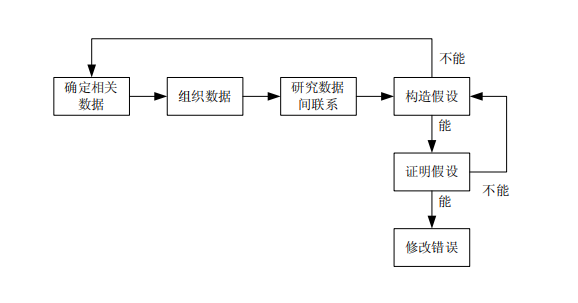

# Day 7  调试（错误分析）详解--什么是调试？、暴力法调试、归纳法调试、演绎法调试、回溯法调试、测试法调试、调试的原则、错误分析总结

[TOC]

# 什么是调试？

简单地讲，调试是执行一次成功的测试之后所要进行的工作。记住，所谓成功的测试，是指它可以证明程序没有实现预期的功能。调试是一个包含两个步骤的过程，从执行了一个成功的测试用例、发现了一个问题之后开始。

第一步，确定程序中可疑错误的准确性质和位置；

第二步，修改错误。

虽然调试对于程序测试来说非常必要、不可或缺，但它似乎是软件开发过程中最不受程序员欢迎的部分之一。其主要原因可能包括以下几点：

• 个人自尊会从中阻挠。不管我们是否喜欢，调试都说明了程序员并不完美，要么在软件的设计，要么在程序编码时会犯错。

• 热情耗尽。在所有的软件开发活动中，调试是最耗费脑力的苦差事，况且，进行调试往往经受着来自机构或自身的巨大压力，必须尽可能快地改正问题。

• 可能会迷失方向。调试是艰苦的脑力工作，因为发现的错误实际上可能会出现在程序的任何语句中。也就是说，如果不首先检查程序，我们就不能绝对地肯定在一个薪金管理程序出具的支票中出现的数字错误不是由某个子程序引起的，该子程序要求操作员将一个特定的表格传输给打印机。让我们以诊断一个物理系统为例子作对比，如汽车。假如汽车在爬坡时熄火了（症状），那么我们可能会迅速而有效地排除掉某些部件——调频/调幅收音机、速度表或汽车门锁——引起该故障的可能。根据我们对汽车引擎的整体了解，该故障一定是发生在引擎上，我们甚至可以排除掉某些引擎部件，如水箱和滤油器。

• 必须自力更生。与其他软件开发活动相比，关于调试过程的研究、资料和正式的指南都比较少。尽管本文是关于软件测试的，并不讨论调试，但这两个过程显然是相互联系的。

针对调试的两个步骤，即错误定位和错误修改，对错误进行定位可能解决了 95％的问题。因此，本章集中讨论错误的定位过程，当然是假定某个成功的测试用例已经发现了一个错误。

>本文是讨论错误的定位过程，当然是假定某个成功的测试用例已经发现了一个错误。

# 暴力法调试(Debugging by Brute Force)

调试程序的最为普遍的模式是所谓的“暴力”方法。这种方法之所以流行，是因为它不需要过多思考，是耗费脑力最少的方法，但同时也效率低下，通常来讲不是很成功。

暴力调试方法可至少被划分为三种类型：

1. 利用内存信息输出来调试。

2. 根据一般的“在程序中插入打印语句”建议来调试。

3. 使用自动化的调试工具进行调试。

第一种类型，使用内存信息输出（通常使用十六进制或八进制格式粗略地显示所有的存储区域）是最缺乏效率的暴力调试方法，原因如下：

• 难以在内存区域写源程序中的变量之间建立对应关系。

• 即使对下复杂程度较低的程序，内存信息输出也会产生数最非常庞大的数据，其中的大多数都是与调试无关的。

• 内存信息输出显示的是程序的静态快照，仅能显示出在某一个时刻程序的状态；为了发现错误，还需要研究程序的动态状态（随时间的状态变化）。 

• 内存信息输出很少可以精确地在错误发生的地方产生，因此无法显示在错误发生时程序的状态。错误发生到输出内存信息这段时间之内程序执行的活动，可能会掩盖掉发现错误所需的线素。

• 通过分析输出的内存信息来发现问题的方法并不大多（因此很名程序员都是密切注视，急切地渴望着错误能神奇地从内存信息输出中自行暴露出来）。

第二种类型，在失效的程序中插入输出变量值的语句，这种做法也不具有很强的优势。

它可能比内存信息输出要好一些，因为可以显示程序的动态状态，让我们检查的信息可以相对容易地与源程序联系起来。但是这种方法同样也有很多缺点：

• 它不是鼓励我们去思考程序中的问题，而主要是一种碰运气的方法。

• 它所产生的需要分析的数据量非常庞大。

• 它要求我们修改程序，这些修改可能会掩盖掉错误、改变关键的时序关系，或者会引入新的错误。

• 它可能对小型程序有效，但如果应用到大型程序，成本就相当高。况且对

于某些类型的程序，如操作系统或过程控制软件，这种办法甚至无法使用。

第三种类型，自动化调试工具的工作机制类似于在程序中插入打印语句，但是并不修改程序本身。可以使用编程语言的调试功能，或使用特殊的交互式调试工具来分析程序的动态状态。可能会用到的典型的语言功能有：产生可打印的语句执行轨迹的机制、子程序调用以及/或者对特定变量的修改等。调试工具的一个共同的功能是可以设置断点，使程序在执行到某条特定语句或改动了某个特定变量的值时暂停执行，然后程序员就可以检查程序的当前状态。同样，这种方法也主要是在碰运气，常常会生成数量过于庞大的无关数据。

这些暴力调试方法的主要问题在于：它们都忽略了思考的过程。我们可以在调试程序和侦破谋杀案之间找出相似点来。实际上，在几平所有的谋杀悬念小说中，谜案都是通过仔细分析线索，将表面上不重要的细节全联结起来而最终侦破的。这不是一个使用蛮力的方法，要使用蛮力的是寻觅障碍物或搜寻财宝。

还有些证据表明，无论调试小组成员是富有经验的程序员还是学生，肯动脑筋而不是依赖别人帮助的人能够更快、更准确地发现程序错误。因此，我们建议仅在下列情况下使用暴力调试方法：（1）其他的方法都失败了：（2）作为我们下面将会讨论的思考过程的补充，而不是替代方法。

# 归纳法调试(Debugging by Induction)

很显然，认真的思考能够发现大部分错误，甚至不需要调试人员使用调试工具．归纳是一种特殊的思考过程，可以从细节转到全局，也就是从线索（即错误的症状，可能是一个或多个测试用例的结果）出发，寻找线索之间的联系。

归纳的过程如图 所示。

归纳调试的步骤如下：

1. 确定相关数据。调试人员犯的一个主要错误是未能将所有可用的数据或症状都考虑进去。第一步是列举出所有知道的程序执行的正确和不正确之处，这些不正确之处即是症状，让我们相信确实存在错误。那些相似却不相同、且未引起症状出现的测试用例提供了额外的有价值的线索。

2. 组织数据。记住，归纳意味着从特殊到一般，因此第二步是组织这些相关数据，以便观察线索间的模式，尤其重要的是要找到矛盾、事件，比如仅当客户的保险金账户收支不太平衡时出现的错误。

3. 做出假设。下一步是研究线索之间的联系，利用线索结构里可能的模式做出一个或多个关于错误原因的假设。如果还无法做出推测，就需要更多的数据。

4. 证明假设。考虑到调试在进行时所承受的压力，这个时期最主要的错误是忽略了这个阶段，直接跳到结论去改正问题。但是在继续下一步之前，证明这些假设的合理性是非常重要的。如果忽略了这一步，可能接下去只修改了问题症状，而没解决问题本身。应将假设与其最初的线索或数据相比较，以此来证明假设的合理性，确定这些假设可以完全解释这些线索的存在。如果无法解释，要么这些假设是无效的或不完整的，要么还有更多的错误存在。

   

# 演绎法调试(Debugging by Deduction)

演绎的过程是从一些普遍的理论或前提出发，使用排除和精炼的过程，达到一个结论。

演绎的步骤如下：

1. 列举出所有可能的原因或假设．第一步是建立一份所有想象得到的错误线索的清单，线索不需要有完整的解释，它们纯粹是一些推测，帮助我们组织和分析现有的数据。

2. 利用数据排除可能的原因。详细检查所有的数据，尤其寻找存在矛盾的地方，然后尽量排除所有可能的原因，仅留下一条，如果所有的原因都排除掉了，需要增加额外的测试用例，得到更多的数据来设计新的推测。如果剩下的原因多于一个，那么首先选择最有可能的原因，即主要假设。

3. 提炼剩下的假设。此时的可能原因也许是正确的,但可能不够具体，不能指出错误来。因此，下一步是使用现有的线索来提炼这个推侧。

4. 证明剩下的假设。这个重要步骤与归纳法中的第 4 步骤相同。

# 回溯法调试(Debugging by Backtracking)

在小型程序中定位错误的一种有效方法是沿着程序的逻辑结构回溯不正确的结果，直到找出程序逻辑出错的位置。换句话说，从程序产生不正确结果（如打印了不正确的数据）的地方开始，从该处观察到的结果推断出程序变量应该是些什么值。

在头脑中，从这个位置开始逆向执行程序，重复使用“如果程序在此处的状态是这样的，那么程序在上面位置的状态就必然是那样的”过程，就能很快定位出错误。使用这个过程，可以确定程序中从状态符合预期值的位置点，到第一个状态不符合预期值的位置点之间的范围。

> 在小型程序中定位错误的一种有效方法是沿着程序的逻辑结构回溯不正确的结果，直到找出程序逻辑出错的位置。

# 测试法调试(Debugging by Testing)

最后一个“思维型”的调试方法是使用测试用例。这可能听起来有些奇怪，因为从本章一开始就将调试和测试区分了开来。然而，考虑下面两种类型的测试用例。供测试的测试用例，其目的是暴露出以前尚未发现的错误．供调试的测试用例，其目的是提供有用的信息，供定位某个被怀疑的错误之用。两者之间的区别是，供测试的测试用例会“胖”一些，因为我们尽量使用较少数量的测试用例来涵盖较多的条件，而供调试的测试用例则“瘦”一些，因为每个测试用例仅需要覆盖一个或几个条件。换句话说，当发现了某个被怀疑的错误的症状之后，我们需要编写与原先有所变化的测试用例，尽量确定错误的位置。

实际上，这种方法不是一个完全独立的方法；它常常结合归纳法一起使用，以获得进行假设和/或证明假设所需的信息。它也可以和演绎法一起使用，以排除有嫌疑的原因，提炼剩下的假设，并/或证明假设。

# 调试的原则

由于调试的过程由两部分组成，即定位错误及修改错误，因此我们也将讨论两类原则

## 1、定位错误的原则

1.动脑筋

调试是一个解决问题的过程。最为有效的调试方法是动脑筋对错误症状的有关信息进行分析。一个高效的程序调试人员应该不使用计算机就能定位大多数的错误。

2.如果遇到了僵局，就留到稍后解决

人类的潜意识是一个潜在的问题求解器。我们经常提到的所谓灵感，其实就是当人类的意识停留在诸如吃东西、走路或看电影之上时，潜意识却正在思考另一个向题。如果在合理时间内（也许小型程序为 30 分钟，大一点的程序为几个小时），我们还不能定位某个间题，就丢开它，做些其他的事情，因为思维的效率开始明显下降。忘记这个问题一段时间之后，我们的潜意识可能已经解决了它，或者思维会焕然一新，可以重新检查问题的症状。

3.如果遇到了困境，就把问题描述给其他人听与其他人交谈可能会帮助我们发现一些新的东西。事实上，经常是仅仅将问题描述给一个好的倾听者时，我们就会突然找到问题的解决之道，而无需倾听者提供任何帮助。

4.仅将测试工具作为第二种手段在试过了其他的方法之后才使用调试上具，并将其作为头脑思考的辅助手段，而不是替代手段。正如本章前面所述，调试工具比如输出和跟踪工具，代表的是一种偶然的调试方法。经验证明，不使用工具的人即使在调试并不熟悉的程序时，也要比使用工具的人更为成功。

5.避免使用试验法——仅将其作为最后的手段调试程序的新手最常犯的错误是为了解决问题而试验性地去修改程序。调试者可能会说：“我知道什么出错了，所以我要改动一下语句．看一看会发生什么”。这种纯粹是无计划的方法甚至不属于调试．它表现的是盲目的行动。它获得成功的机会不仅很小，而且还会将新的错误引入程序，使问题更为复杂。

## 2、修改错误的技术

1.存在一个缺陷的地方，很有可能还存在其他缺陷，即发现程序某个部分存在一个错误时，该部分存在其他错误的可能性要高于没有发现错误时的可能性。换句话说，错误有扎堆的倾向。在修改某个问题的同时，应检查下紧临的地方，看看有没有任何可能是错误之处。

2.应纠正错误本身，而不仅是其症状另一个普遍的错误做法是只修改了错误的症状或仅仅是该错误的一个实例，而不是错误本身。如果所做的改正不符合错误的所有线索，那么可能只修改了错误的一部分。

3.正确纠正错误的可能性并非100%如果将这个观点告诉一些人，他们当然会表示赞同，但是如果将它说给正在修改错误的人听，答案就可能不一样了(“是的，对大多数情况是这样，但这个修改如此之小，它肯定百分之百地正确”）。我们永远也不要假设为纠正错误而增加到程序中的代码是正确的。用新的语句替换原来的语句，这种修改要远比程序中原先的代码更易发生错误。言外之意是应对错误的修改进行测试，也许比对原先程序的测试还要严格。

一个严格的回归测试计划可以确保对某个错误的修改没有在程序的其他位置引入另外的错误。

4.正确修改错误的可能性随着程序规模的增加而降低换句话说，根据我们的经验，由于修改不正确而引人的错误与原始错误之比，在规模较大的程序中呈递增趋势。对于一个广泛使用的大型程序，每发现6 个新错误，其中就有 1个错误是由干先前对程序的改正而造成的。

5.应意识改正错误会引入新错误的可能性我们不仅需要考虑到不正确的修改，而且还必须考虑到某个看似正确的修改会产生未料到的副作用，比如引入了一个新错误。不仅存在修改无效的可能，还存在修改引入了新错误的可能。言外之意是，不仅应在修改之后对错误的情境进行测试，还应执行回归测试以判断是否引入了新错误。

6.修改错误的过程也是临时回到设计阶段的过程，我们应该认识到修改错误也是程序设计的一种形式。在认识到修改易产生错误的性质之后，常识告诉我们，在设计阶段使用的任何规程、方法和形式都同样适用于错误修改阶段。举例来说，如果项目证明代码检查很管用，那么在修改错误之后进行代码检查就显得倍加重要。

7.应修改源代码，而不是目标代码在调试大型系统，尤其是用汇编语言编写的系统时，偶尔会存在这样的修

改错误的倾向，即先立即修改目标代码．稍后再修改源程序．这种方法带来了两个问题，（1）这通常是“通过试验进行调试”的信号；（2）目标代码与源程序不同步，这意味着当程序重新编译或重新汇编之后，同样的错误很容易又浮现出来，这是一种草率的、不专业的调试方法。

# 总结

有关程序调试最后一个应认识之处是，调试除了有消灭程序中错误的价值之外，还有其他重要作用：它可以告诉我们软件错误的一些本质．我们对此了解得非常之少．关于软件错误本质的信息可以为改进将来的设计、编码和测试过程提供有价值的反馈信息。任何程序员和编程机构都可以从详细分析发现的错误，或至少一部分错误的过程中获得提高。错误分析是一项困难且费时的工作，相比“有百分之多少的错误是逻辑设计错误” 、“有百分之多少的错误出现在 IF 语句中”这些肤浅的分类，它蕴涵的内容要多得多。

详细的错误分析会包括如下内容：

**错误出现在什么地方？**

这个问题是最难回答的问题之一，它需要通过对程序文档和项目历史进行回溯研究，但同时它也是最有价值的问题。它要求我们指出该错误的源头和发生时间。举例来说，错误的源头可能是规格说明中的一个模棱两可的语句，对先前错误的一次修改，或对最终用户需求的一个错误理解，

**谁制造了这个错误？**

如果发现有 60 ％的设计错误都是由 10 名软件分析师中的某个人犯下的，或某程序员犯的错是其他程序员的 3 倍，难道这不是相当有用么？（不是为了处罚某人，而是为了进行培训。） 

**哪些做得不正确？**

仅仅判断错误的发生时间和出现人员还不够，其中丢失的环节是准确地判断出错误发生的原因。

错误是由于某人写得不清楚？是由干某人缺乏对该编程语言的培训？是打字错误？假设做得不对？还是因为没有考虑有效输入？

**如何避免该错误的出现？**

**在下一个项目中可以进行哪些调整以避免该问题的出现？**

此向题的答案就是我们所寻找的最为宝贵的反馈信息或知识。

**为什么错误没有早些发现？**

如果错误是在测试引入段发现的，我们就应该研究为什么在更早些的测试阶段、代码审查和设计评审中没有发现该错误。

 **该如何更早地发现错误？**

这个问题的答案是另一个宝贵的反馈信息。

**该如何改进评审和测试过程以便在将来的项目中更早地发现同类型的错误？**

假设分析的问题不是由最终用户发现的（也就是说，是由测试用例发现的），我们就应意识发生了一些有价值的事情：我们编写了一个成功的测试用例。

**这个测试用例为什么会成功？我们是否能从中学习些什么，无论是针对该程序还是将来的程序，设计出更多的成功用例？**

>  分析的过程是很艰难的，但是找到的答案为改进后续的编程实践提供极其宝贵的价值。值得警惕的是，绝大多数的程序员和编程机构都尚未使用这种方法。

>  如果有什么不懂的，或者疑问欢迎评论区提问~
>
> 个人GitHub主页：https://571290717.github.io/

