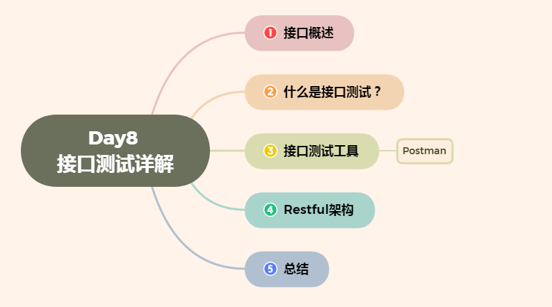
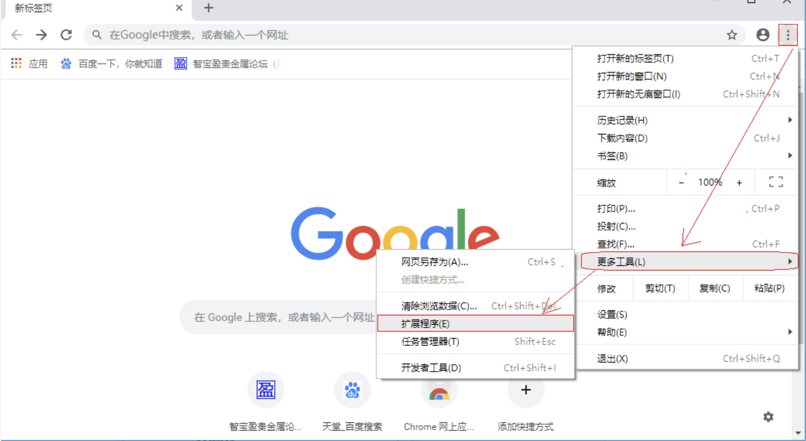
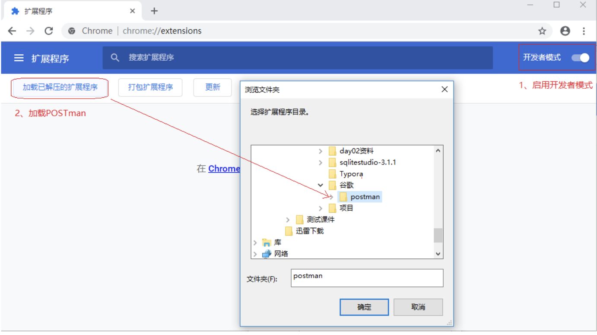

# Day8 接口测试详解--接口概述、什么是接口测试、常用的接口测试工具、RESTFUL架构


[TOC]




# 1. 接口概述

### **1.1 什么是接口呢？**

接口一般来说有两种，一种是程序内部的接口，一种是系统对外的接口; 或者一种是软件接口,一种是硬件接口. 

我们常说的接口是应用程序编程接口,也就是Application Programming Interface,简称API.

### **1.2 常见接口**

1. webService接口：是走soap协议通过http传输，请求报文和返回报文都是xml格式的，我们在测试的时候都用通过工具才能进行调用，测试。可以使用的工具有SoapUI、jmeter、loadrunner等；

2. http api接口：是走http协议，通过路径来区分调用的方法，请求报文都是key-value形式的，返回报文一般都是json串，有get和post等方法，这也是最常用的两种请求方式。可以使用的工具有postman、RESTClient、jmeter、loadrunner等；

### **1.3 使用接口的优点**

- 项目开发中,使用接口带来的优点

```
1. 统一设计标准；
2. 前后端开发相对独立；
3. 扩展性灵活；
4. 前后端都可以使用自己熟悉的技术；
```

- 项目开发中,未使用接口的缺点

```
1. 研发标准不统一，团队磨合难度高
2. 研发周期长
3. 可扩展性差
```

# 2. 什么是接口测试？

### **2.1 什么是接口测试**

接口测试是测试系统组件间数据交互的一种方式. 

接口测试就是通过测试不同情况下的输入参数和与之对应的输出结果来判断接口是否符合或满足相应的功能性、安全性要求.

>  **简单的说,接口测试是就是代替前端或者第三方,来验证后端实现是否符合接口规范.**
>
> 

###  **2.2 接口测试的好处**

通过接口测试,测试接口的正确性和稳定性, 能快速定位bug,提高测试效率. 

- 能为项目平台带来高效的缺陷监测和质量监督能力；
- 平台越复杂，系统越庞大，接口测试的效果越明显（提高测试效率，提升用户体验，降低研发成本）

### **2.3 接口测试原理**

**原理:**

**模拟客户端向服务器发送请求报文，服务器接收请求报文后对相应的报文做处理并向客户端返回应答，客户端接收响应数据后并进行判断**

- 请求: 是否正确, 默认请求成功是返回200, 假如请求错误返回400, 404, 500等状态码
- 检查: 返回数据的正确性与完整性
- 安全性: 接口一般不会暴露在网上任意被调用,需要做一些限制,比如必须登录或者请求次数、频率限制

### **2.4 基本流程**

接口测试流程: 定位服务器接口资源并提交测试数据，然后查看响应结果是否符合预期

1. 定位接口资源(URL)

2. 提交测试数据

3. 检查响应结果

### **2.5 接口测试分类**

- web接口测试
- 模块接口测试

##### (1). web接口测试

- 服务器接口测试, 是测试浏览器与服务器的接口, 是B/S架构的

- 外部接口测试, 测试第三方接口,

  > 举例：支付接口测试/天气预报接口测试

##### (2). 模块接口测试

- 单元测试的基础,主要测试模块的调用与返回.


# 常用的接口测试工具

- **loadrunner：**一款商业性能测试工具，可用来做接口测试、性能测试、压力测试等，很好很强大
- **jmeter：**一款开源的性能测试工具，操作简单，方便，既有jdbc request操作数据库数据，也有http request和soap request应对测试
- **postman：**谷歌浏览器的扩展工具，谷歌商店中选中安装，界面同poster差别不大，界面简洁
- **soapui：**开源测试工具，通过soap/http协议来检查、调用、实现Web Service的功能/负载/符合性测试；
- **RestClient**:  Firefox上一款用于测试各种Web服务的插件，它可以向服务器发送各种HTTP请求（用户也可以自定义请求方式).

我们主要使用Jmeter, 简单了解Postman、RestClient

### 1.  Postman

是google开发的一款功能强大的网页调试与发送网页HTTP请求，并能运行测试用例的的Chrome插件.


#### 1.1 安装postman

- 安装chrome浏览器
- 安装postman插件
- 安装方式离线式/在线式(比较慢,建议离线) [potman安装包](../img/postman/Postman-win64-6.1.3-Setup.exe)

#### 1.2 Postman安装步骤

- 1). 安装谷歌浏览器

- 2). 打开浏览器扩展页面

  - chrome://extensions/
  - 自定义及控制->更多工具->程序扩展

- 3). 勾选开发者模式

  

- 4). 加载已解压的扩展程序





#### **1.3 Postman演示**

- 请求方法（GET）
- 请求URL：<http://www.sojson.com/open/api/weather/json.shtml?city=北京>

#### **1.4 结果**

- 查看响应状态码
- 查看响应数据


#### 小结

接口测试常用工具很多,我们讲解的是比较常用的postman以及后续重点学习的jmeter.


# RESTFUL架构

------

## 目标

- **了解**接口常用架构-RESTful架构相关知识

------

## 1. 定义

RESTful架构是一种**接口**设计架构**风格**，而**不是标准**，只是提供了一组设计**原则**。

*RESTFUL*是一种网络应用程序的设计风格和开发方式，基于HTTP，可以使用XML格式定义或JSON格式定义。*RESTFUL*适用于移动互联网厂商作为业务接口的场景，实现第三方OTT调用移动网络资源的功能，动作类型为新增、变更、删除所调用资源。

REST全称是Representational State Transfer，中文意思是表述性状态转移。 


## 2. 风格

- http://服务器地址:端口号[/项目名称/版本]/**资源**集合[/单个资源]

  ```
  - http://:为我们HTTP协议的访问头标准   
  - 服务器地址：为我们项目服务器IP地址  
  - 端口号：为我们服务器内项目访问的指定编号  
  - [/项目名称/版本]：可选  
  - 资源：互联网-图片、音乐、视频、文本、数据
  ```

------

## 3. RESTful相关知识(科普)

##### 3.3 HTTP请求方法

- GET（SELECT）：从服务器取出资源（一项或多项）。
- POST（CREATE）：在服务器新建一个资源。
- PUT（UPDATE）：在服务器更新资源（客户端提供改变后的完整资源）。
- DELETE（DELETE）：从服务器删除资源。

##### 3.4 响应状态

客户端请求服务求后，服务器响应给客户端的状态码。

##### 3.5 状态码集合汇总

| 序号 | 状态码                    | 动词             | 说明                                                         |
| ---- | ------------------------- | ---------------- | ------------------------------------------------------------ |
| 01   | 200 OK                    | [GET]            | 服务器成功返回用户请求的数据，该操作是幂等的（Idempotent）**幂等:无论执行操作多少次，结果都会执行1次结果相同** |
| 02   | 201 CREATED               | [POST/PUT/PATCH] | 用户新建或修改数据成功                                       |
| 03   | 202 Accepted              | [*]              | 表示一个请求已经进入后台排队（异步任务）                     |
| 04   | 204 NO CONTENT            | [DELETE]         | 用户删除数据成功                                             |
| 05   | 400 INVALID REQUEST       | [POST/PUT/PATCH] | 用户发出的请求有错误，服务器没有进行新建或修改数据的操作，该操作是幂等的 |
| 06   | 401 Unauthorized          | [*]              | 表示用户没有权限（令牌、用户名、密码错误）                   |
| 07   | 403 Forbidden             | [*]              | 表示用户得到授权（与401错误相对），但是访问是被禁止的        |
| 08   | 404 NOT FOUND             | [*]              | 用户发出的请求针对的是不存在的记录，服务器没有进行操作，该操作是幂等的 |
| 09   | 406 Not Acceptable        | [GET]            | 用户请求的格式不可得（比如用户请求JSON格式，但是只有XML格式） |
| 10   | 410 Gone                  | [GET]            | 用户请求的资源被永久删除，且不会再得到的                     |
| 11   | 422 Unprocesable entity   | [POST/PUT/PATCH] | 当创建一个对象时，发生一个验证错误                           |
| 12   | 500 INTERNAL SERVER ERROR | [*]              | 服务器发生错误，用户将无法判断发出的请求是否成功             |

##### 3.6 对结果进行判断

| 序号 | 方法   | 预期结果                                                     |
| ---- | ------ | ------------------------------------------------------------ |
| 01   | GET    | collection：代码：200；数据：返回资源对象的列表（数组）      |
| 02   | GET    | collection/resource：代码：200；数据：返回单个资源对象       |
| 03   | POST   | collection：代码：200/201；数据：返回新生成的资源对象        |
| 04   | PUT    | collection/resource：代码：200/201；数据：返回完整的资源对象 |
| 05   | DELETE | collection/resource：代码：204；数据：返回为空               |

## 4. 总结(RESTful)

| 序号 | 名称        | 值                                                           |
| ---- | ----------- | ------------------------------------------------------------ |
| 01   | 定义        | 一种软件**架构风格**、**设计风格**，而**不是标准**           |
| 02   | RESTful风格 | http://服务器地址:端口号/[服务名]/[版本]/资源集合/单个资源   |
| 03   | 请求方法    | GET(获取资源);POST(新增资源);PUT(更新资源);DELETE(删除资源)  |
| 04   | 状态码      | **GET:200**;POST:200/201;PUT:200/201;**DELETE:204**          |
| 05   | [JSON]      | 是一种轻量级的数据交换格式;JSON是已键/值对组合方式，键名写在前面并用双引号 "" 包裹，使用冒号 : 分隔，然后紧接着值： 1 {"name": "张三","age":18} |


# 总结：

接口测试要遵循一些要点:

1. 接口的功能性实现. 检查接口返回的数据与预期结果的一致性.
2. 测试接口的容错性, 例如传递的数据类型是错误的能否处理.
3. 测试接口参数的边界值. 例如传递的数据足够大或者为负数时能否处理
4. 测试接口性能, 接口处理和响应数据的时间也是测试的一个方面, 这牵扯到代码实现的优化
5. 测试接口的安全性. 特别是第三方接口,比如登录的用户名密码第三方是否是密文传输的


> 如果有什么不懂的，或者疑问欢迎评论区提问~
>
> 个人GitHub主页：https://571290717.github.io/


