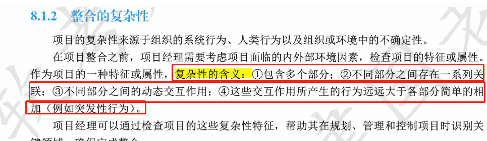

# 软考笔记


　　**二、软考信息系统项目管理教材第四版变更明细**

| **信息系统项目管理师 第四版** | **信息系统项目管理师 第三版**                                |
| ----------------------------- | ------------------------------------------------------------ |
| 第1章 信息化发展              | 第1章 信息化和信息系统                                       |
| 第2章 信息技术发展            | 新增                                                         |
| 第3章 信息系统治理            | 新增                                                         |
| 第4章 信息系统管理            | 新增                                                         |
| 第5章 信息系统工程            | 【软件工程】+第22章 信息系统安全管理                         |
| 第6章 项目管理概论            | 第2章 信息系统项目管理基础                                   |
| 第7章 项目立项管理            | 第3章 项目立项管理                                           |
| 第8章 项目整合管理            | 第4章 项目整体管理                                           |
| 第9章 项目范围管理            | 第5章 项目范围管理                                           |
| 第10章 项目进度管理           | 第6章 项目进度管理                                           |
| 第11章 项目成本管理           | 第7章 项目成本管理                                           |
| 第12章 项目质量管理           | 第8章 项目质量管理                                           |
| 第13章 项目资源管理           | 第9章 项目人力资源管理                                       |
| 第14章项目沟通管理            | 第10章 项目沟通管理和干系人管理                              |
| 第15章 项目风险管理           | 第11章 项目风险管理                                          |
| 第16章 项目采购管理           | 第12章 项目采购管理+第13章 项目合同管理                      |
| 第17章 项目干系人管理         | 第10章 项目沟通管理和干系人管理                              |
| 第18章 项目绩效域             | 来源PMBOK7.0第二章                                           |
| 第19章 配置与变更管理         | 第14章 信息文档管理与配置管理+第16章 项目变更管理            |
| 第20章 高级项目管理           | 第18章 组织级项目管理+第20章 项目集管理+第21章 项目组合管理+第24章 项目管理成熟度模型+第25章 量化的项目管理 |
| 第21章 项目管理科学基础       | 第27章 管理科学基础知识                                      |
| 第22章 组织通用治理           | 来源《管理学原理》部分+第17章 战略管理                       |
| 第23章 组织通用管理           | 来源《管理学原理》部分+第15章 知识管理+第19章 流程管理       |
| 第24章 法律法规与标准规范     | 第26章 知识产权与标准规范                                    |
|                               | 第23章 信息系统综合测试与管理                                |
|                               | 第28章 项目管理过程实践和案例分析                            |

　　**三、软考信息系统项目管理教材第四版新增内容**

| **信息系统项目管理师第四版 新增目录** |                                 |
| ------------------------------------- | ------------------------------- |
| **第1章信息化发展1**                  | **第15章项目风险管理431**       |
| 1.2现代化基础设施7                    | 15.8实施风险应对463             |
| 1.2.1新型基础设施建设7                | **第17章项目干系人管理503**     |
| 1.2.2工业互联网8                      | 17.4规划干系人参与509           |
| 1.2.3车联网10                         | **第18章项目绩效域520**         |
| 1.3现代化创新发展12                   | 18.1干系人绩效域520             |
| 1.3.1农业农村现代化12                 | 18.1.1绩效要点520               |
| 1.3.2两化融合与智能制造13             | 18.1.2与其他绩效域的相互作用521 |
| 1.3.3消费互联网15                     | 18.1.3执行效果检查522           |
| 1.4数字中国16                         | 18.2团队绩效域522               |
| 1.4.1数字经济17                       | 18.2.1绩效要点522               |
| 1.4.2数字政府 20                      | 18.2.2与其他绩效域的相互作用526 |
| 1.4.3数字社会23                       | 18.2.3执行效果检查526           |
| 1.4.4数字生态27                       | 18.3开发方法和生命周期绩效域526 |
| 1.5数字化转型与元宇宙28               | 18.3.1绩效要点526               |
| 1.5.1数字化转型28                     | 18.3.2与其他绩效域的相互作用531 |
| **第2章信息技术发展**                 | 18.3.3执行效果检查532           |
| 2.2.4区块链57                         | 18.4规划绩效域532               |
| 2.2.5人工智能60                       | 18.4.1绩效要点532               |
| 2.2.6虚拟现实63                       | 18.4.2与其他绩效域的相互作用535 |
| **第3章信息系统治理67**               | 18.4.3执行效果检查536           |
| 3.1IT治理67                           | 18.5项目工作绩效域536           |
| 3.1.1T治理基础67                      | 18.5.1绩效要点537               |
| 3.1.2IT治理体系69                     | 18.5.2与其他绩效域的相互作用539 |
| 3.1.3IT治理任务73                     | 18.5.3执行效果检查539           |
| 3.1.4IT治理方法与标准74               | 18.6交付绩效域539               |
| 3.2IT审计80                           | 18.6.1绩效要点540               |
| 3.2.1IT审计基础80                     | 18.6.2与其他绩效域的相互作用541 |
| 3.2.2审计方法与技术83                 | 18.6.3执行效果检查541           |
| 3.2.3审计流程88                       | 18.7度量绩效域542               |
| 3.2.4审计内容89                       | 18.7.1绩效要点542               |
| **第4章信息系统管理93**               | 18.7.2与其他绩效域的相互作用549 |
| 4.1管理方法93                         | 18.7.3执行效果检查550           |
| 4.1.1管理基础93                       | 18.8不确定性绩效域550           |
| 4.1.2规划和组织94                     | 18.8.1绩效要点550               |
| 4.1.3设计和实施98                     | 18.8.2与其他绩效域的相互作用552 |
| 4.1.4运维和服务100                    | 18.8.3执行效果检查552           |
| 4.1.5优化和持续改进104                | **第22章组织通用治理**          |
| 4.2管理要点107                        | 22.2绩效考核645                 |
| 4.2.1数据管理107                      | 22.2.1绩效计划645               |
| 4.2.2运维管理119                      | 22.2.2绩效实施648               |
| 4.2.3信息安全管理125                  | 22.2.3绩效治理649               |
| **第5章信息系统工程129**              | 22.2.4绩效评估650               |
| 5.1.5部署交付142                      | 22.2.5绩效评价结果反馈653       |
| 5.2数据工程146                        | 22.2.6绩效评价结果应用653       |
| 5.2.1数据建模147                      | 22.3转型升级654                 |
| 5.2.2数据标准化149                    | 22.3.1战略转型升级654           |
| 5.2.3数据运维153                      | 22.3.2数字化转型实施656         |
| 5.2.4数据开发利用157                  | **第23章组织通用管理663**       |
| 5.2.5数据库安全161                    | 23.1人力资源管理663             |
| 5.3.1集成基础163                      | 23.1.1人力资源管理基础663       |
| 5.3.2网络集成164                      | 23.1.2工作分析与岗位设计664     |
| 5.3.3数据集成165                      | 23.1.3人力资源战略与计划667     |
| 5.3.4软件集成167                      | 23.1.4人员招聘与录用670         |
| 5.3.5应用集成169                      | 23.1.5人员培训673               |
| 6.4.5项目绩效域221                    | 23.1.6组织薪酬管理676           |
| 6.4.6价值交付系统221                  | 23.1.7人员职业规划与管理680     |
| **第8章项目整合管理237**              | 23.4 市场营销705                |
| 8.2项目整合管理过程239                | 23.4.1营销基础705               |
| 8.2.1过程概述239                      | 23.4.2营销环境708               |
| 8.2.2裁剪考虑因素241                  | 23.4.3营销分析709               |
| 8.2.3敏捷与适应方法241                | 23.4.4营销管控713               |
| 8.6管理项目知识255                    | 24.1.6商标法718                 |
| **第12章项目质量管理358**             | 24.1.7网络安全法718             |
| 12.4管理质量368                       | 24.1.8数据安全法719             |
| **第13章项目资源管理380**             | **第24章法律法规与标准规范717** |
| 13.5获取资源396                       | 24.2.2新一代信息技术标准723     |





distributed

ledger

record

transaction

parties

efficiently

verifiable

permanent

分布式的

分类账簿

记录

交易

当事人

有效地

可核实的

永久的


```
record - 百度翻译
记录
常见释义
英[ˈrekɔːd , rɪˈkɔːd]
美[ˈrekərd , rɪˈkɔːrd]
n.	记录，记载; 〈计〉记录（指作为一个单位来处理的一组相连的数据）; 〈报刊〉纪事，纪录; 履历，历史，成绩; 案卷，档案; 唱片，录制品; （有关过去的）事实; （尤指体育运动中）最高纪录，最佳成绩; 审判记录，议事录，记录凭证; 明证，纪念品; 前科记录; 公文书;
v.	记录，记载; 标志，显示，表明，记明; 录制，录(音)，录(像); （尤指体育上）获得（好成绩）; 登录，登记，提交（契据等）备案; （自动仪器、仪表等）自动记录表明，标示; 演奏音乐供录制，灌（唱片）; 〈古〉吟唱，（鸟）啭鸣; 发表正式（或法律方面的）声明;
adj.	创纪录的，空前的;
[例句]The temperature reached a record low in London last night.
昨晚伦敦的气温降到了有记录以来的最低点。
[其他]	第三人称单数：records 复数：records 现在分词：recording 过去式：recorded 过去分词：recorded


verify - 百度翻译
验证
常见释义
英[ˈverɪfaɪ]
美[ˈverɪfaɪ]
vt.	验证; 核实; 证实; 证明; 核准; 查对;
[例句]He tried his best to verify this theory.
他想尽一切办法来验证这个理论。
[其他]	第三人称单数：verifies 现在分词：verifying 过去式：verified 过去分词：verified

```


monitoring

contract

performance

corrections

appropriate

contracts

监测

合同

表演

校正

适当的

合同

procurement


```
monitoring 监视 ; 检查 ; 监听 ; 跟踪调查 ; 监视，[自]监控；检验，检查 ; monitor的现在分词
contract 合同 ; 合约 ; 协议 ; 契约 ; 收缩，缩小 ; 订立 ; 得 ; 与…订立合同 ; 感染 ; 订立…的合同
performance 履行，执行，完成 ; 进行，施行 ; 表现，性能，业绩，工作情况 ; 表演，演出 ; <口>行为，举动 ; 事情，成绩，作品 ; 艺术上的表现，演技 ; 演技 ; 麻烦，忙乱 ; 语言表现，言语行为 ; 性能卓越的，高性能的
corrections 纠正 ; 修正 ; 改正 ; 处罚 ; 惩罚 ; 惩治 ; 改正的行动 ; correction的复数
appropriate 适当的 ; 合适的 ; 恰当的 ; 拨 ; 挪用 ; 占用 ; 盗用 ; 侵吞
contracts 合同 ; 合约 ; 协议 ; 契约 ; 收缩，缩小 ; 得 ; 与…订立合同 ; 感染 ; contract的第

procurement
英
/prəˈkjʊəmənt/
  
美
/prəˈkjʊrmənt/
 
n.
采购;(尤指为政府或机构)购买

control 控制
conduct 实施
strategy
n.
战略;策略;规划;行动计划;部署;策划;战略部署;计策;统筹安排


involves 
population人口
inspection
involves 需要 ; 影响 ; 参加，加入 ; 包含 ; 牵涉 ; 牵连 ; 使成为必然部分 ; involve的第三人称单数
inspection 检查 ; 视察 ; 查看 ; 审视

```


