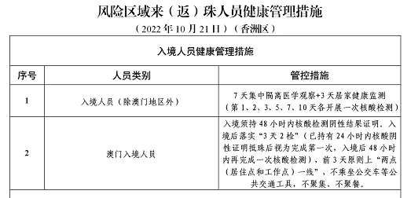
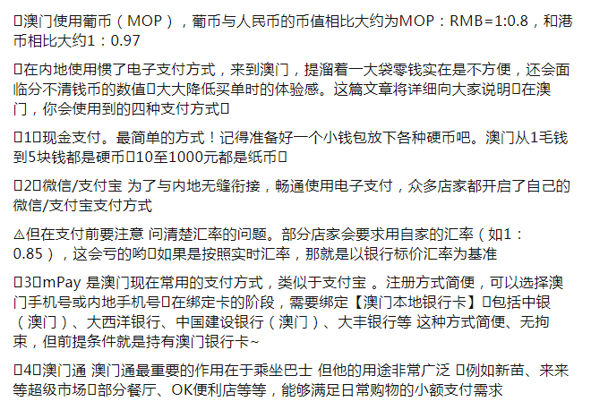
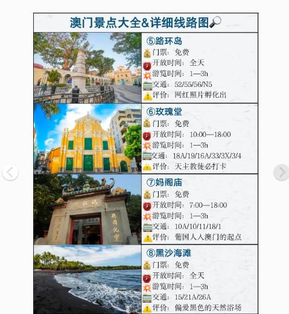
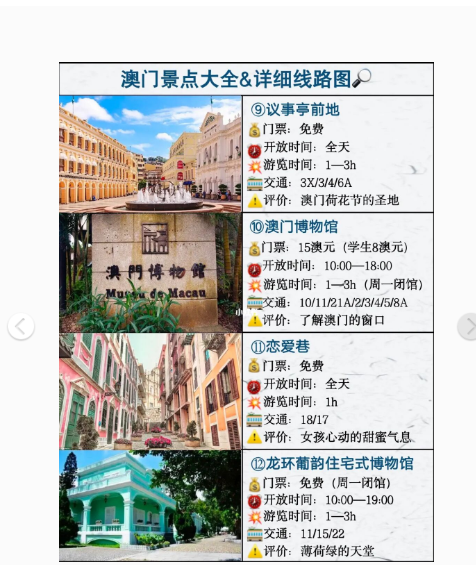
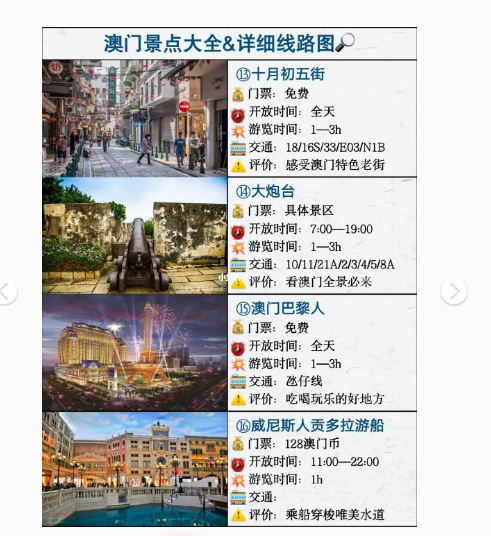
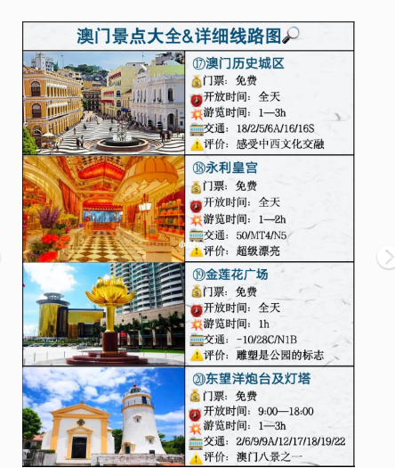
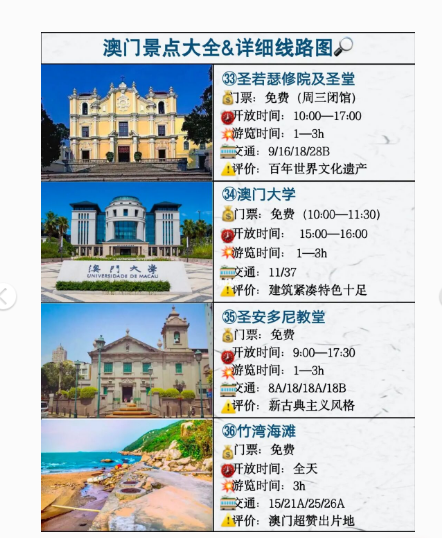
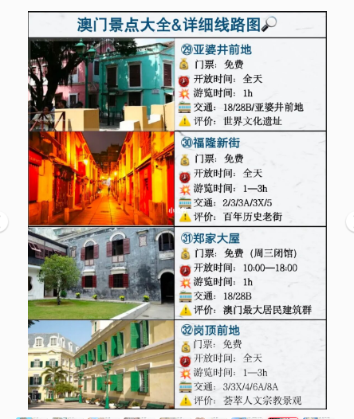
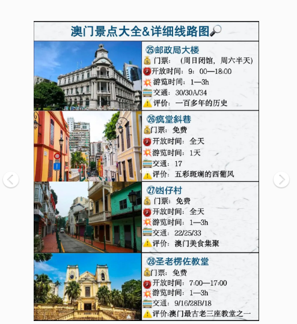
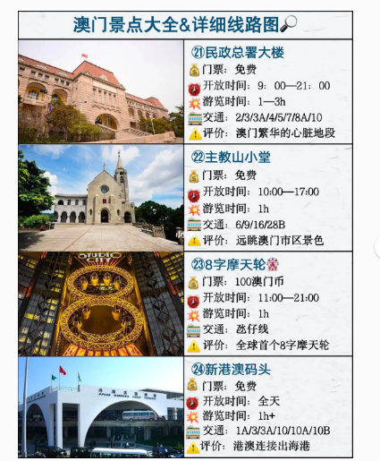

# 珠海到澳门全攻略🇲🇴

------

## 一、珠海到澳门通关

**拱北口岸通关，第一次过口岸要走人工通道**

**【科大医院】地址为澳门凼仔伟龙马路澳门科技大学 H 座，三针的费用约5600元人民币，开诊时间为周一至周日，上午9点至下午5点，不用预约 随到随打。路线：坐高铁到珠海站——珠海拱北口岸——澳门关闸——打车到科大医院），或者在澳门关闸搭乘免费巴士到新濠天地或威尼斯人酒店，步行15分钟即可到达科大医院。**

**主要有三种方式兑换澳门元：**
**1、在内地各城市的中国银行的分行将人民币兑换成澳门元。**
**2、到澳门的中国银行兑换。**
**3、到澳门后到澳门中国银行的分行、支行或营业所办一张中银卡（凭通行证），本卡可以存入人民币、澳门元和港币，取出为澳门元和人民币。**
**拓展资料**

**澳门核酸点。各个酒店都有自费验核酸的，很方便，一般8个小时能出来，所以提前做好规划不用担心回程问题哦**

回珠海：

上网信号：

1、淘宝买卡

2、打客服电话开启漫游

#  二、澳门消费指南

💙💙1、澳门出入最新要求，现在是7天核酸结果来回，但划重点来了！‼‼️‼️‼️️坐船回深圳的小红薯们‼️‼️‼️码头要求72小时核酸才能买票以及进站，我们不知道这个消息，在核酸还有20分钟过72小时的时候进站了，差点回不来了！所以大家要注意留意码头的核酸要求，别耽误了行程

💙💙2、澳门核酸点。各个酒店都有自费验核酸的，很方便，一般8个小时能出来，所以提前做好规划不用担心回程问题哦

💙💙3、购物汇率。一般在79上下波动，之前是支》微，但最近是微比支划算，可以随时对比。

💙💙4、支付优惠券。支付bao记得定位澳门，可以领取优惠券和优惠汇率，微xin搜索“境wai游礼包”，领取汇率优惠和叠加优惠券，支付一次领新的一张哦。

💙💙5、返现活动。携🍊订酒店机票的，可以领取返现，另外金沙商圈也有交行的返现哦，但我暂时还没收到返现不知道是不是超名额了，有新消息会更新。

💙💙6、DFA满75折，雅婷部分产品直接75折，加上汇率都非常划算

💙💙7、金沙🐟乐，进门会有服务员推荐你办会员卡，有几张餐券赠送，但实际上餐券是500-100的哦，有需要才注册。而且最近当天累计10个积分可以兑换免费酒店一晚，还是非常划算的！另外这张卡可以在金沙餐饮打9折，还是不错的。

💙💙8、酒店。记得领取5折优惠券再预定，维尼🐻斯人一晚不到300，超划算了。但如果你们是计划玩几局的话，可以一天玩超过10个积分去兑换免费酒店哦。

💙💙9、苹果专卖。汇率折算可以说是非常划算了，具体情况可以在我主页另外一篇笔记看哦

💙💙10、最近人特别少，连包包都不需要排队，爱马仕香奈鹅lv直接进。

💙💙金沙消费券的活动4月没有，5月开始有，有其他优惠欢迎大家补充或者再评论区提问哦！

\#澳门旅行 #澳门 #澳门酒店 #澳门购物 #澳门通关 #周末去哪儿 #薅羊毛

主要有三种方式兑换澳门元：
1、在内地各城市的中国银行的分行将人民币兑换成澳门元。
2、到澳门的中国银行兑换。
3、到澳门后到澳门中国银行的分行、支行或营业所办一张中银卡（凭通行证），本卡可以存入人民币、澳门元和港币，取出为澳门元和人民币。
拓展资料
1.香港是继纽约和伦敦之后的世界第三大金融中心，因此使港币成为体系健全、币值稳定的货币之一。虽然港币发行历史不算长，区域也不大，但其发展具有一定的代表性。
2.港元的纸币绝大部分是在香港金融管理局监管下由三家发钞银行发行的。三家发钞行包括汇丰银行、渣打银行和中国银行，另有新款紫色十元钞票，由香港金融管理局自行发行。硬币则由金融管理局负责发行。自1983年起，香港建立了港元发行与美元挂钩的联系汇率制度。发钞银行在发行任何数量的港币时，必须按7.80港元兑1美元的兑换汇率向金管局交出美元，记入外汇基金账目，领取了负债证明书后才可印钞。这样，外汇基金所持的美元就为港元纸币的稳定提供支持。
3.值得注意的是，香港所有钞票的式样都有版权。所以，任何人在未有得到版权持有人的许可前，都不能任意复制钞票的式样。在香港多年来有几家机构因为未得钞票版权持有银行的批准而在广告上运用，结果被判支付巨额罚款。
4.香港的第一张纸币是1845年由东方汇理银行发行，但在很长时间里都没能真正的普遍流通。直到1857年，香港政府准许用纸币支付费用，随之许多银行相继开始发行钞票，到1865年有5家银行发行的钞票得到了香港政府的认可，但5元以下的钞票除非特别许可不得发行。真正以港元为货币单位是在1935年11月。
5.1945年以后，香港地区流通的货币是由三家银行发行的，即汇丰银行、渣打银行和有利银行，1元以下的由政府发行。到1959年有利银行被汇丰银行收购，这一时期的港币钞票均由汇丰银行和渣打银行发行，5元以下硬币由政府发行。1994年中国银行开始在香港地区发行钞票。到2012年为止香港地区有三家银行发行钞票，即汇丰银行、中国银行和渣打银行。在香港地区发行钞票的三家银行对老版钞票一般不宣布停止流通，而是回笼后不再投放，使其逐步退出流通。自1993年起，汇丰银行和渣打银行发行的新版钞票将带有殖民地色彩的图案均由狮头和紫荆花图案所代替。旧版钞票仍可使用，但将会逐渐退出流通领域。

# 赴澳门接种9价HPV疫苗攻略！！

如果已经感染的话可以补充一些硒元素，对转阴很有帮助，我之前是在某东买的深海植物硒，不到半年就转阴了，如果你现在想打九价疫苗，国内很难打到，这是去澳门接种的攻略，分享给你们。

澳门的科大医院、镜湖医院和银葵医院均有9价HPV疫苗接种，9-45岁男女均可接种。必须接种全部三剂疫苗方可提供保护，较常用的接种时间为：第二剂于第一剂后60天接种；第三剂于第一剂后180天接种，并且要求在一年内完成三剂。

1、【科大医院】地址为澳门凼仔伟龙马路澳门科技大学 H 座，三针的费用约5600元人民币，开诊时间为周一至周日，上午9点至下午5点，不用预约 随到随打。路线：坐高铁到珠海站——珠海拱北口岸——澳门关闸——打车到科大医院），或者在澳门关闸搭乘免费巴士到新濠天地或威尼斯人酒店，步行15分钟即可到达科大医院。

2、【镜湖医院】地址为澳门镜湖马路33号，三针的费用约4880元人民币，非澳门居民要先在医院官网预约，并且每日限额10名。

3、【银葵医院】是私立医院，地址为澳门苏亚利斯博士大马路2。三针费用一次性付清，约5900元人民币，需要提前1～2天电话预约。

4、【澳门妇女联合总会妇女保障中心】地址为澳门半岛文第士街17-C，单针费用约5600元人民币。乘车路线：坐高铁到珠海站——珠海拱北口岸——澳门关闸搭25 或25B巴士到二龙喉公园站下，步行200米即到。

注意事项：1、提前一天做核酸检测；2、接种HPV疫苗前一个月不可接种其它疫苗，接种HPV疫苗后须相隔至少14天方可接种其它疫苗；3、不要在疾病急性期接种，例如感冒、发热等；4、接种HPV疫苗后14天内清淡饮食，忌酒；5、多带一件厚外套，医院等候时间较长，空调很冷！

- # 珠海去离澳门你需要知道的一切，有问必答！

  我是1月初去澳门玩的，暴走了四天，回来在家瘫了几天，终于有精力来更新下这次旅行。

  今天给大家介绍下准备篇，去澳门及通关攻略。

  ⚪️去澳门要准备什么：

  一.7天内阴性证明（包括了你到澳门及离开的时间，若离开超过七天期限，要在澳门做核酸才能离开，澳门核酸也很方便，基本上大型商场都有核酸点）。通关电子纸质都可以，建议时间够，纸质也带身上，因为电子信息上传可能没那么快，我当时提前一天去做的，结果第二天一早去走自动过关无效，因为信息还没来的及上传。

  在微信搜索粤康码，点击通关凭证，根据指示填写信息就好，提前截图好。珠海机场落地都要做核酸现在，坐大巴去口岸很方便。珠海高铁站就在拱北口岸旁边。

  二.港澳通行证和身份证，现在疫情，签注也需要七个工作日，需要提前计划好时间。

  三.换钱，可以提前在 中国银行公众号 预约，大概两到三个工作日。拱北口岸也有很多换钱点，然后澳门银行也可以换，一般500或1000港币/澳门币起，1000元收20手续费。建议带一张信用卡，换500在身上备着，虽然用支付宝/微信地方很多，但是有一些网红小店不支持且需要换些零钱做公交（零钱可以在酒店换）。

  ◾️基本上人民币/澳门币/港币都支持，如果实在不行投人民币坐公交或者商店付钱也可以，但是汇率1:1:1，就是有点亏。10澳门币=8人民币。

  🟡出关

  大家去澳门很大一部分都会shopping，确实价格非常划算，活动也很多。理论上是5000免税，但是你别太张扬，把logo袋子招摇摆出来，一般没事，不会查你。发票，包装，商品最好分开装，挑早上九点，中午，傍晚出关，这时候人多，工作人员基本上不会看你。

  

  明天更新澳门旅游第一篇，官也街吃喝/澳门看电影/看夜景篇。#澳门旅行 #澳门 #澳门通关 #珠海 #

- 

# 澳门九价｜HPV终于上岸啦！

因为疫情原因最后一针被拖了两个月终于在8月14日打上了。

📍科大医院：澳门特别行政区嘉模堂区伟龙马路科技大学H座

🕑：9:00-17:00无需预约（据说现在暂无HPV）‼️ 具体情况请关注【科大医院】公众号

💰：当天去当天打，平均一针折合人民币1800—1900 元，一次一付。

关于去澳门所需要准备的东西如图2️⃣、3️⃣

tips📃：建议当天去当天回的早上坐最早高铁到关口👉从青茂口岸过关后 👉出口左手边往前走大概100米处有一个公交车站 【乘坐51 公交车2站】到【科大站】下车，自备好6 元澳币。不找零‼️

珠海→澳门:48小时核酸

澳门→ 珠海:入珠海无需强制核酸啦!!

(但是出境要24小时，回到自己的地方还是要做个3天2检哦)

暑假过后游客量不多，在澳门做核酸的话很方便不用怎么排队

过关前提前准备:

珠海➡️澳门粤康码🐎

🇲🇴粤康码通关凭证(选广东→澳门)

澳康码(这个只是通关使用哦，如果当天来回核酸有效期在24小时内就不用在澳门再次核酸啦)

澳门➡️珠海

在【健康珠海】小程序申报就可以啦，入境后没有强制核酸了

也可自愿在口岸进行采样

现在只能是低风险地区入境免隔离中高风险地区有24小时核酸也不行哦❌

打个比喻(深圳有的地方是低风险但是同一个市有其他区域高风险澳门入境会手动给你转黄码，宝子们就不要冒这个风险啦)

入境后截图保存好澳门健康码出入公共场所都要出示

✍️签证一定要提前一个星期到半个月办理哦，疫情防控现在都不支持机办!

🏷️便利tips

🥡外卖app推✅mFood(澳觅)

🚕打车app就用澳门电召

🚌巴士就用澳门通卡片实名后半价优惠

📱上网口岸/🍑宝买流量卡或者zfb按天开通数据漫游，前者实惠后者方便

💰兑换不用换太多现金，逛吃wx或zfb都很方便的啦

🛃过关口岸建议走横琴(近氹仔)一地两检快速过关➡️或者拱北(近半岛)虽然人多但是发cai车基本各大热门酒店都可到达免费🆓

🏨住宿喜欢逛街就住氹仔，喜欢吃就住半岛老区

# 澳门🇲🇴旅游攻略第1⃣️篇//线路景点大全🔥

这篇详细讲景点和旅游线路规划，感兴趣可以出内陆去澳门需要注意事项⚠️

[火R]经典一日游[火R]

\#大三巴牌坊 —#玫瑰圣母堂 —#新马路议事亭前地广场 —#東望洋燈塔 —#澳门渔人码头 —#龙环葡韵 —#澳门官也街 —#澳门威尼斯人度假村

[火R]世遗打卡一日游[火R]

议事亭前地—#岗顶前地 —#圣老楞佐堂 —#郑家大屋 —#亞婆井前地 —#澳门西望洋山 —#妈阁庙

[火R]美食打卡一日游[火R]

\#红街夜市 —#三盏灯 —#义字街 —#包公庙 —大三巴

[火R]赛博朋克拍照📷路线[火R]

\#澳門龍園 —东望洋山—#東望洋新街 —东望洋斜巷—#瘋堂斜巷 —#澳门大炮台

[火R]葡式建筑群拍照📷半日游[火R]

氹仔嘉善堂—氹仔观音堂—路氹历史馆—官也街—嘉模会堂—嘉模圣母堂—龙环葡韵

[火R]徒步爱好者一日游[火R]

\#龍爪角 —黑沙沙滩

[火R]二日游🔥

[打卡R]Day[一R]：大三巴牌坊—玫瑰圣母堂—新马路议事亭前地—妈阁庙 —渔人码头—东望洋灯塔

[打卡R]Day[二R]：#十月初五马路 —#圣方济各圣堂 —#黑沙滩 —#澳門氹仔 —龙环葡韵—官也街—威尼斯人度假村/#新濠天地

[火R]三日游[火R]

[打卡R]Day[一R]：大三巴牌坊—恋爱巷—玫瑰圣母堂—#关前正街 —疯堂斜巷—大炮台

[打卡R]Day[二R]：官也街—龙环葡韵—威尼斯人—#澳門倫敦人 —#澳门巴黎人 —#8字形摩天轮

[打卡R]Day[三R]：路环岛—黑沙海滩—#竹湾豪园 —#澳門龍爪角 —#九澳

[种草R]澳门🇲🇴基本情况:

[一R]澳门🇲🇴由三个半岛构成:澳门半岛、氹仔岛、路环岛

[二R]澳门半岛:历史人文、生活气息比较浓，好吃的老店也集中在澳门半岛。

[三R]氹仔有大型酒店和赌场:永利皇宫、威尼斯人、伦敦人、巴黎人都集中在此。是一个金碧辉煌的世界，购物集中在此

[四R]路环岛有海岸线，想去海边，感受小清新的氛围，可以去环岛。跟厦门、台湾的感觉比较像。

[五R]澳门并不是一年四季都是夏天，现在是澳门的冬天，温度像内地的秋天，千万不要只带夏装。具体温度可以网上查。

