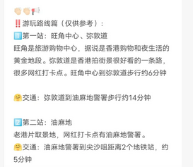
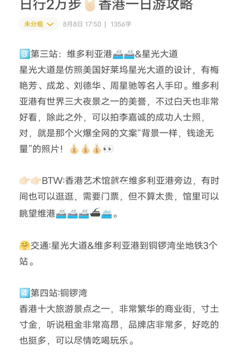
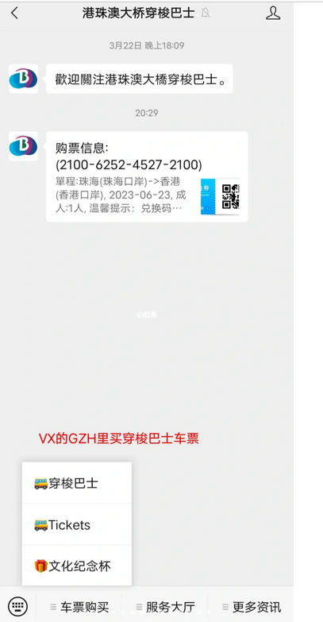
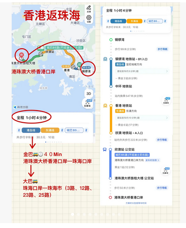

# 珠海到香港

# ‼️提前准备篇：

**1️⃣身份证、港澳通行证（确保签注有效）**
**2️⃣两个充电宝，少了找不到电，多了太重**
**3️⃣港币若干，丰俭由人**
**4️⃣公众号“海关旅客指尖服务”进行健康申报，提前截图保存，出入关都要填**
**5️⃣下载地图，用于步行导航和公交地铁导航，我用的是高德地图，全程也算畅通无阻**

**6、支付宝搜索“境外上网”，选择运营商-目的地-套餐**

**7、③翻译器用!【有道翻译官】，路牌车辆拍照翻译，问路对话输入翻译，不用担心语言交流问题**

工具：谷歌地图Google Map（真的非常好用！）
流量：zfb购买的套餐，没有像别人说的卡顿问题~很好用

## ‼️买票篇（交通）：

从公众号“港珠澳大桥穿梭巴士”买票，选择单程珠海-香港，日间票58RMB（6:00-23：59），夜间票63RMB（0:00-5:59），注意看出发日期，别买错啦，不然退票要手续费5RMB（问就是白送过），不用提前太久买票，可以注意班次信息，看好时间，注意港珠澳大桥珠海口岸要8点才可通关

在公众号上买好票的话，要到**港珠澳大桥珠海公路口岸自助取票机打印纸质**票作为上车凭证，根据指引很容易找到
港珠澳大桥珠海公路口岸到达香港口岸约40分钟

一日游可以选择不买八达通，大部分可以ZFB或WX支付（坐可爱的叮叮车要现金或八达通），**修改支付宝左上角定位为中国香，选择“出行”，授权获取地铁和公交乘车二维码，注意二维码下面有可用路线信息。**

**到香港口岸后坐A21到旺角中心、油麻地或尖沙咀，40分钟左右**

# ‼️游玩路线篇（仅供参考～写不下了～请看上图）

**旺角→油麻地署警→尖沙咀→星光大道→天星小轮→中环摩天轮→坚尼地城→湾仔→维多利亚港→铜锣湾**

**3.美食推荐**
**华嫂冰室（餐厅）、兰芳园（奶茶）、妈咪鸡蛋仔、Bakehouse（蛋挞）、potato corner（薯条）、富豪雪糕**

5⃣一日游路线
①迪士尼一日游
②目的购买奢侈品：尖沙咀(多商城免税店)➡️维多利亚港(结束购物附近看看夜景)
③打卡式旅游：黄大仙祠➡️旺角➡️油麻地➡️尖沙咀➡️星光大道➡️太平山顶(杜莎夫人蜡像馆就在这里)➡️中环(摩天轮，大黄鸭)➡️乘坐天星小轮➡️维多利亚港

A11巴士抵达铜锣湾时代广场
价格：41.9港币
时长：45分钟左右

👏🏻👏🏻📢

# ‼️回程篇:

铜锣湾坐地铁到旺角地铁站，找来时下车的公交站，转坐A21公交到香港口岸，记得买回程票，还是可以在公众号上买的，然后就可以坐上回港珠澳大桥珠海公路口岸的穿梭巴士啦。如果是住在珠海或想在珠海玩的话，可以打滴，想省钱的话，可以坐公交，公交有3、12、23、25线路，站名叫大桥口岸枢纽站，入关后根据指引可以很容易找到各个交通方式的上车点

# 提示篇

②香港出租车起步价27/2公里，之后每200米叮一次。
③香港消费工资除以7和内地水平差不多(哪里赚钱哪里话花，来旅游花销会比较多，因为物价高)。
④关于是否排外，我个人旅行途中接触到的都很友好，保持礼貌一般再哪里都不太会被讨厌。
⑤关于安全，香港的警察都很友好，但人生地不熟的情况下，避免去些老城区的偏僻巷子里。

深圳－香港 －珠海

# 必要花销

富豪雪糕13+叮叮车3+摩天轮20+天星小轮6
⚠️⚠️注意事项：
1.提前在淘宝上购买流量卡，一天1GB¥10，不用插卡，到了香港切换。
2.在口岸附近兑换300港币，有些店和打车只能现金支付。
3.要带充电宝和一瓶水，否则都很贵。
4.叮叮车、地铁、摩天轮、富豪雪糕🍦可以微信和支付宝，天星小轮必须用现金6港币。
5.地铁上不能饮食、爱心座椅不能随意坐，路上不能乱扔垃圾说脏话抽烟🚬，不能闯红灯，以上可能会被罚款。
6.叮叮车下车提前按铃，香港车速较快，注意安全
7.坐金巴回珠海路线如图1.3
路线：珠海➡️香港
1.从珠港澳穿梭巴士小程序买票🎫58💰，从港珠澳大桥口岸上车30分钟左右到达香港
2.乘公交33💰到达旺角 步行到油麻地 太子 在乘地铁🚇到达尖沙咀开始扫街

4.在尖沙咀一个巷子里吃了九龙餐室，这个类似盖浇饭的还不错，最后也尝了他家的菠萝包
5.星光大道就在维多利亚港，无论是白天还是夜晚拍照真的都非常漂亮
6.港币4元坐星天小轮夜游维多利亚港(这个是真的很划算）星天小轮到达中环 可以坐车去太平山顶。我们那天两个人都太累就没有去太平山顶坐缆车🚡……吐槽几句……地铁🚇挺贵 而且地铁路线特别不好找 大部分闸口都是可以刷支付宝 此外各种地图导航在这里都会谜😤最后回去时真的非常非常赶 9点25的车从香港西九龙到广州东 我们从香港站坐地铁🚇到西九龙就一站，但出站到过关检查真的特别远，最少得留出半小时😏😏😏

