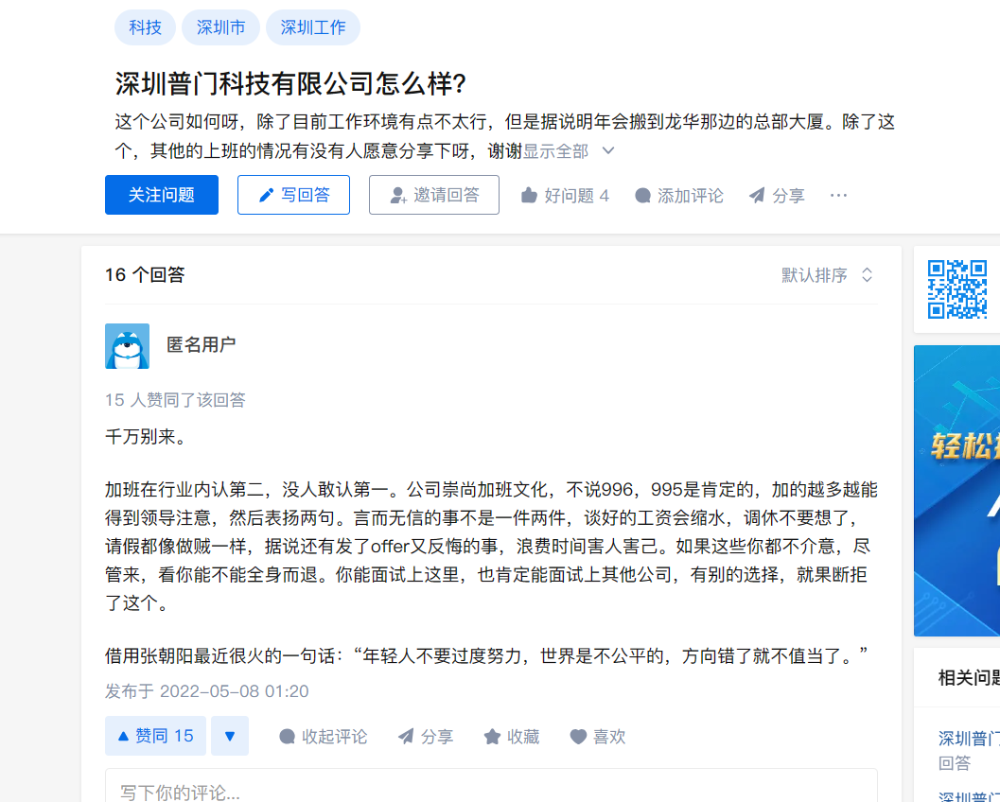

普门科技软件测试工程师面试


'''

'''

```
1、自我介绍
#你好面试官，我叫黄高翔，21年毕业于沈阳理工大学，信息管理与信息系统专业，在大学期间有前端开发的实习经历，在校期间也获得英语四级证书、全国计算机等级C语言二级证书，后通过校招进入珠海格力电器从事软件测试工程师工作，主要负责公司软件的功能测试、性能测试工作、以及自动化测试，我个人对测试行业也很有兴趣、在格力工作期间也是提前两个月转正、从一开始的功能测试做起，到现在也是带领其他测试组成员完成测试任务了。
个人掌握的技能也包括测试理论、测试工具、Python、mysql数据库、测试框架、以及基础的前端知识和后端Django框架，自己也能搭建的Django项目。


普门背景：
深圳普门科技股份有限公司是一家研发和市场双轮驱动的专业化高科技医疗设备企业，国家高新技术企业，科创板上市企业（股票简称：普门科技；股票代码：688389）。公司致力于治疗与康复产品、体外诊断产品及配套试剂的研发、生产、全球销售和服务。

公司荣获国家科学技术进步奖一等奖、荣获中国分析测试协会科学技术奖【特等奖】、荣获深圳市科学技术进步奖一等奖等。经过国家六部委批准设立【院士工作站】；建成了 “广东省工程技术研究中心”、“深圳市工程技术研究中心”、“深圳市工程实验室”、“深圳市企业技术中心”、“博士后创新实践基地”等6大技术创新平台。先后承担国家科技部、发改委、工信部、省级、市区级研发及产业化项目30多项。

在体外诊断产品领域，建成电化学发光免疫分析技术平台。在免疫比浊、液相色谱、免疫荧光、血凝力学、分子诊断等检测技术平台，自主开发特色化、专业化的体外诊断设备与配套试剂。

在治疗与康复产品领域，基于多元化的治疗与康复产品，以疾病和临床科室为中心，为临床内科、外科、皮肤科等多科室提供定制化、专业化的床旁治疗与康复解决方案。荣获国家工业和信息化部 、民政部、卫健委授予的“智慧健康养老应用试点示范企业”称号。

公司具有包括研究开发、生产制造、销售服务和质量管理等体系完善的医疗器械产业化平台，在全国积极打造治疗与康复设备和体外诊断产品产业链。

目前，普门科技研发的诊疗产品在全国18000多家医院装机使用，取得了显著的临床诊疗效果，临床医生和患者给予了极高的评价，社会效益非常显著。装机医院包括1900余家知名三级医院。产品远销全球90多个国家和地区，覆盖欧洲、亚洲、南美洲、中东及非洲等市场。
文化

一大使命
致力于创造对人类健康和生命有显著价值的产品和服务
为客户、员工、股东和社会创造价值

两大愿景
成长为全球令人尊敬的医疗产品和服务供应商
成长为跨越生命的企业


六大核心价值
客户至上
质量为本
创新为要
持续学习
勇于担当，永葆激情
团队合作，以人为本


14、你有什么问题要问？
问2、贵公司希望该岗位的员工需要那些能力
问1、如果有幸加入贵公司会给我按排什么工作呢
问3、该岗位是否是急招呢？，如果合适是需要什么时候入职上岗呢？
问4、想面试官对我这次面试表现评价一下
```




