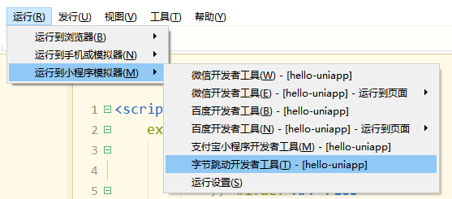

# uni-app介绍

 

uni-app是一个使用Vue.js开发所有前端应用的框架

### 一套代码，运行到多个平台

uni，读you ni，是统一的意思。

# uni-app 快速入门

## 1.通过HBuilderX可视化界面

- HBuilderX：[官方IDE下载地址](http://www.dcloud.io/hbuilderx.html)

HBuilderX是通用的前端开发工具，但为uni-app制成特别强化。

### 创建uni-app

在点击工具栏里的文件->新建->项目：


选择uni-app类型，输入工程名，选择模板，点击创建，即可成功创建。

uni-app自带的模板有。Hello uni-app，是官方的组件和API示例。还有一个重要模板是uni ui项目模板，日常开发推荐使用该模板，已内置大量常用组件


### 运行uni-app

1. 浏览器运行：进入hello-uniapp项目，点击工具栏的运行->运行到浏览器->选择浏览器，即可在浏览器里面体验uni-app的H5版。


1. 浏览器运行：进入hello-uniapp项目，点击工具栏的运行->运行到浏览器->选择浏览器，即可在浏览器里面体验uni-app的H5版。


1. 真机运行：连接手机，开启USB调试，进入hello-uniapp项目，点击工具栏的运行->真机运行->选择运行的设备，即可在该设备里面体验uni-app。
2. 

3. 如手机无法识别，请点击菜单运行-运行到手机或模拟器-真机运行常见故障排查指南。注意当前开发App也需要安装微信开发者工具。

4. 在微信开发者工具里运行：进入hello-uniapp项目，点击工具栏的运行->运行到小程序模拟器->微信开发者工具，即可在微信开发者工具里面体验uni-app。
5. 

6. 注意：如果是第一次使用，需要先配置小程序ide的相关路径，才能运行成功。如下图，需在输入框输入微信开发者工具的安装路径。若HBuilderX不能正常启动微信开发者工具，需要开发者手动启动，然后将uni-app生成小程序工程的路径复制到微信开发者工具里面，在HBuilderX里面开发，在微信开发者工具里面就可以看到实时的效果。uni-app或将项目编译到根目录的unpackage目录。       

7. 在支付宝小程序开发者工具里运行：进入hello-uniapp项目，点击工具栏的运行->运行到小程序模拟器->支付宝小程序开发者工具，即可在支付宝小程序开发者工具里面体验uni -app。
8. 

9. 在百度开发者工具里运行：进入hello-uniapp项目，点击工具栏的运行->运行到小程序模拟器->百度开发者工具，即可在百度开发者工具里面体验uni-app。
10. 

11. 在字节跳动开发者工具里运行：进入hello-uniapp项目，点击工具栏的运行->运行到小程序模拟器->字节跳动开发者工具，即可在字节跳动开发者工具里面体验uni -app。
12. 

提示

- 如果是第一次使用，需要配置开发工具的相关路径。请点击工具栏的运行->运行到小程序模拟器->运行设置，配置相应的小程序开发者工具的路径。
- 支付宝/百度/字节跳动小程序工具，不支持直接指定项目启动并运行。因此开发工具启动后，替换HBuilderX控制台中提示的项目路径，在相应的小程序开发者工具中打开。
- 如果自动启动小程序开发工具失败，请手动启动小程序开发工具放入HBuilderX控制台提示的项目路径，打开项目。


# 运行的快捷键是Ctrl+r。


HBuilderX还提供了快捷运行菜单，可以按数字快速选择要运行的设备：


### 发布uni-app

#### 打包为原生App（云端）

在HBuilderX工具栏，点击发行，选择原生app-云端打包，如下图：


出现如下界面，点击打包即可。


#### 打包为原生App（离线）

uni-app支持离线打包，在HBuilderX生成离线打包资源，然后参考[离线打包](http://ask.dcloud.net.cn/docs/#//ask.dcloud.net.cn/article/104)（或参考其他用户写的[离线打包日记](https://ask.dcloud.net.cn/article/35302)），即可进行离线打包。

在HBuilderX工具栏，点击发行，选择本地打包，如下图，点击立即生成离线打包资源。


#### 发布为H5

1. 在manifest.json的可视化界面，进行如下配置（发布在网站根目录可不配置应用基本路径），此时发行网站路径是www.xxx.com/h5，如：[https](https://uniapp.dcloud.io/h5) ://uniapp.dcloud.io/h5 。
2. 

3. 在HBuilderX工具栏，单击发行，选择网站-H5手机版，如下图，单击即可生成H5的相关资源文件，保存于解压目录。


注意

- history模式发行需要后台配置支持，详见：历史模式的预定配置
- 打包部署后，在服务器上开启gzip可以进一步压缩文件。具体的配置，可以参考网上的分享：[https](https://juejin.im/post/5af003286fb9a07aac24611b) : [//juejin.im/post/5af003286fb9a07aac24611b](https://juejin.im/post/5af003286fb9a07aac24611b)

#### 发布为小程序

发布为微信小程序：

1. 申请微信小程序AppID，参考：微信教程。
2. 在HBuilderX中顶部菜单上依次单击“发行” =>“小程序-微信”，输入小程序名称和appid单击发行即可在unpackage/dist/build/mp-weixin生成微信小程序项目代码。
3. 

4. 在微信小程序开发者工具中，导入生成的微信小程序项目，测试项目代码运行正常后，点击“上传”按钮，然后按照“提交审核” =>“发布”小程序标准流程，逐步操作即可，详细查看：微信官方教程。

发布为百度小程序：

1. 入驻小程序并申请百度小程序AppID，参考：百度小程序教程。
2. 在HBuilderX中顶部菜单上依次单击“发行” =>“小程序-百度”，输入小程序名称和appid单击发行即可在/unpackage/dist/build/mp-baidu生成百度小程序项目代码。
3.       

4. 在百度小程序开发者工具中，导入生成的百度小程序项目，测试项目代码运行正常后，点击“上传”按钮上传代码，然后在百度小程序的[管理中心](https://smartprogram.baidu.com/developer/applist.html)选择创建的应用点击访问发布，选择对应的版本然后提交审核。

 发布为支付宝小程序：

1. 入驻支付宝小程序，参考：支付宝小程序教程。
2. 在HBuilderX中顶部菜单上依次单击“发行” =>“小程序-支付宝”，即可在/unpackage/dist/build/mp-alipay生成支付宝小程序项目代码。
3. 

4. 在支付宝小程序开发者工具中，导入生成的支付宝小程序项目，测试项目代码运行正常后，点击“上传”按钮上传代码，在支付宝小程序后台，选择刚提交的版本点击提交审核，详见：支付宝小程序文档。

发布为字节跳动小程序：

1. 入驻字节跳动小程序，参考：字节跳动小程序教程。
2. 在HBuilderX中顶部菜单上依次单击“发行” =>“小程序-字节跳动”，即可在/unpackage/dist/build/mp-alipay生成字节跳动小程序项目代码。
3. 

4. 在字节跳动小程序开发者工具中，导入生成的字节跳动小程序项目，测试项目代码运行正常后，点击“上传”按钮上传代码，在字节跳动小程序后台，选择刚提交的版本点击提交审核，详见：字节跳动小程序文档。

发布为QQ小程序： 内容同上，不再重复。

发布的快捷键是Ctrl+u。同样可拉下快速发布菜单并按数字键选择。


## 2.通过vue-cli命令行

除了HBuilderX可视化界面，也可以使用cli脚手架，可以通过vue-cli创建uni-app项目。

### 环境安装


整体安装vue-cli

```
npm install -g @vue/cli
```

### 创建uni-app

使用正式版（对应HBuilderX最新正式版）

```
vue create -p dcloudio/uni-preset-vue my-project
```

使用alpha版（对应HBuilderX最新alpha版）

```
vue create -p dcloudio/uni-preset-vue#alpha my-alpha-project
```

此时，会提示选择项目模板，初次体验建议选择hello uni-app项目模板，如下所示：


#### 自定义模板

选择自定义模板时，需要填写uni-app模板地址，这个地址其实就是托管在云端的仓库地址。以GitHub上，地址格式为userName/repositoryName，如dcloudio/uni-template-picture就是下载图片模板。

更多支持的下载方式，请参考这个插件的说明：download-git-repo

### 运行并发布uni-app

```
npm run dev:%PLATFORM%
npm run build:%PLATFORM%
```

%PLATFORM% 可取值如下：

| 值      | 平台           |
| :------ | :------------- |
| 5天     | H5             |
| 支付宝  | 支付宝小程序   |
| mp-百度 | 百度小程序     |
| mp-微信 | 微信小程序     |
| 头条    | 字节跳动小程序 |
| mp-qq   | qq小程序       |

可以自定义更多条件编译平台，插入钉钉小程序，参考package.json文档。

其他：

- dev模式编译出的各平台代码存放于根目录下的/dist/dev/目录，打开各平台开发工具选择对应的平台目录即可进行预览（h5平台不会在此目录，存在于缓存中）；
- build模式编译出的各平台代码存放于根目录下的/dist/build/目录，发布时选择此目录进行发布；
- dev和build模式的区别：dev模式有SourceMap可以方便的进行断点调试；build模式进行代码进行压缩，体积更小更适合发布为正式版应用；进行环境判断时，dev模式process.env.NODE_ENV的转换开发，构建模式process.env.NODE_ENV的转换生产。

### 使用cli创建项目和使用HBuilderX可视化界面创建项目有什么区别

#### 编译器的区别

- cli创建的项目，编译器安装在项目下。并且不会跟随HBuilderX升级。如需升级编译器，执行npm update。
- HBuilderX可视化界面创建的项目，编译器在HBuilderX的安装目录下的插件目录，转换为HBuilderX的升级会自动升级编译器。
- 已经使用了cli创建的项目，如果想继续在HBuilderX里使用，可以把工程拖到HBuilderX中。注意如果是把整个项目拖入HBuilderX，则编译时走的是项目下的编译器。如果是把src目录拖入到HBuilderX中，则走的是HBuilderX安装目录下plugin目录下的编译器。
- cli在HBuilderX的插件管理界面安装无效的情况下，那个只作用于HBuilderX创建的项目。

#### 开发工具的区别

- cli创建的项目，内置了d.ts，与其他常规npm库一样，可在vscode，webstorm等支持d.ts的开发工具里正常开发并有语法提示。
- 使用HBuilderX创建的项目不带d.ts，HBuilderX内置了uni-app语法提示库。如需把HBuilderX创建的项目在其他编辑器打开并补充d.ts，可以在项目下先执行npm init，然后npm i @types/uni-app -D，来补充d.ts。
- 但vscode等其他开发工具，在vue或Uni-app领域，开发效率比不过HBuilderX。详见：[https](https://ask.dcloud.net.cn/article/35451) ://ask.dcloud.net.cn/article/35451
- 其他开发工具无法发布App，但可以发布H5，各种小程序。如需开发App，可以先在HBuilderX里运行起来，然后在其他编辑器里修改保存代码，代码修改后会自动同步到手机附件。
- 如果使用cli新建项目，那下载HBuilderX时只需下载10M的标准版即可。因为编译器已经安装到项目下了。

注意：HBuilderX创建的项目，一样可以使用npm，参考：[https](https://uniapp.dcloud.io/frame?id=npm支持) ://uniapp.dcloud.io/frame?id [=](https://uniapp.dcloud.io/frame?id=npm支持) npm%e6%94%af%e6%8c%81


# 如何学习 uni-app

建议第一步，看完uni-app官网的首页介绍。

建议第二步，通过快速上手，亲身体验下uni-app。

建议第三步，看完《 uni-app官方教程》，出品人：DCloud，课时：共3节。


# uni-app 框架简介

uni-app 使用 vue 的语法 + 小程序的标签和 API。

## 开发规范


为了实现多端兼容，综合考虑编译速度，运行性能等因素，uni-app 约定了如下开发规范：

- 页面文件向导 [Vue单文件组件（SFC）规范](https://vue-loader.vuejs.org/zh/spec.html)

（每个 `.vue` 文件包含三种类型的顶级语言块 `<template>`、`<script>` 和 `<style>`，还允许添加可选的自定义块：）

- 组件标签靠近小程序规范，详见 uni-app 组件规范

```
所有组件与属性名都是小写，单词之间以连字符-连接。
<component-name property1="value" property2="value">
	content
</component-name>
每个属性通过=赋值。如下面的示例中，属性property1的值被设为字符串value。
在开始标签和结束标签之间，称为组件内容。如下面示例的content
开始标签上可以写属性，属性可以有多个，多个属性之间用空格分割。如下面示例的property1和property2。注意闭合标签上不能写属性。
组件名称由尖括号包裹，称为标签，它有开始标签和结束标签。

```


- 互连能力（JS API）靠近微信小程序规范，但需要将 wx替换为 uni，详见 uni-app 接口规范
- 数据绑定及事件处理同 Vue.js 规范，同时补充了 App 和页面的生命周期
- 为兼容多端运行，建议使用 flex 布局进行开发


弹性盒子布局(*Flexible Box*/flexbox)

flex 布局 = 弹性盒子布局


## 目录结构

一个 uni-app 工程，默认包含如下目录及文件：

```
┌─components            uni-app组件目录
│  └─comp-a.vue         可复用的a组件
├─hybrid                存放本地网页的目录，详见
├─platforms             存放各平台专用页面的目录，详见
├─pages                 业务页面文件存放的目录
│  ├─index
│  │  └─index.vue       index页面
│  └─list
│     └─list.vue        list页面
├─static                存放应用引用静态资源（如图片、视频等）的目录，注意：静态资源只能存放于此
├─wxcomponents          存放小程序组件的目录，详见
├─main.js               Vue初始化入口文件
├─App.vue               应用配置，用来配置App全局样式以及监听 应用生命周期
├─manifest.json         配置应用名称、appid、logo、版本等打包信息，详见
└─pages.json            配置页面路由、导航条、选项卡等页面类信息，详见
    
```


> 优先相对路径就行~


提示

- static 下目录的 js 文件不会被 compile-，里面如果有 es6 的代码，不经过转换直接运行，在手机设备上会报错。
- css，less/scss 等资源同样不要放在 static 目录下，建议这些公共的资源放在 common 目录下。
- HbuilderX 1.9.0+ 支持在根目录创建 ext.json sitemap.json 文件。

| 有效目录   | 说明         |
| :--------- | :----------- |
| 应用程式加 | 应用程式     |
| mp-h5      | H5           |
| mp-weixin  | 微信小程序   |
| mp-Alipay  | 支付宝小程序 |
| mp-baidu   | 百度小程序   |

## 资源路径说明

### 模板内引用静态资源

> template 内引用静态资源，如 image，video 等标签的 src 属性时，可以使用相对路径或绝对路径，形式如下

```
<!-- 绝对路径，/static指根目录下的static目录，在cli项目中/static指src目录下的static目录 -->
<image class="logo" src="/static/logo.png"></image>
<image class="logo" src="@/static/logo.png"></image>
<!-- 相对路径 -->
<image class="logo" src="../../static/logo.png"></image>
```

注意

- @初始的绝对路径以及相对路径会通过base64转换规则校验
- 引入的静态资源在非 h5 平台，均不转为 base64。
- H5 平台，小于 4kb 的资源会被转换成 base64，其余不转。
- 自 HBuilderX 2.6.6-alpha 起 template 内支持@初始路径日期静态资源，旧版本不支持此方式

### js 文件引用

> js 文件或 script 标签内（包括renderjs等）日期 js 文件时，可以使用相对路径和绝对路径，形式如下

```
// 绝对路径，@指向项目根目录，在cli项目中@指向src目录
import add from '@/common/add.js'
// 相对路径
import add from '../../common/add.js'
```

注意

- js 文件不支持使用/开头的方式引用

### css发布静态资源

> css 文件或 style 标签内引用 css 文件时（ scss，less 文件同理），只能使用相对路径

```
/* 绝对路径 */
@import url('/common/uni.css');
@import url('@/common/uni.css');
/* 相对路径 */
@import url('../../common/uni.css');
```

注意

- 自 HBuilderX 2.6.6-alpha 起支持绝对路径日期静态资源，旧版本不支持此方式

> css 文件或 style 标签内引用的图片路径可以使用相对路径也可以使用绝对路径，需要注意的是，有些小程序端css 文件可以引用本地文件（请看注意事项）。

```
/* 绝对路径 */
background-image: url(/static/logo.png);
background-image: url(@/static/logo.png);
/* 相对路径 */
background-image: url(../../static/logo.png);
```

提示

- @初始的绝对路径以及相对路径会通过 base64 转换规则校验
- 不支持本地图片的平台，小于 40kb，一定会转 base64。（共四个平台 mp-weixin，mp-qq，mp-toutiao，app v2）
- h5 平台，小于 4kb 会转 base64，超过 4kb 时不转。
- 其余平台不会转 base64


# uni-app 生命周期

## 生命周期

### 应用生命周期

uni-app 支持如下应用生命周期函数：

| 函数名               | 说明                                                    |
| :------------------- | :------------------------------------------------------ |
| onLaunch             | 当`uni-app`初始化完成时触发（局部只触发一次）           |
| onOpen               | 当`uni-app`启动，或从后台进入前台显示                   |
| onHide               | 当`uni-app`从前台进入后台                               |
| onError              | 当`uni-app`报错时触发                                   |
| onUniNViewMessage    | 对`nvue`页面发送的数据进行监听，可参考 nvue 向 vue 通讯 |
| onUnhandledRejection | 对未处理的 Promise 拒绝事件监听函数（2.8.1+）           |
| onPageNotFound       | 页面不存在监听函数                                      |
| onThemeChange        | 监听系统主题变化                                        |

注意

- ##### 应用生命周期仅可在 App.vue 中监听，在其他页面监听无效。

- onlaunch 里进行页面调整，如遇白屏报错，请参考 https://ask.dcloud.net.cn/article/35942

示例代码

```
<script>
    // 只能在App.vue里监听应用的生命周期
    export default {
        onLaunch: function() {
            console.log('App Launch')
        },
        onShow: function() {
            console.log('App Show')
        },
        onHide: function() {
            console.log('App Hide')
        }
    }
</script>
```

### 页面生命周期

uni-app 支持如下页面生命周期函数：

| 函数名                              | 说明                                                         | 平台差异说明                                         | 最低版本 |
| :---------------------------------- | :----------------------------------------------------------- | :--------------------------------------------------- | :------- |
| onInit                              | 监听页面初始化，其参数通onLoad参数，为上个页面传递的数据，参数类型为Object（用于页面传参），触发时机早于onLoad | 百度小程序                                           | 3.1.0+   |
| 负载                                | 监听页面加载，其参数为上个页面传递的数据，参数类型为 Object（用于页面传参），参考示例 |                                                      |          |
| 展出                                | 监听页面显示。页面每次出现在屏幕上都触发，包括从下级页面点返回进入当前页面 |                                                      |          |
| onReady                             | 监听页面初次渲染完成。注意如果渲染速度快，会在页面进入动画完成前触发 |                                                      |          |
| 隐藏                                | 监听页面隐藏                                                 |                                                      |          |
| onUnload                            | 监听页面卸载                                                 |                                                      |          |
| onResize                            | 监听窗口尺寸变化                                             | App，微信小程序                                      |          |
| onPullDownRefresh                   | 监听用户拖动动作，一般用于拖动刷新，参考示例                 |                                                      |          |
| onReachBottom                       | 页面上拉触底事件的处理函数                                   |                                                      |          |
| onTabItemTap                        | 单击选项卡时触发，参数为对象，具体见以下注意事项             | 微信小程序，百度小程序，H5，App（自定义组件模式）    |          |
| onShareAppMessage                   | 用户点击右上角分享                                           | 微信小程序，百度小程序，字节跳动小程序，支付宝小程序 |          |
| onPageScroll                        | 监听页面滚动，参数为对象                                     | nvue 暂不支持                                        |          |
| onNavigationBarButtonTap            | 监听原生标题栏按钮点击事件，参数为对象                       | 5+ App，H5                                           |          |
| onBackPress                         | 监听页面返回，返回事件= {from：backbutton，navigationBack}，backbutton 表示来源是左上角返回按钮或android 返回键； navigateBack 表示来源是 uni.navigateBack；详细说明及使用：onBackPress 详解。支付宝小程序只有真机能触发，只能监听非 navigateBack 引起的返回，不可阻止默认行为。 | App，H5、支付宝小程序                                |          |
| onNavigationBarSearchInputChanged   | 监听原生标题栏搜索输入框输入内容变化事件                     | App，H5                                              | 1.6.0    |
| onNavigationBarSearchInputConfirmed | 监听原生标题栏搜索输入框搜索事件，用户点击软键盘上的“搜索”按钮时触发。 | App，H5                                              | 1.6.0    |
| onNavigationBarSearchInputClicked   | 监听原生标题栏搜索输入框点击事件                             | App，H5                                              | 1.6.0    |
| onShareTimeline                     | 监听用户点击右上角转发到朋友去                               | 微信小程序                                           | 2.8.1+   |
| onAddToFavorites                    | 监听用户点击右上角收藏                                       | 微信小程序                                           | 2.8.1+   |

onInit使用注意

- 仅百度小程序基础库 3.260 以上支持 onInit 生命周期
- 其他版本或平台可以同时使用 onLoad 生命周期进行兼容，注意避免重复执行相同逻辑
- 不依赖页面传参的逻辑可以直接使用 created 生命周期替代

onReachBottom 使用注意 可在 pages.json 里定义具体页面底部的触发距离 onReachBottomDistance，比如设为 50，那么滚动页面到距离底部 50px 时，就会触发 onReachBottom 事件。

如使用 scroll-view 导致页面没有滚动，则触底事件不会被触发。scroll-view 滚动到底部的事件请参考 scroll-view 的文档

onPageScroll 参数说明：

| 属性      | 类型 | 说明                                  |
| :-------- | :--- | :------------------------------------ |
| scrollTop | 数   | 页面在垂直方向已滚动的距离（单位 px） |

注意

- onPageScroll 里不要写交互复杂的 js，比如频繁修改页面。因为这个生命周期是在渲染层触发的，在非 h5 端，js是在逻辑层执行的，两层之间通信是有损耗的。如果在滚动过程中，频发触发两层之间的数据交换，可能会造成卡顿。
- 如果想实现滚动时标题栏透明渐变，在 App 和 H5 下，可在 pages.json 中配置 titleNView 下的 type 为 transparent，[参考](https://uniapp.dcloud.io/collocation/pages?id=app-titlenview)。
- 如果需要滚动吸顶固定某些元素，推荐使用 css 的粘性布局，参考[插件市场](https://ext.dcloud.net.cn/plugin?id=715)。插件市场也有其他 js 实现的吸顶插件，但性能不佳，需要时可自行搜索。
- 在 App、微信小程序、H5 中，也可以使用 wxs 监听滚动，[参考](https://uniapp.dcloud.io/frame?id=wxs)；在 app-nvue 中，可以使用 bindingx 监听滚动，[参考](https://uniapp.dcloud.io/nvue-api?id=nvue-里使用-bindingx)。
- onBackPress 上不可使用 async，会导致无法阻止默认返回

onTabItemTap 参数说明：

| 属性     | 类型 | 说明                             |
| :------- | :--- | :------------------------------- |
| 指数     | 串   | 被点击 tabItem 的序号，从 0 开始 |
| pagePath | 串   | 被点击 tabItem 的页面路径        |
| 文本     | 串   | 被点击 tabItem 的按钮文字        |

注意

- onTabItemTap 常用于单击当前 tabitem，滚动或刷新当前页面。如果是单击不同的 tabitem，一定会触发页面切换。

- 如果想在 App 端实现点击某个 Tabitem，则不能使用 onTabItemTap，可以使用 plus.nativeObj.view 放一个区块盖住原先的 TAbitem，并拦截点击事件。

- 支付宝小程序平台 onTabltemTap 表现为点击非当前 tabitem 后触发，因此不能用于实现点击返回顶部这种操作。

  

  ```
  onTabItemTap : function(e) {
      console.log(e);
      // e的返回格式为json对象： {"index":0,"text":"首页","pagePath":"pages/index/index"}
  },
  ```

onNavigationBarButtonTap 参数说明：

| 属性 | 类型 | 说明                     |
| :--- | :--- | :----------------------- |
| 指数 | 数   | 原生标题栏按钮方块的下标 |

```
onNavigationBarButtonTap : function (e) {
    console.log(e);
    // e的返回格式为json对象：{"text":"测试","index":0}
}
```

onBackPress 某些参数对象说明：

| 属性 | 类型 | 说明                                                         |
| :--- | :--- | :----------------------------------------------------------- |
| 从   | 串   | 触发返回行为的来源：'backbutton'-左上角导航栏按钮和安卓返回键；'navigateBack'-uni.navigateBack（）方法。支付宝小程序端不支持返回此字段 |

```
export default {
    data() {
        return {};
    },
    onBackPress(options) {
        console.log('from:' + options.from)
    }
}
```

注意

- nvue 页面支持的生命周期参考：nvue 生命周期介绍。
- 支付宝小程序真机可以监听到非 navigateBack 引发的返回事件（使用小程序开发工具时不会触发 onBackPress），不可以阻止默认返回行为

### 组件生命周期

`uni-app` 组件支持的生命周期，与 vue 标准组件的生命周期相同。这里没有页面级的 onLoad 等生命周期：

| 函数名        | 说明                                                         | 平台差异说明   | 最低版本 |
| :------------ | :----------------------------------------------------------- | :------------- | :------- |
| beforeCreate  | 在实例初始化之后被调用。[详见](https://cn.vuejs.org/v2/api/#beforeCreate) |                |          |
| created       | 在实例创建完成后被立即调用。[详见](https://cn.vuejs.org/v2/api/#created) |                |          |
| beforeMount   | 在挂载开始之前被调用。[详见](https://cn.vuejs.org/v2/api/#beforeMount) |                |          |
| mounted       | 挂载到实例上去之后调用。[详见](https://cn.vuejs.org/v2/api/#mounted) 注意：此处并不能确定子组件被全部挂载，如果需要子组件完全挂载之后在执行操作可以使用`$nextTick`[Vue官方文档](https://cn.vuejs.org/v2/api/#Vue-nextTick) |                |          |
| beforeUpdate  | 数据更新时调用，发生在虚拟 DOM 打补丁之前。[详见](https://cn.vuejs.org/v2/api/#beforeUpdate) | 仅 H5 平台支持 |          |
| updated       | 由于数据更改导致的虚拟 DOM 重新渲染和打补丁，在这之后会调用该钩子。[详见](https://cn.vuejs.org/v2/api/#updated) | 仅 H5 平台支持 |          |
| beforeDestroy | 实例销毁之前调用。在这一步，实例仍然完全可用。[详见](https://cn.vuejs.org/v2/api/#beforeDestroy) |                |          |
| destroyed     | Vue 实例销毁后调用。调用后，Vue 实例指示的所有东西都会解绑定，所有的事件监听器会被移除，所有的子实例也会被销毁。[详见](https://cn.vuejs.org/v2/api/#destroyed) |                |          |


# uni-app 路由

## 路由

uni-app页面路由为框架统一管理，开发者需要在pages.json里配置每个路由页面的路径和页面样式。类似的小程序在app.json中配置页面路由相同。所以uni-app的路由用法与Vue Router不同，如仍希望采用Vue Router方式管理路由，可在插件市场搜索Vue-Router。

### 路由路由

uni-app有两种页面路由重定向方式：使用导航器组件扩展，调用API重定向。

### 页面栈

框架以栈的形式管理当前所有页面，当发生路由切换的时候，页面栈的表现如下：

| 路由方式 | 页面栈表现                       | 触发时机                                                     |
| :------- | :------------------------------- | :----------------------------------------------------------- |
| 初始化   | 新页面入栈                       | uni-app：的第一个页面                                        |
| ：新页面 | 新页面入栈                       | 调用API  uni.navigateTo ，使用组件  <navigator open-type =“ navigate” /> |
| 页面重启 | 当前页面出栈，新页面入栈         | 调用API  uni.redirectTo ，使用组件 <navigator open-type =“ redirectTo” /> |
| 页面返回 | 页面不断出栈，直到目标返回页     | 调用API  uni.navigateBack  ，使用组件 <navigator open-type =“ navigateBack” /> ，用户按左上角返回按钮，安卓用户点击物理后退键 |
| 标签切换 | 页面全部出栈，只留下新的标签页面 | 调用API  uni.switchTab  ，使用组件 <navigator open-type =“ switchTab” />  ，用户切换Tab |
| 重加载   | 页面全部出栈，只留下新的页面     | 调用API  uni.reLaunch  ，使用组件  <navigator open-type =“ reLaunch” /> |

## 运行环境判断

### 开发环境和生产环境

uni-app可通过process.env.NODE_ENV判断当前环境是开发环境还是生产环境。一般用于连接测试服务器或生产服务器的动态切换。

- 在HBuilderX中，点击“运行”编译出来的代码是开发环境，点击“发行”编译出来的代码是生产环境
- cli模式下，是通行的编译环境处理方式。

```
if(process.env.NODE_ENV === 'development'){
    console.log('开发环境')
}else{
    console.log('生产环境')
}
```

如果你需要自定义更多环境，某种测试环境：

- 假设只需要对单一平台配置，可以的package.json中配置，在HBuilderX的运行和发行菜单里会多一个出来。https://uniapp.dcloud.io/collocation/package
- 如果是针对所有平台配置，可以在VUE-config.js中配置。https://uniapp.dcloud.io/collocation/vue-config

快捷代码块

HBuilderX中敲入代码块uEnvDev，uEnvProd可以快速生成对应development，production的运行环境判定代码。

```
// uEnvDev
if (process.env.NODE_ENV === 'development') {
    // TODO
}
// uEnvProd
if (process.env.NODE_ENV === 'production') {
    // TODO
}
```

### 判断平台

平台判断有2种场景，一种是在编译期判断，一种是在运行期判断。

- 编译期判断编译期判断，即条件编译，不同平台在编译出包后已经是不同的代码。详见：条件编译

```
// #ifdef H5
    alert("只有h5平台才有alert方法")
// #endif
```

如上代码只会编译到H5的发行包里，其他平台的包不会包含如上代码。

- 运行期诊断运行期判断是指代码已经打入包中，仍然需要在运行期判断平台，此时可使用uni.getSystemInfoSync().platform判断客户端环境是Android，iOS还是小程序开发工具（在百度小程序开发工具，微信小程序开发工具，支付宝小程序开发工具中使用uni.getSystemInfoSync().platform返回值重置devtools）。

```
switch(uni.getSystemInfoSync().platform){
    case 'android':
       console.log('运行Android上')
       break;
    case 'ios':
       console.log('运行iOS上')
       break;
    default:
       console.log('运行在开发者工具上')
       break;
}
```

如有必要，也可以在条件编译里自己定义的一个变量，赋值。在后续运行代码中动态判断环境。


# uni-app 页面样式


https://www.w3cschool.cn/uni_app/uni_app-kg6i370j.html


