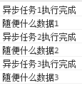
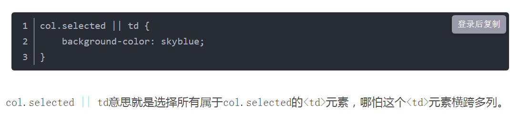

# 元岛 1期学会小程序


uniapp + serverless   + mongoDB


1个小时看一看Uniapp


下载hbuilder x


创建项目-默认模板

vue3

启用unicloud 阿里云


工具--设置


字体 

制表符长度（tab键缩进）  2

勾选空格代表制表符

勾选失去焦点自动保存


编辑配置----编辑器行高1.5

勾选保存时自动格式化


勾选tab插入自动补全


插入多光标使用的修饰符alt


运行配置----设置小程序配置---选择微信开发者工具路径


快捷键预设vscode

主题雅蓝


视图--关闭迷你地图  

工具-安装插件--四个--

--内置终端

---uniapp---vue3 

--unicloud云开发

---unimodules插件


运行菜单---运行微信小程序--就会把vue变成小程序代码


 尝试改数据

pages--index -- index。vue   


编辑器提示未绑定unicloud（后端开发）


右键unicloud 初始化向导---提示注册和认证


回编辑器点击刷新，选择刚刚创建的空间

点下一步，点开始部署，再点跳过


（截止目前--6分钟 --基本设置完成）


回到项目目录，

unicloud目录  ---项目后端--主要用于验证权限和后端数据库

点开后，有cloudfunctions（云函数）

​				    		comon（公用）  （里面两个不用管）

​							创建云函数，起名fun

​							右键上传部署到云端（后面小程序就可以访问这个函数了）

。hbuilderx 编辑器配置不用管

static放图片等静态资源


uni_modules    uniapp的插件目录第三方库


unpackage 就是uniapp把vue转换成小程序代码的产物（一般不用管）


app。vue是文件的起始入口


和app。js一样

index。html暂时不用管是写h5网页的

main。js是主js文件也不用管

manifest。json是项目配置 （有小程序appid的话，可以配置一下）

uni.css不用管是一下公用样式


pages。json 比较重要是页面设置和全局样式


page---主要页面代码


vue语法必须到处一个默认对象

导出    默认   

｛｝这个号在js里就是对象

export default {
			data() {

需要记忆的属性

### 1 、data（）｛

｝

只要在这个函数输出的数据，才能在template中拿到并使用

这里

return｛

xxx: xxx

｝

这里return返回的数据

在上面template这用 ｛｛xxx｝｝就可以使用该数据了

*innerText*:获取元素的文本


### 2、生命周期函数

onload（）｛  当页面加载时

｝

onshow  当页面展示时

onReachBottom  当页面滑动到底部的事件

onShareAppMessage 当分享时

            onload(){
                uni.showToast({
                    title:"加载"
                })
            },


### 3、methods  --方法


装所有自定义函数  

			methods: {
				greet(event){
					// `event` 是原生 DOM 事件
					console.log(event);
					uni.showToast({
						title: 'Hello ' + this.name + '!'
					});
	            
				},
	            changeTime(){
	                this.title = 
	            }
			}

this 。title就是data里面return出来的那个title


	<template>
		<view>
			<!-- `greet` 是在下面定义的方法名 -->
			<button @click="greet">Greet</button>
	        
	        <text class='title'>{{title}}</text>
	        <button type="primary" @click="changeTime()">TIME</button>
		</view>
	</template>
	<script>
		export default {
			data() {
				return {
					name: 'Vue.js',
	                title : '11111'
				}
			},
	        onLoad(){
	            // uni.showToast({
	            //     title:"加载"
	            // })
	            this.timer = setInterval(()=> this.changeTime(),1000)
	        },
	        onUnload() {
	            clearInterval(this.timer)
	        },
			// 在 `methods` 对象中定义方法
			methods: {
				greet(event){
					// `event` 是原生 DOM 事件
					console.log(event);
					uni.showToast({
						title: 'Hello ' + this.name + '!'
					});
	            
				},
	            changeTime(){
	                this.title = new Date().toLocaleString()
	            }
			}
		}
	</script>


写后端

unicloud。callFuncation（【】）


 

```
runAsync().then(function(data){
    console.log(data);
    //后面可以用传过来的数据做些其他操作
    //......
});
```

在runAsync()的返回上直接调用then方法，then接收一个参数，是函数，并且会拿到我们在runAsync中调用resolve时传的的参数

```
runAsync1()
.then(function(data){
    console.log(data);
    return runAsync2();
})
.then(function(data){
    console.log(data);
    return runAsync3();
})
.then(function(data){
    console.log(data);
});
```

[](javascript:void(0);)

这样能够按顺序，每隔两秒输出每个异步回调中的内容，在runAsync2中传给resolve的数据，能在接下来的then方法中拿到。运行结果如下：



## [链式使用 Promise](https://developer.mozilla.org/zh-CN/docs/learn/javascript/asynchronous/promises#链式使用_promise)

在你通过 `fetch()` API 得到一个 `Response` 对象的时候，你需要调用另一个函数来获取响应数据。这次，我们想获得 JSON 格式的响应数据，所以我们会调用 `Response` 对象的 [`json()`](https://developer.mozilla.org/zh-CN/docs/Web/API/Response/json) 方法。事实上，`json()` 也是异步的，因此我们必须连续调用两个异步函数。

试试这个：

JSCopy to Clipboard

```
const fetchPromise = fetch(
  "https://mdn.github.io/learning-area/javascript/apis/fetching-data/can-store/products.json",
);

fetchPromise.then((response) => {
  const jsonPromise = response.json();
  jsonPromise.then((json) => {
    console.log(json[0].name);
  });
});
```

在这个示例中，就像我们之前做的那样，我们给 `fetch()` 返回的 Promise 对象添加了一个 `then()` 处理程序。但这次我们的处理程序调用 `response.json()` 方法，然后将一个新的 `then()` 处理程序传递到 `response.json()` 返回的 Promise 中。

执行代码后应该会输出“baked beans”（“products.json”中第一个产品的名称）。

等等！还记得上一篇文章吗？我们好像说过，在回调中调用另一个回调会出现多层嵌套的情况？我们是不是还说过，这种“回调地狱”使我们的代码难以理解？这不是也一样吗，只不过变成了用 `then()` 调用而已？

当然如此。但 Promise 的优雅之处在于 *`then()` 本身也会返回一个 Promise，这个 Promise 将指示 `then()` 中调用的异步函数的完成状态*。这意味着我们可以（当然也应该）把上面的代码改写成这样：

JSCopy to Clipboard

```
const fetchPromise = fetch(
  "https://mdn.github.io/learning-area/javascript/apis/fetching-data/can-store/products.json",
);

fetchPromise
  .then((response) => {
    return response.json();
  })
  .then((json) => {
    console.log(json[0].name);
  });
```

不必在第一个 `then()` 的处理程序中调用第二个 `then()`，我们可以直接*返回* `json()` 返回的 Promise，并在该返回值上调用第二个 "then()"。这被称为 **Promise 链**，意味着当我们需要连续进行异步函数调用时，我们就可以避免不断嵌套带来的缩进增加。

在进入下一步之前，还有一件事要补充：我们需要在尝试读取请求之前检查服务器是否接受并处理了该请求。我们将通过检查响应中的状态码来做到这一点，如果状态码不是“OK”，就抛出一个错误：

JSCopy to Clipboard

```
const fetchPromise = fetch(
  "https://mdn.github.io/learning-area/javascript/apis/fetching-data/can-store/products.json",
);

fetchPromise
  .then((response) => {
    if (!response.ok) {
      throw new Error(`HTTP error: ${response.status}`);
    }
    return response.json();
  })
  .then((json) => {
    console.log(json[0].name);
  });
```

## [错误捕获](https://developer.mozilla.org/zh-CN/docs/learn/javascript/asynchronous/promises#错误捕获)

这给我们带来了最后一个问题：我们如何处理错误？`fetch()` API 可能因为很多原因抛出错误（例如，没有网络连接或 URL 本身存在问题），我们也会在服务器返回错误消息时抛出一个错误。

在上一篇文章中，我们看到在嵌套回调中进行错误处理非常困难，我们需要在每一个嵌套层中单独捕获错误。

`Promise` 对象提供了一个 [`catch()`](https://developer.mozilla.org/zh-CN/docs/Web/JavaScript/Reference/Global_Objects/Promise/catch) 方法来支持错误处理。这很像 `then()`：你调用它并传入一个处理函数。然后，当异步操作*成功*时，传递给 `then()` 的处理函数被调用，而当异步操作*失败*时，传递给 `catch()` 的处理函数被调用。

如果将 `catch()` 添加到 Promise 链的末尾，它就可以在任何异步函数失败时被调用。于是，我们就可以将一个操作实现为几个连续的异步函数调用，并在一个地方处理所有错误。

试试这个版本的 `fetch()` 代码。我们使用 `catch()` 添加了一个错误处理函数，并修改了 URL（这样请求就会失败）。

JSCopy to Clipboard

```
const fetchPromise = fetch(
  "bad-scheme://mdn.github.io/learning-area/javascript/apis/fetching-data/can-store/products.json",
);

fetchPromise
  .then((response) => {
    if (!response.ok) {
      throw new Error(`HTTP 请求错误：${response.status}`);
    }
    return response.json();
  })
  .then((json) => {
    console.log(json[0].name);
  })
  .catch((error) => {
    console.error(`无法获取产品列表：${error}`);
  });
```

尝试运行这个版本：你应该会看到 `catch()` 处理函数输出的错误。

## [Promise 术语](https://developer.mozilla.org/zh-CN/docs/learn/javascript/asynchronous/promises#promise_术语)

Promise 中有一些具体的术语值得我们弄清楚。

首先，Promise 有三种状态：

- **待定（pending）**：初始状态，既没有被兑现，也没有被拒绝。这是调用 `fetch()` 返回 Promise 时的状态，此时请求还在进行中。
- **已兑现（fulfilled）**：意味着操作成功完成。当 Promise 完成时，它的 `then()` 处理函数被调用。
- **已拒绝（rejected）**：意味着操作失败。当一个 Promise 失败时，它的 `catch()` 处理函数被调用。

注意，这里的“成功”或“失败”的含义取决于所使用的 API：例如，`fetch()` 认为服务器返回一个错误（如[404 Not Found](https://developer.mozilla.org/zh-CN/docs/Web/HTTP/Status/404)）时请求成功，但如果网络错误阻止请求被发送，则认为请求失败。

有时我们用 **已敲定（settled）** 这个词来同时表示 **已兑现（fulfilled）** 和 **已拒绝（rejected）** 两种情况。

如果一个 Promise 处于已决议（resolved）状态，或者它被“锁定”以跟随另一个 Promise 的状态，那么它就是 **已兑现（fulfilled）**。

文章 [Let's talk about how to talk about promises](https://thenewtoys.dev/blog/2021/02/08/lets-talk-about-how-to-talk-about-promises/) 对这些术语的细节做了很好的解释。


总结就是


。then（xxx）


前一个函数输出是then里面函数的输入

```
fetchPromise
  .then((response) => {
    if (!response.ok) {
      throw new Error(`HTTP error: ${response.status}`);
    }
    return response.json();
  })
  .then((json) => {
    console.log(json[0].name);
  });
  
  
  
  
    .then((json) => {
    console.log(json[0].name);
  });
  
  
  
  (json) =>    等价于  funcation（json）
  
  
    .then(funcation（json） {
    console.log(json[0].name);
  });
  
  
  
  
```


留言板小案例：


1、加标签

```
<input type="text" class="input" v-model="content" placeholder="留言">
<button type="primary" @click="publish()" size="mini"> push</button>
```

​        


2、写函数名

```
data(){
return{
content:''
}
}


methods: {
				
                publish(){
                    uniCloud.callFunction({
                            name:"fun",
                            data:{
                                api : 'publish',
                                content : this.content
                            }
                        }).then(res=>{
                            console.log(res)
                           
                        })
                        
                },
			}
		}
```


3、写css

```
<style>
    
    .content{
        display: flex;
        align-items: center;
        margin: 40rpx;
        
    }
    .input{
        border-bottom: 1px solid #ccc;
        padding:  6rpx;
        flex: 1;
    }
    
    
    
    
</style>
```


4、写unicloud 后端的东西

fun-index。js


```

// 初始化云数据库
let db = uniCloud.database({
    throwOnNotFound : flase,
})


exports.main = async (event, context) => {
    if(event.api === 'publish'){
        return await db.collection('message').add({
            content:event.content,
        })
    }
    
    
    
	//返回数据给客户端
	return event
};

```


5、检查uniclod后台数据表中数据


6、再修改后端fun -index。js


```

// 初始化云数据库
let db = uniCloud.database({
    throwOnNotFound : flase,
})


exports.main = async (event, context) => {
    if(event.api === 'publish'){
        return await db.collection('message').add({
            content:event.content,
        })
    }
    
    if (event.api === 'getMessages'){
        return await db.collection('message').get()
    }
    
    
    
	//返回数据给客户端
	return event
};

```


7、再改前段


```
		export default {
			data() {
				return {
					content: '',
                    list : []
				}
			},
            onLoad(){
                uniCloud.callFunction({
                    name:'fun',
                    data:{
                        api:"getMessages"
                    }
                }).then(res => {
                    this.list = res.result.data
                })
                 },
```


8、在写展示


```
	<template>
		<view>
			<!-- `greet` 是在下面定义的方法名 -->
			<button @click="greet">Greet</button>
            
            <text class='title'>{{title}}</text>
            <button type="primary" @click="changeTime()">TIME</button>
		
            <input type="text" class="input" v-model="content" placeholder="留言">
            <button type="primary" @click="publish()" size="mini"> push</button>
        </view>
        
        <view v-for="item in  list" :key="item._id" >
            <view class="">
                <view> {{item.content}}</view>
            </view>
        </view>
        
	</template>
```


9、加样式


```
    .box{
        margin : 40rpx;
        border-bottom: 1px solid #ccc;
        padding: 20rpx 0;
    }
    
```


10、优化体验

```
			methods: {
				greet(event){
					// `event` 是原生 DOM 事件
					console.log(event);
					uni.showToast({
						title: 'Hello ' + this.name + '!'
					});
                
				},
                changeTime(){
                    this.title = new Date().toLocaleString()
                },
                publish(){
                    uniCloud.callFunction({
                            name:"fun",
                            data:{
                                push : 'push',
                                content : this.content
                            }
                        }).then(res => {
                            console.log(res)
                            this.list.push({
                                _id : res.result.id,
                                content: this.content,
                            })
                            this.content = ""
                        })
                        
                },
			}
```


知识梳理

| onLoad | 监听页面加载，该钩子被调用时，响应式数据、计算属性、方法、侦听器、props、slots 已设置完成，其参数为上个页面传递的数据，参数类型为 Object（用于页面传参），参考[示例](https://uniapp.dcloud.net.cn/api/router#navigateto) |      |      |
| ------ | ------------------------------------------------------------ | ---- | ---- |
| onShow | 监听页面显示，页面每次出现在屏幕上都触发，包括从下级页面点返回露出当前页面 |      |      |

​            onLoad(){

​            onUnload(){

| onUnload | 监听页面卸载 |
| -------- | ------------ |
|          |              |

​              uniCloud.callFunction({

	                uniCloud.callFunction({
	                name:'fun',
	                data:{
	                    api:"getMessages"
	                }
	            }).then(res => {
	                this.list = res.result.data
	            })

#### uni-app项目使用uniCloud.callFunction的方式调用云函数

如果是未开通过uniCloud的uni-app项目：

1. 首先开通uniCloud服务空间，[参考](https://unicloud.dcloud.net.cn/)
2. 对项目点右键，创建uniCloud开发环境，然后绑定到上一步创建的服务空间上
3. 对uniCloud/cloudfunctions/点右键，创建云函数
4. 分别在前端和云端复制下列代码
5. 对云函数点右键，上传到服务空间

客户端示例：

```js
// 在得到access_token后，通过callfunction调用云函数
uniCloud.callFunction({
  name: 'xxx', // 你的云函数名称
  data: {
    'access_token': 'xxx', // 客户端一键登录接口返回的access_token
    'openid': 'xxx' // 客户端一键登录接口返回的openid
  }
}).then(res => {
  // res.result = {
  //   code: '',
  //   message: ''
  // }
  // 登录成功，可以关闭一键登录授权界面了
}).catch(err=>{
  // 处理错误
})
```

复制代码

云函数代码示例：

```
async - 百度翻译
异步的  
常见释义

```


```js
'use strict';
exports.main = async (event, context) => {
  // event里包含着客户端提交的参数
  const res = await uniCloud.getPhoneNumber({
  	appid: '_UNI_ABCDEFG', // 替换成自己开通一键登录的应用的DCloud appid
  	provider: 'univerify',
  	apiKey: 'xxx', // 在开发者中心开通服务并获取apiKey
  	apiSecret: 'xxx', // 在开发者中心开通服务并获取apiSecret
  	access_token: event.access_token,
  	openid: event.openid
  })
  
  console.log(res); // res里包含手机号
  // 执行用户信息入库等操作，正常情况下不要把完整手机号返回给前端
  // 如果数据库在uniCloud上，可以直接入库
  // 如果数据库不在uniCloud上，可以通过 uniCloud.httpclient API，将手机号通过http方式传递给其他服务器的接口，详见：https://uniapp.dcloud.net.cn/uniCloud/cf-functions?id=httpclient
  return {
    code: 0,
    message: '获取手机号成功'
  }
}
```

复制代码

完整的项目实例源码，可以参考：

1. uni-starter，云端一体应用快速开发基本项目模版：https://ext.dcloud.net.cn/plugin?id=5057
2. hello uni-app，打包后直接体验：https://m3w.cn/uniapp；源码获取：在HBuilderX中新建uni-app项目，选择hello uni-app模板。一键登录的具体位置在 API - login 栏目中

​           


​     this.timer = setInterval(()=> this.changeTime(),1000)

## setInterval(callback, delay, rest)

设定一个定时器。按照指定的周期（以毫秒计）来执行注册的回调函数

**参数说明**

| 参数     | 类型     | 必填 | 说明                                                         |
| :------- | :------- | :--- | :----------------------------------------------------------- |
| callback | Function | 是   | 回调函数                                                     |
| delay    | Number   | 否   | 执行回调函数之间的时间间隔，单位 ms                          |
| rest     | Any      | 否   | param1, param2, ..., paramN 等附加参数，它们会作为参数传递给回调函数 |

**返回值**

| 返回值     | 类型   | 说明                                                         |
| :--------- | :----- | :----------------------------------------------------------- |
| intervalID | Number | 定时器的编号，这个值可以传递给 [clearInterval](https://uniapp.dcloud.net.cn/api/timer#clearinterval) 来取消该定时 |

**代码示例**

```text
this.timer = setInterval(() => {
    //TODO 
}, 1000);
```


​                clearInterval(this.timer)

​					uni.showToast({


### uni.showToast(OBJECT)

显示消息提示框。

**OBJECT参数说明**

| 参数     | 类型     | 必填 | 说明                                                         | 平台差异说明                                           |
| :------- | :------- | :--- | :----------------------------------------------------------- | :----------------------------------------------------- |
| title    | String   | 是   | 提示的内容，长度与 icon 取值有关。                           |                                                        |
| icon     | String   | 否   | 图标，有效值详见下方说明，默认：success。                    |                                                        |
| image    | String   | 否   | 自定义图标的本地路径（app端暂不支持gif）                     | App、H5、微信小程序、百度小程序、抖音小程序（2.62.0+） |
| mask     | Boolean  | 否   | 是否显示透明蒙层，防止触摸穿透，默认：false                  | App、微信小程序、抖音小程序（2.47.0+）                 |
| duration | Number   | 否   | 提示的延迟时间，单位毫秒，默认：1500                         |                                                        |
| position | String   | 否   | 纯文本轻提示显示位置，填写有效值后只有 `title` 属性生效，且不支持通过 uni.hideToast 隐藏。有效值详见下方说明。 | App                                                    |
| success  | Function | 否   | 接口调用成功的回调函数                                       |                                                        |
| fail     | Function | 否   | 接口调用失败的回调函数                                       |                                                        |
| complete | Function | 否   | 接口调用结束的回调函数（调用成功、失败都会执行）             |                                                        |

**icon 值说明**

| 值        | 说明                                                         | 平台差异说明                                                 |
| :-------- | :----------------------------------------------------------- | :----------------------------------------------------------- |
| success   | 显示成功图标，此时 title 文本在`小程序`平台最多显示 7 个汉字长度，`App`仅支持单行显示。 | 支付宝小程序无长度无限制                                     |
| error     | 显示错误图标，此时 title 文本在`小程序`平台最多显示 7 个汉字长度，`App`仅支持单行显示。 | 支付宝小程序、快手小程序、抖音小程序、百度小程序、京东小程序、QQ小程序不支持 |
| fail      | 显示错误图标，此时 title 文本无长度显示。                    | 支付宝小程序、抖音小程序                                     |
| exception | 显示异常图标。此时 title 文本无长度显示。                    | 支付宝小程序                                                 |
| loading   | 显示加载图标，此时 title 文本在`小程序`平台最多显示 7 个汉字长度。 | 支付宝小程序不支持                                           |
| none      | 不显示图标，此时 title 文本在`小程序`最多可显示两行。        |                                                              |

**示例**

```javascript
uni.showToast({
	title: '标题',
	duration: 2000
});
```


​            <button type="primary"


# 开始实践登录注册


1、uni-app小程序获取openid

2、云开发转uniCloud

3、手机APP第三放登录

4、用户名密码登录

5、手机号邮箱登录


登录方式：

1、账号密码

2、邮箱号、手机号、

3、第三方登录

开发者--第三方开方平台---第三方秘钥---用户---第三方打开应用---用户授权----拿到授权码---后端收到----用授权码和秘钥请求第三方服务器----后端拿到信息---登录成功


1、留言板小程序基础上改

改OnLoad（）

```
onLoad(){
                //先查询本地是否有token，有加上就好，没有的话
                //本地请求小程序获取token
                //然后uni.setStorageSync('token',token)保存到前端
                
                
                
                
                
                let token = uni.getStorageSync('token');
                if(!token){
                    uni.login().then(({code}) =>
                    {
                        uniCloud.callFunction({
                            name:'fun',
                            data:{
                                api:'loginWithMp',
                                code
                            }
                        }).then(({result})=>
                        {
                            token = result.token;
                            uni.setStorageSync('token',token)
                        })
                    })
                }
                
                
                
                
                uniCloud.callFunction({
                    name:'fun',
                    data:{
                        api:"getMessages"
                    }
                }).then(res => {
                    this.list = res.result.data
                })
```


2、写getlist函数

```
getlist(api){
                    uniCloud.callFunction({
                        name:'fun',
                        data:{
                            api:api||"getMessages",
                            token:uni.getStorageSync('token')
                        }
                    }).then(res=>{
                        this.list = res.result.data
                    })
                },
```


A||B

意思是A中所有的B元素





3、写OnLoad（）

```
onLoad(){
                //先查询本地是否有token，有加上就好，没有的话
                //本地请求小程序获取token
                //然后uni.setStorageSync('token',token)保存到前段
                let token = uni.getStorageSync('token');
                if(!token){
                    uni.login().then(({code}) =>
                    {
                        uniCloud.callFunction({
                            name:'fun',
                            data:{
                                api:'loginWithMp',
                                code
                            }
                        }).then(({result})=>
                        {
                            token = result.token;
                            uni.setStorageSync('token',token)
                            this.getlist()
                        })
                    })
                }else{
                    this.getlist()
                }
```

截止完成了已登录和未登录两个带token执行getlist了

 4、写mothods                      

token:uni.getStorageSync('token')

从本地缓存中获取数据


```
methods: {
                getlist(api){
                    uniCloud.callFunction({
                        name:'fun',
                        data:{
                            api:api||"getMessages",
                            token:uni.getStorageSync('token')
                        }
                    }).then(res=>{
                        this.list = res.result.data
                    })
                },
                
                
                
                
                
				greet(event){
					// `event` 是原生 DOM 事件
					console.log(event);
					uni.showToast({
						title: 'Hello ' + this.name + '!'
					});
                
				},
                changeTime(){
                    this.title = new Date().toLocaleString()
                },
                publish(){
                    uniCloud.callFunction({
                            name:"fun",
                            data:{
                                push : 'push',
                                content : this.content,
                                token:uni.getStorageSync('token')
                            }
                        }).then(res => {
                            console.log(res)
                            this.list.push({
                                _id : res.result.id,
                                content: this.content,
                            })
                            this.content = ""
                        })
                        
                },
                onTextareaKeyDown(){
                    if (event.keyCode == 13){
                        event.preventDefault();
                        publish()
                    }
                },
			}
		}
```


5、写后端loginwithMP


视频9：30秒


```

// 初始化云数据库
// let db = uniCloud.database({
//     throwOnNotFound : false,
// })

let appId = "你的小程序id"
let appSecret = "你的小程序secret"
let jwtSecret = "自己编一个jwtSecret"


exports.main = async (event, context) => {
    if(event.api === 'loginWithMp'){
        let wxRes = await uniCloud.httpclient.request(
        'https://api.weixin.qq.com/sns/jscode2session?appid=APPID&secret=SECRET&js_code=JSCODE&grant_type=authorization_code '
        ,{'dataType':'json',})
        
        let userId = wxRes.data.openid;
        if(!userId){
            throw Error(wxRes.data.errmsg)
        }
        let user = await db.collection('user').doc(userId).get();
        
        if(user.data[0]){
            return{
                user:user.data[0]
            }
        }else{
            let data = {
                _id:userId,
                createdAt: Date.now()
            }
            await db.collection('user').add(data);
            return{
                user:data
            }
        }
        
    }
    
    
    
    
    if(event.api === 'publish'){
        return await db.collection('message').add({
            content:event.content,
        })
    }
    
    if (event.api === 'getMessages'){
        return await db.collection('message').get()
    }
    
    
    
	//返回数据给客户端
	return event
};

```


6、开始使用Javascript和npm-----token加密生成


cd --到fun目录

输入npm install -S jsonwebtoken

（意思是安装并保存 jsonwebtoken）


Ctrl+c 取消执行

npx nrm use taobao

这个是切换npm第三方下载地址为国内地址的命令


let jwt = require('jsonwebtoken')


7、改fun 然后上传云函数

```
let jwt = require('jsonwebtoken')

初始化云数据库
let db = uniCloud.database({
    throwOnNotFound : false,
})

let appId = "你的小程序id"
let appSecret = "你的小程序secret"
let jwtSecret = "自己编一个jwtSecret"


exports.main = async (event, context) => {
    if(event.api === 'loginWithMp'){
        let wxRes = await uniCloud.httpclient.request(
        'https://api.weixin.qq.com/sns/jscode2session?appid=APPID&secret=SECRET&js_code=JSCODE&grant_type=authorization_code '
        ,{'dataType':'json',})
        
        let userId = wxRes.data.openid;
        if(!userId){
            throw Error(wxRes.data.errmsg)
        }
        let user = await db.collection('user').doc(userId).get();
        let token = 'Bearer' + jwt.sign({userId},jwtSecret)
        if(user.data[0]){
            return{
                user:user.data[0],
                token
            }
        }else{
            let data = {
                _id:userId,
                createdAt: Date.now()
            }
            await db.collection('user').add(data);
            return{
                user:data,
                token
            }
        }
        
    }
    
    if(!event.token){
        throw Error('未登录')
    }
    let auth = jwt.verify(event.token.replace('Bearer',''),jwtSecret)
    let userId = auth.userId;

    
    
    
    if(event.api === 'publish'){
        return await db.collection('message').add({
            content:event.content,
            public:false,
            userId
        })
    }
    
    if (event.api === 'getMessages'){
        return await db.collection('message').where({
            public:true
        }).get()
    }
    
    if (event.api === 'getMyMessages'){
        return await db.collection('message').where({
            public:true
        }).get()
    }
    
	//返回数据给客户端
	return event
};

```


8、前端加一个


```
	<template>
		<view>
			<!-- `greet` 是在下面定义的方法名 -->
			<button @click="greet">Greet</button>
            
            <text class='title'>{{title}}</text>
            <button type="primary" @click="changeTime()">TIME</button>
		
            <input type="text" class="input" v-model="content" placeholder="留言" @comfirm="publish() " onkeydown="onTextareaKeyDown()">
            <button type="primary" @click="publish()" size="mini"> push</button>
             <button type="primary" @click="getlist('getMyMessages')" size="mini"> mymessages
             </button>
        </view>
        
        <view v-for="item in  list" :key="item._id" >
            <view class="box">
                <view > {{item.content}}</view>
                <view v-if="!item.public">
                    未公开
                </view>
            </view>
        </view>
        
	</template>
	<script>
		export default {
			data() {
				return {
					content: '',
                    list : [],
                    title:''
				}
			},
            onLoad(){
                //先查询本地是否有token，有加上就好，没有的话
                //本地请求小程序获取token
                //然后uni.setStorageSync('token',token)保存到前段
                let token = uni.getStorageSync('token');
                if(!token){
                    uni.login().then(({code}) =>
                    {
                        uniCloud.callFunction({
                            name:'fun',
                            data:{
                                api:'loginWithMp',
                                code
                            }
                        }).then(({result})=>
                        {
                            token = result.token;
                            uni.setStorageSync('token',token)
                            this.getlist()
                        })
                    })
                }else{
                    this.getlist()    
                }
                
                
                
                
                uniCloud.callFunction({
                    name:'fun',
                    data:{
                        api:"getMessages"
                    }
                }).then(res => {
                    this.list = res.result.data
                })
                
                this.timer = setInterval(()=> this.changeTime(),1000)
                
                 },
            onUnload(){
                clearInterval(this.timer)
            },

			// 在 `methods` 对象中定义方法
			methods: {
                getlist(api){
                    uniCloud.callFunction({
                        name:'fun',
                        data:{
                            api:api||"getMessages",
                            token:uni.getStorageSync('token')
                        }
                    }).then(res=>{
                        this.list = res.result.data
                    })
                },
                
                
                
                
                
				greet(event){
					// `event` 是原生 DOM 事件
					console.log(event);
					uni.showToast({
						title: 'Hello ' + this.name + '!'
					});
                
				},
                changeTime(){
                    this.title = new Date().toLocaleString()
                },
                publish(){
                    uniCloud.callFunction({
                            name:"fun",
                            data:{
                                push : 'push',
                                content : this.content,
                                token:uni.getStorageSync('token')
                            }
                        }).then(res => {
                            console.log(res)
                            this.list.push({
                                _id : res.result.id,
                                content: this.content,
                            })
                            this.content = ""
                        })
                        
                },
                onTextareaKeyDown(){
                    if (event.keyCode == 13){
                        event.preventDefault();
                        publish()
                    }
                },
			}
		}
	</script>


<style>
    
    .content{
        display: flex;
        align-items: center;
        margin: 40rpx;
        
    }
    .input{
        border-bottom: 1px solid #ccc;
        padding:  6rpx;
        flex: 1;
    }
    
    .box{
        margin : 40rpx;
        border-bottom: 1px solid #ccc;
        padding: 20rpx 0;
    }
    
    
    
</style>
```

